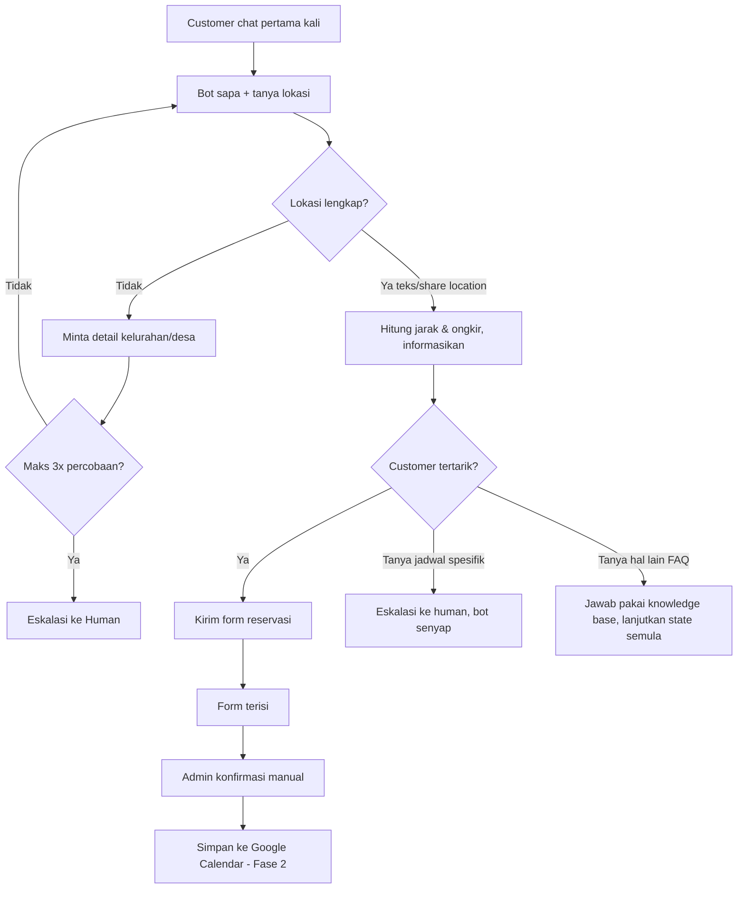

# Product Requirements Document
## WhatsApp Clinic Automation Chatbot
**Versi:** 1.0  
**Status:** Fase 1 selesai development, menunggu testing manual & persona content  
**Terakhir diperbarui:** 22 Juli 2026

### 1. Latar Belakang & Masalah
Bisnis klinik treatment saat ini menangani percakapan calon customer secara manual di WhatsApp — mulai dari sapaan awal, penentuan lokasi customer, kalkulasi ongkir, sampai follow-up pasca treatment. Proses manual ini punya beberapa masalah:
- Waktu respon lambat di luar jam kerja
- Follow-up pasca treatment (review, ajakan booking ulang) sering terlewat karena mengandalkan ingatan admin
- Tidak ada sistem terstruktur untuk tracking customer yang "hilang" (belum purchase, belum booking treatment lanjutan)
- Kalkulasi ongkir manual rawan human error

### 2. Tujuan Produk
- Mengotomasi percakapan awal customer (sapaan → lokasi → ongkir → reservasi) tanpa kehilangan sentuhan personal
- Memastikan tidak ada follow-up yang terlewat lewat sistem terjadwal otomatis
- Menjaga keputusan yang butuh judgment manusia (konfirmasi jadwal, approval reservasi) tetap di tangan admin/agent
- Menyediakan jawaban FAQ otomatis yang konsisten tanpa membebani admin untuk pertanyaan repetitif

### 3. Target Pengguna
- **Primary user:** Calon customer / customer existing klinik yang chat via WhatsApp
- **Internal user:** Admin/pemilik klinik yang mengelola konfirmasi reservasi dan menangani pertanyaan jadwal spesifik

### 4. Ruang Lingkup

#### 4.1 Fase 1 — Conversation Engine (Status: Development selesai, menunggu testing manual)

| # | Requirement | Status |
|---|---|---|
| 1 | Bot membalas sapaan otomatis saat ada pesan pertama dari nomor baru | ✅ Selesai |
| 2 | Bot menanyakan lokasi customer | ✅ Selesai |
| 3 | Jika lokasi tidak lengkap (misal hanya "Surabaya"), bot minta detail desa/kelurahan | ✅ Selesai |
| 4 | Jika lokasi tidak bisa di-resolve setelah 3x percobaan, eskalasi ke human | ✅ Selesai |
| 5 | Bot menangkap koordinat dari share location native WhatsApp | ✅ Selesai |
| 6 | Sistem menghitung ongkir berdasarkan jarak (Haversine) dari titik klinik | ✅ Selesai |
| 7 | Jika customer menunjukkan minat, bot kirim link/form reservasi | ✅ Selesai |
| 8 | Jika customer tanya ketersediaan jadwal spesifik, bot eskalasi ke human dan bot berhenti membalas otomatis untuk thread tersebut | ✅ Selesai |
| 9 | Auto-release: bot kembali aktif otomatis setelah 6 jam tanpa balasan agent, kembali ke state sebelum eskalasi | ✅ Selesai |
| 10 | Bot mensimulasikan perilaku mengetik manusia (typing indicator + delay proporsional) sebelum kirim pesan | ✅ Selesai |
| 11 | Bot bisa menjawab pertanyaan FAQ berdasarkan knowledge base (FAQ + dokumen) tanpa mengganggu alur state yang sedang berjalan | ✅ Selesai |
| 12 | Integrasi WhatsApp menggunakan WAHA (self-hosted) | ✅ Selesai |
| 13 | Pesan masuk diproses lewat antrian (queue), bukan diproses paralel tanpa kontrol — memastikan (a) satu customer tidak dibalas tumpang tindih kalau kirim pesan cepat berturut-turut, dan (b) total pengiriman pesan ke seluruh customer dibatasi (throttle) supaya tidak memicu rate limit/flag di WAHA | 🔧 Perlu ditambahkan |

**Belum selesai / pending sebelum Fase 1 dianggap tuntas:**
- Pengisian konten `persona.ts` (gaya bahasa & tone bot)
- Implementasi message queue (lihat poin 13) — ditemukan sebagai isu di sistem berjalan: saat ini semua pesan masuk diproses bersamaan tanpa urutan/kontrol
- Testing manual end-to-end dengan WAHA aktif (koneksi QR, typing indicator nyata, share location asli, akurasi jawaban FAQ)
- Import data FAQ & dokumen asli milik klinik (bukan data dummy)

#### 4.2 Fase 2 — Scheduling & Follow-up Engine (Status: Didesain, belum dikerjakan)

| # | Requirement |
|---|---|
| 1 | Setelah admin konfirmasi jadwal, sistem simpan reservasi ke Google Calendar |
| 2 | Pagi hari sebelum jadwal treatment, sistem kirim reminder otomatis ke customer |
| 3 | Sehari setelah treatment, sistem kirim follow-up otomatis menanyakan review/hasil treatment |
| 4 | Skema follow-up belum purchase: jika customer belum melakukan pembelian/reservasi, follow-up otomatis dikirim di hari ke-3, ke-7, dan ke-14 sejak kontak terakhir. Follow-up berhenti jika reservasi masuk di tengah jeda |
| 5 | Skema follow-up treatment lanjutan: 1 bulan setelah treatment terakhir, sistem follow-up otomatis menawarkan treatment berikutnya. Jika tidak dibalas, follow-up ulang di bulan ke-2, lalu terakhir di bulan ke-3 |
| 6 | Jika sampai bulan ke-3 tidak ada respon/booking, customer ditandai status lost |
| 7 | Jika ada booking treatment lanjutan sebelum status lost, sistem tandai sebagai repeat_order |

#### 4.3 Di Luar Scope (untuk saat ini)
- Dashboard admin dengan UI visual (saat ini cukup REST endpoint)
- Pembayaran online / payment gateway
- Multi-cabang klinik (asumsi saat ini: satu titik lokasi klinik)
- Vector/embedding search untuk knowledge base (dimulai dari full-text search sederhana; upgrade jika volume FAQ bertambah signifikan atau akurasi retrieval terbukti kurang)

### 5. Alur Percakapan Utama (Ringkasan)

### 6. Data yang Disimpan
- **Customer:** nomor telepon, nama, lokasi (kelurahan/kecamatan/kota, koordinat), jarak & ongkir terhitung, status keanggotaan
- **Conversation:** status percakapan saat ini, apakah sedang ditangani manusia
- **Message log:** seluruh histori pesan masuk/keluar (untuk audit dan debugging)
- **Knowledge base:** kumpulan FAQ dan potongan dokumen referensi untuk menjawab pertanyaan customer
- **Reservasi & treatment (Fase 2):** jadwal, status konfirmasi, riwayat treatment, status repeat order

### 7. Aturan Bisnis Kunci
- **Kalkulasi ongkir (bersifat sementara/interim):**
  
  | Jarak dari klinik | Ongkir |
  |---|---|
  | 0 – 5 km | Gratis |
  | >5 – 6 km | Rp 5.000 |
  | >6 – 10 km | Rp 10.000 |
  | >10 km | Di luar jangkauan |

  *Catatan penting: Logic tiering di atas adalah aturan sementara untuk Fase 1. Ke depan akan ada UI/sistem terpisah untuk menghitung ongkir yang akan menggantikan formula Haversine ini. Karena itu, `delivery.service.ts` harus tetap diperlakukan sebagai modul yang mudah diganti (isolated, tidak di-hardcode ke banyak tempat lain).*
- **Follow-up belum purchase:** hari ke-3, ke-7, ke-14 sejak kontak terakhir tanpa transaksi.
- **Follow-up treatment lanjutan:** bulan ke-1, ke-2, ke-3 sejak treatment terakhir; jika tidak ada respon sampai bulan ke-3 → status lost.

### 8. Batasan & Risiko yang Diketahui
- WAHA bersifat unofficial (bukan API resmi Meta) — berisiko session terputus sewaktu-waktu.
- Full-text search knowledge base mengandalkan kecocokan kata, bukan makna.
- Auto-release human handling murni berbasis waktu (6 jam).
- Semua follow-up otomatis di Fase 2 perlu mekanisme berhenti otomatis begitu ada transaksi baru.

### 9. Kriteria Selesai (Definition of Done) Fase 1
- [ ] `persona.ts` terisi dengan gaya bahasa final
- [ ] Koneksi WAHA stabil, QR ter-scan, session aktif
- [ ] Typing indicator terbukti muncul di WhatsApp asli
- [ ] Share location asli berhasil ditangkap dan dikonversi ke ongkir yang benar
- [ ] Minimal satu pertanyaan FAQ asli dari data klinik terjawab dengan akurat
- [ ] FAQ & dokumen asli klinik (bukan dummy) sudah diimport
- [ ] Message queue aktif: teruji tidak ada balasan tumpang tindih ke satu customer yang chat cepat berturut-turut, dan pengiriman ke banyak customer sekaligus berjalan terkontrol (tidak simultan tanpa batas)
