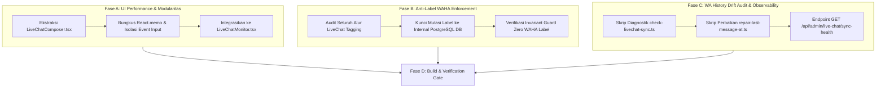

# Implementation Plan — LiveChat Comprehensive Optimization & WA Sync (Revisi v3 — September 2026)

**Tanggal:** 2026-09-01 (Direvisi komprehensif: 2026-09-14)  
**Status:** In Progress (Fase Historis Selesai, Sisa Fase Siap Eksekusi)  
**Prasyarat:** Mandat `AGENTS.md` (SaaS-readiness, Zero New Dependencies, **Mandat Mutlak Larangan Menyentuh Label WAHA**)

---

## 1. Status Audit Penyelesaian Historis (Fase yang Sudah Berjalan)

Berdasarkan audit langsung kode sumber aktif per 14 September 2026, sebagian besar keluhan kritis (P0/P1) pada draf awal rencana ini **telah berhasil diselesaikan**:

| Komponen / Masalah Asal | Status | Solusi yang Sudah Aktif di Produksi | Lokasi Kode Sumber |
|---|:---:|---|---|
| **Search Decoupling (Fase 5 lama)** | **RESOLVED** | Search nomor HP global via API backend (`searchQuery`) telah dipisahkan total dari pencarian pesan internal thread (`inChatSearchQuery`). Mencari nomor tidak lagi memunculkan banner *"tidak ada bubble pesan"*. | `LiveChatMonitor.tsx:480-496` & `conversation.service.ts:177-185` |
| **Tanggal WIB (Fase 6 lama)** | **RESOLVED** | Seluruh pemformatan tanggal chat dan separator "Hari ini/Kemarin" konsisten menggunakan zona waktu `Asia/Jakarta`, mencegah bug pergantian hari dini pada pukul 23:30 WIB. | `packages/admin-dashboard/src/utils/dateWib.ts` |
| **Jump & Highlight (Fase 8 lama)** | **RESOLVED** | Pencarian pesan dalam thread otomatis menyorot teks `<mark>`, menampilkan floating bar navigasi *“Hasil X dari Y”*, tombol Chevron 🔼/🔽, dan animasi kilat highlight 3.5 detik. | `LiveChatMonitor.tsx:1620-1642` |
| **Filter Phantom Chat (Fase 2 lama)** | **RESOLVED** | Percakapan tanpa pesan riil otomatis difilter di level query database Prisma (`messages: { some: {} }`), mencegah percakapan kosong naik ke atas list. | `conversation.service.ts:170` |
| **Peredam Goyang Viewport (Fase 4 lama)** | **RESOLVED** | Event `visualViewport` di-throttle 200ms dan diberi threshold >80px (hanya bereaksi saat keyboard virtual iOS buka/tutup, bukan per karakter ketikan). | `LiveChatMonitor.tsx:1644-1668` |
| **Debounce Typing & Draft (Fase 4 lama)** | **RESOLVED** | Pengetikan menggunakan `replyTextRef.current` (uncontrolled) dan boolean state `hasReplyText` hanya trigger render saat transisi kosong <-> terisi. Typing presence ke server di-debounce 500ms. | `LiveChatMonitor.tsx:671-705` |

---

## 2. Sisa Pekerjaan Riil (The Remaining Actionable Scope)

Sisa pekerjaan yang benar-benar relevan dan selaras dengan arsitektur terkini difokuskan pada **3 Fase Terarah**:



---

## 3. Rincian Staged Tasks Sisa

### Fase A: Ekstraksi & Isolasi `LiveChatComposer.tsx` (Performa Mobile)
**Tujuan**: Memangkas ukuran `LiveChatMonitor.tsx` (yang saat ini 6.238 baris) dan mengisolasi siklus render form input sehingga pengetikan di perangkat seluler (terutama Safari iOS) menjadi 100% lancar tanpa re-render thread/sidebar.

1. **[NEW] `packages/admin-dashboard/src/components/livechat/LiveChatComposer.tsx`**:
   - Komponen input balasan mandiri terbungkus `React.memo`.
   - Mengelola state lokal:
     - Textarea / ContentEditable auto-resize (`min-h-[38px] max-h-[125px]`).
     - Popover Emoji Picker & Favorite Emojis.
     - Popover Quick Reply dengan pemicu slash token (`/`).
     - Penyimpanan draf per-chat lokal (`draft_${selectedId}`).
     - Debounced typing presence (500ms).
   - Props Contract:
     ```typescript
     export interface LiveChatComposerProps {
       conversationId: string | null;
       disabled?: boolean;
       sending?: boolean;
       onSendMessage: (text: string) => Promise<void>;
       onAttachMedia?: (file: File) => void;
       onVoiceRecordComplete?: (blob: Blob) => void;
       onInsertInvoiceClick?: () => void;
       scrollToBottom: (force?: boolean, onlyNearBottom?: boolean) => void;
     }
     ```
2. **[MODIFY] `LiveChatMonitor.tsx`**:
   - Ganti blok JSX input manual baris ~5240–5332 dengan `<LiveChatComposer ... />`.
   - Hapus state lokal input yang tidak lagi diperlukan di root monitor.

---

### Fase B: Penegakan Mandat Mutlak Anti-Label WAHA pada Alur Live Chat
**Tujuan**: Menjamin tidak ada residu atau rencana baru yang mencoba memanggil API label WAHA, sesuai aturan mutlak di `AGENTS.md`.

1. **[VERIFY] `src/routes/admin/livechat.subroute.ts`**:
   - Seluruh mutasi label (Hold, Unassign, Tagging) murni menulis ke kolom `Customer.labels` dan kolom flag `Customer.is_hold_labeled` di basis data PostgreSQL.
   - Dilarang keras memanggil `wahaClient.addLabel` atau `wahaClient.removeLabel`.

---

### Fase C: Skrip Diagnostik Drift Riwayat Pesan & Observabilitas
**Tujuan**: Menyediakan alat ukur dan perbaikan idempoten untuk integritas urutan chat tanpa spekulasi.

1. **[NEW] `scripts/check-livechat-sync.ts` (Read-Only Diagnostic)**:
   - Memeriksa desinkronisasi `conversations.last_message_at` terhadap timestamp riil pesan terakhir `max(messages.created_at)`.
   - Menghitung pesan masuk/keluar yang tidak memiliki `wa_message_id`.
   - Output: Laporan metrik statistik kesehatan data riwayat di terminal.
2. **[NEW] `scripts/repair-last-message-at.ts` (Idempotent Fix)**:
   - Menjalankan koreksi idempoten melalui SQL transaksional:
     ```sql
     UPDATE conversations c
     SET last_message_at = sub.latest_created
     FROM (
       SELECT conversation_id, MAX(created_at) AS latest_created
       FROM messages
       GROUP BY conversation_id
     ) sub
     WHERE c.id = sub.conversation_id
       AND (c.last_message_at IS NULL OR c.last_message_at != sub.latest_created);
     ```
3. **[MODIFY] `src/routes/admin/livechat.subroute.ts`**:
   - Tambahkan endpoint ringan `GET /api/admin/live-chat/sync-health`:
     - Mengembalikan status: `{ success: true, driftsFound: number, activeSync: BackgroundSyncProgress, healthy: boolean }`.

---

## 4. Verification Plan & Regression Gate (Fase D)

### Automated Tests
1. **Typecheck & Frontend Build**:
   - `npm --prefix packages/admin-dashboard run build` (memastikan bundle Vite dan komponen baru terkompilasi sempurna ke `dist/`).
   - `npm run build` (`tsc` root exit code 0).
2. **Invariant Guard Test**:
   - `npx vitest run tests/unit/v3/waha-label-ban-invariant.test.ts` (memastikan 0 pelanggaran label WAHA).
3. **Offline Regression Test**:
   - `npx vitest run tests/unit/live-chat.test.ts`

### Manual Verification
1. Buka halaman `/admin/live-chat` di browser desktop & mobile viewport (iPhone emulation).
2. Uji alur pengetikan: verifikasi tidak ada jitter/lompat layar, emoji picker berfungsi, draf tersimpan saat berganti chat, dan tombol Kirim berfungsi mulus.
3. Jalankan `npx tsx scripts/check-livechat-sync.ts` di terminal untuk memverifikasi kesehatan urutan chat.
