# 📘 Buku Panduan Operasional Admin: Manajemen Reservasi & Sistem Klinik

> **ℹ️ DOKUMEN PENDAMPING (telah direkonsiliasi ke v1.1 pada 2026-10-03).**
> 7 butir regresi faktual telah diperbaiki (ambang demam 37.8°C, status bayar DB,
> GCal mock, status series `cancelled`, okupansi `pending`, tepi diagram legal, contoh fiktif
> ditandai). Namun sumber kebenaran tunggal untuk kode & AI tetap `docs/SOP_ADMIN_RESERVASI.md`
> **v1.1** + database. Dokumen ini untuk dibaca manusia; DILARANG menjadikannya sumber seed
> Knowledge Base AI (menghindari duplikasi/konflik chunk). Rujukan: `docs/KNOWN_ISSUES.md` #210.

> **Status Dokumen**: Panduan Resmi Operasional (SOP Admin & Knowledge Base AI Copilot)  
> **Versi**: 1.0 (Oktober 2026)  
> **Target Pengguna**: Admin CS, Supervisor Klinik, Bidan Koordinator, dan **Hermes Agent (AI Copilot Engine)**

---

## 📑 Daftar Isi
1. [Pendahuluan: Filosofi Sistem & Pembagian Peran](#1-pendahuluan-filosofi-sistem--pembagian-peran)
2. [Anatomi & Siklus Hidup Reservasi (The Reservation Lifecycle)](#2-anatomi--siklus-hidup-reservasi-the-reservation-lifecycle)
3. [Panduan Langkah-demi-Langkah Pengoperasian Reservasi](#3-panduan-langkah-demi-langkah-pengoperasian-reservasi)
   - [3.1 Menangani Reservasi Masuk dari WhatsApp Bot](#31-menangani-reservasi-masuk-dari-whatsapp-bot)
   - [3.2 Menangani Permintaan Hari-H (Same-Day Booking)](#32-menangani-permintaan-hari-h-same-day-booking)
   - [3.3 Membuat Reservasi Manual (Input CS)](#33-membuat-reservasi-manual-input-cs)
   - [3.4 Menggunakan Fitur Hold (Kunci Slot Sementara)](#34-menggunakan-fitur-hold-kunci-slot-sementara)
   - [3.5 Penugasan Terapis (Staff Assignment) & Jeda Aman 5 Menit](#35-penugasan-terapis-staff-assignment--jeda-aman-5-menit)
   - [3.6 Verifikasi Alamat, GPS Pin, dan Foto Rumah Pasien](#36-verifikasi-alamat-gps-pin-dan-foto-rumah-pasien)
   - [3.7 Pembayaran, Bukti Transfer, dan Penyesuaian Ongkir](#37-pembayaran-bukti-transfer-dan-penyesuaian-ongkir)
   - [3.8 Reschedule (Ganti Jadwal) dan Pembatalan](#38-reschedule-ganti-jadwal-dan-pembatalan)
   - [3.9 Paket Layanan Berseri (Reservation Series / Multi-Sesi)](#39-paket-layanan-berseri-reservation-series--multi-sesi)
4. [Navigasi Halaman Reservasi: Tabel vs Kalender](#4-navigasi-halaman-reservasi-tabel-vs-kalender)
5. [Integrasi AI Copilot (Hermes Agent) untuk Admin](#5-integrasi-ai-copilot-hermes-agent-untuk-admin)
6. [Aturan Emas Klinis & Batasan Operasional (SOP Guards)](#6-aturan-emas-klinis--batasan-operasional-sop-guards)
7. [Modul Knowledge Ingestion untuk Hermes Agent (AI Knowledge Chunks)](#7-modul-knowledge-ingestion-untuk-hermes-agent-ai-knowledge-chunks)

---

## 1. Pendahuluan: Filosofi Sistem & Pembagian Peran

Sistem **WA Clinic Bot & Dashboard** dirancang dengan prinsip **"AI Membantu, Manusia Memutuskan"**.

```
+---------------------+         +---------------------+         +---------------------+
|   Pasien WhatsApp   | <=====> |   AI Bot (Bidan)    | <=====> |   Admin Dashboard   |
|   (Bunda / Ayah)    |         | (Otomasi 24/7, RAG) |         |  (Human-in-the-Loop)|
+---------------------+         +---------------------+         +---------------------+
```

### Pembagian Tugas:
* **AI Bot WhatsApp (Bidan Yusi)**:
  * Menjawab konsultasi awal keluhan ibu & bayi dengan empati dan batasan SOP medis.
  * Menghitung estimasi ongkir otomatis berdasarkan lokasi/jarak (tier).
  * Membantu merekam minat jadwal hingga membuat reservasi otomatis saat ada kesepakatan final.
  * Mengalihkan ke admin (*human handling*) bila pasien membutuhkan penanganan khusus.
* **Admin CS / Supervisor Klinik**:
  * Mengendalikan jadwal nyata: memvalidasi ketersediaan slot, memverifikasi alamat, dan menugaskan terapis/bidan.
  * Mengelola pembayaran, bukti transfer, dan konfirmasi akhir ke pasien.
  * Mengambil alih percakapan (*Takeover*) pada situasi sensitif atau negosiasi khusus.
* **Hermes Agent (AI Copilot)**:
  * Asisten cerdas internal admin di dashboard yang dapat ditanya sewaktu-waktu mengenai rekap jadwal, pasien yang belum dibalas, riwayat kunjungan pasien, dan aturan SOP klinik.

---

## 2. Anatomi & Siklus Hidup Reservasi (The Reservation Lifecycle)

Di dalam sistem ini, setiap reservasi memiliki status resmi yang mengatur ketersediaan slot jadwal. Status ini **bukan sekadar label teks**, melainkan aturan otomatis (*state machine*).

### 2.1 Tujuh Status Reservasi & Artinya

| Status | Arti & Perilaku Sistem | Apakah Menempati Slot? |
| :--- | :--- | :---: |
| **`pending`** | **Menunggu Verifikasi Admin**. Reservasi baru masuk dari AI bot (terutama booking same-day) atau draf input yang belum difinalisasi. Pasien belum menerima konfirmasi resmi. Aktif administratif, **TAPI dikecualikan dari audit overcapacity** (keputusan by-design) — jangan anggap slot terkunci keras. | **Ya (Aktif adm.)** |
| **`hold`** | **Terkunci Sementara**. Pasien meminta waktu untuk transfer atau berembuk. Berlaku maksimal **2 jam** (atau hingga tengah malam hari pembuatan). Jika melewati batas, sistem otomatis melepas slot ini. | **Ya (Aktif)** |
| **`confirmed`** | **Jadwal Pasti**. Pasien dan klinik telah sepakat, terapis dijadwalkan, slot terkunci penuh. Pasien sudah dijadwalkan menerima reminder H-1. | **Ya (Aktif)** |
| **`en_route`** | **Terapis Sedang Menuju Lokasi (OTW)**. Dipicu saat terapis/admin menekan tombol OTW. Sistem mencatat timestamp keberangkatan dan menginformasikan ke pasien jika diaktifkan. | **Ya (Aktif)** |
| **`completed`** | **Pelayanan Selesai**. Treatment telah selesai dilakukan. Status ini memicu antrean follow-up kepuasan (Review H+1). *Catatan: Tidak boleh diselesaikan sebelum tanggal kunjungan tiba.* | **Tidak (Selesai)** |
| **`cancelled`** | **Dibatalkan**. Pasien membatalkan janji atau berhalangan. Slot kembali terbuka untuk pasien lain. Follow-up reminder otomatis dihentikan. | **Tidak (Bebas)** |
| **`rejected`** | **Ditolak oleh Klinik**. Digunakan bila jadwal penuh di luar kapasitas, wilayah di luar jangkauan layanan, atau kondisi kontraindikasi medis pasien. | **Tidak (Bebas)** |

---

### 2.2 Diagram Alur Perubahan Status

```mermaid
stateDiagram-v2
    [*] --> pending: Booking Bot / Draf Input (satu-satunya pintu masuk; tanpa tanggal hanya boleh pending)
    
    pending --> confirmed: Admin Verifikasi & Setujui
    pending --> hold: Menunggu Pembayaran
    pending --> cancelled: Pasien Batal

    hold --> confirmed: Pembayaran Diterima
    hold --> pending: Perlu Penyesuaian
    hold --> cancelled: Waktu Hold Habis / Batal

    confirmed --> en_route: Terapis Berangkat (OTW)
    confirmed --> completed: Treatment Selesai
    confirmed --> cancelled: Reschedule Batal

    en_route --> completed: Treatment Selesai
    en_route --> cancelled: Kendala Darurat di Jalan

    completed --> [*]: Masuk Arsip & Review H+1
    cancelled --> [*]: Slot Bebas Kembali
    rejected --> [*]: Slot Bebas Kembali
```



> [!CAUTION]
> Diagram di atas diselaraskan ke matriks legal `canTransition`: `pending → confirmed/cancelled/hold`;
> `hold → confirmed/pending/cancelled`; `confirmed/en_route → completed/cancelled`. Intake tanpa
> tanggal **hanya boleh `pending`** (anti ghost booking); `hold`/`confirmed` langsung dari awal
> dan `pending → rejected` **ditolak backend**.

> [!IMPORTANT]
> **Aturan Bentrok Slot & Buffer 20 Menit (`SLOT_BUFFER_MIN`)**:  
> Sistem secara otomatis menambahkan buffer **20 menit** setelah setiap durasi layanan.  
> *Contoh*: Layanan pijat bayi 60 menit mulai jam 09:00 akan memblokir slot terapis hingga jam **10:20** (60 menit tindakan + 20 menit sterilisasi & persiapan perjalanan). Admin tidak dapat memasukkan jadwal terapis yang sama pada rentang jam tersebut.

---

## 3. Panduan Langkah-demi-Langkah Pengoperasian Reservasi

### 3.1 Menangani Reservasi Masuk dari WhatsApp Bot
Ketika AI Bot berhasil mengantarkan pasien hingga tahap reservasi:
1. Masuk ke menu **Reservasi** (`/admin/reservations`).
2. Periksa baris teratas dengan status **`pending`** atau reservasi bertanda badge hijau/kuning.
3. Klik tombol **Detail (Ikon Mata / Baris Reservasi)** untuk membuka *Reservation Detail Modal*.
4. **Cek 4 Hal Wajib**:
   - **Nama Pasien & Kontak**: Pastikan nama ibu dan nama anak tercantum.
   - **Layanan & Usia Anak**: Pastikan usia anak sesuai batas usia layanan (misal: Baby Massage untuk < 12 bulan).
   - **Lokasi & Kelurahan**: Cek kelurahan/kecamatan dan ongkir yang terhitung.
   - **Jam Kunjungan**: Pastikan jam yang diminta tidak bertabrakan dengan jadwal terapis lain.
5. Klik **"Konfirmasi Reservasi"** untuk mengubah status menjadi **`confirmed`**.

---

### 3.2 Menangani Permintaan Hari-H (Same-Day Booking)
Jika pasien meminta jadwal pada **hari yang sama saat ia chat**:
1. AI Bot akan memasukkan reservasi sebagai **`pending`** dengan tanda khusus: **`[SAME_DAY_REQUEST]`** dan badge **⏰ Hari Ini — Perlu Cek**.
2. Notifikasi darurat akan masuk ke Admin melalui Web Push dan Telegram.
3. **Tindakan Admin**:
   * Buka jadwal hari ini di **Mode Kalender Harian (Day View)**.
   * Cek ketersediaan terapis yang sedang kosong di jam yang diminta.
   * Bila ada terapis siap: Pilih nama terapis pada form, klik **Simpan**, dan ubah status ke **`confirmed`**.
   * Bila seluruh terapis penuh: Segera hubungi pasien via **Live Chat** untuk menawarkan opsi geser jam atau booking besok hari.

---

### 3.3 Membuat Reservasi Manual (Input CS)
Gunakan alur ini jika pasien memesan lewat telepon, transfer langsung, atau saat admin sedang bernegosiasi di Live Chat:
1. Di halaman **Reservasi**, klik tombol hijau **"+ Tambah Reservasi"** (atau klik area jam kosong pada Kalender).
2. **Pilih Pasien**:
   * Ketik nomor HP atau nama pasien jika sudah pernah berkunjung (data alamat akan terisi otomatis).
   * Jika pasien baru, lengkapi Nama Bunda, Nomor WhatsApp (format `08...`), Nama Anak, dan Tanggal Lahir/Usia Anak.
3. **Pilih Layanan & Waktu**:
   * Pilih Kategori (Baby / Kids / Moms) dan Layanan.
   * Tentukan Tanggal Kunjungan dan Jam Mulai.
   * Durasi otomatis terisi sesuai katalog layanan resmi.
4. **Alamat & Ongkir**:
   * Pilih Kelurahan/Kecamatan. Sistem akan menampilkan referensi ongkir dari tier atau riwayat sebelumnya.
5. **Pilih Terapis**:
   * Pilih staf/bidan yang akan ditugaskan, atau biarkan kosong jika belum ditentukan.
6. Klik **"Simpan Reservasi"**.

---

### 3.4 Menggunakan Fitur Hold (Kunci Slot Sementara)
**Kapan fitur Hold digunakan?**  
Saat pasien berkata: *"Mbak, tolong keep jam 10 pagi ya, saya mau transfer dulu setelah selesai menyusui."*
1. Pada form reservasi, set status ke **`hold`**.
2. Slot jam tersebut akan terkunci sehingga bot atau admin lain tidak bisa mengambil slot yang sama.
3. **Masa Berlaku**: Slot `hold` otomatis kedaluwarsa setelah **2 jam** atau saat melewati **tengah malam WIB** jika pembayaran tidak kunjung dikonfirmasi.
4. Setelah pasien mengirim bukti transfer, klik reservasi tersebut dan ubah status ke **`confirmed`**.
5. Jika pasien membatalkan secara lisan, klik tombol **"Lepas Hold (Release Hold)"** agar slot langsung terbuka kembali.

---

### 3.5 Penugasan Terapis (Staff Assignment) & Jeda Aman 5 Menit

Sistem dilengkapi **Buffer Notifikasi 5 Menit (`assignment_pending_staff_id`)**:
* Saat admin memilih atau mengubah nama terapis pada suatu reservasi, sistem **tidak langsung** mengirim notifikasi ke Telegram terapis.
* Sistem memberi jeda **5 menit**. Jika dalam 5 menit admin salah klik dan mengganti ke nama terapis lain, notifikasi ke terapis sebelumnya dibatalkan otomatis tanpa membuat terapis bingung.
* Setelah 5 menit berlalu tanpa perubahan, bot Telegram resmi klinik akan mengirimkan jadwal penugasan ke terapis terkait.

> [!TIP]
> **Pre-Visit Brief (H-30 Menit)**:  
> Setiap H-30 menit sebelum jadwal kunjungan dimulai, sistem secara otomatis mengirimkan **Kartu Ringkasan Pasien** ke Telegram terapis yang bertugas. Isinya mencakup: nama bunda, nama anak, keluhan khusus, catatan preferensi, dan tautan Google Maps ke rumah pasien.

---

### 3.6 Verifikasi Alamat, GPS Pin, dan Foto Rumah Pasien
Agar terapis homecare tidak tersesat di lapangan:
1. **Google Maps Link**: Admin dapat menyalin link shareloc pasien langsung ke kolom alamat. Sistem otomatis mengekstrak koordinat Latitude & Longitude secara presisi.
2. **Patokan (Landmark)**: Tuliskan patokan rumah (misal: *"Pagar hitam seberang masjid Al-Ikhlas, masuk gang samping pos ronda"*).
3. **Foto Rumah Pasien**:
   * Admin dapat mengunggah foto tampak depan rumah pasien.
   * Sistem otomatis mengompresi gambar dan membubuhkan **Watermark GPS & Waktu** pada foto agar terapis dapat mencocokkan visual saat tiba di lokasi.

---

### 3.7 Pembayaran, Bukti Transfer, dan Penyesuaian Ongkir
1. **Pemeriksaan Bukti Pembayaran**:
   * Buka detail reservasi, klik tab **Pembayaran**.
   * Admin dapat melihat thumbnail bukti transfer atau mengunggah struk pembayaran jika dikirim via chat.
2. **Status Verifikasi Pembayaran** (nilai resmi DB — tidak ada status `verified`):
   * **`pending`**: Bukti belum dicek / antre moderasi.
   * **`approved`**: Nominal dan rekening cocok, disetujui admin.
   * **`ignored_outlier`**: Ditahan sebagai outlier, tidak dikirim ke Meta.
   * **Lunas = `purchase_occurred_at` terisi**, bukan status `confirmed`/`completed`.
3. **Snapshot Ongkir (`delivery_fee`)**:
   * Nilai ongkir tersimpan permanen pada data reservasi tersebut (*snapshot*), sehingga tidak akan berubah meskipun di masa depan ada penyesuaian tarif tier ongkir klinik.
4. **Event Meta CAPI (Purchase)**:
   * Antrean moderasi: hanya pembayaran `approved` yang mengirim sinyal konversi `Purchase` ke Meta CAPI. Jangan janjikan pengiriman instan.

---

### 3.8 Reschedule (Ganti Jadwal) dan Pembatalan

#### Jika Pasien Minta Reschedule:
1. Buka detail reservasi pasien.
2. Ubah **Tanggal** atau **Jam Kunjungan**.
3. Sistem akan memeriksa apakah terapis yang sama tersedia di jam baru:
   * Jika **tersedia**: Jadwal tersimpan, status tetap `confirmed`. (Catatan: Google Calendar saat ini mode mock — jangan klaim sinkron kalender sungguhan ke pasien.)
   * Jika **bentrok**: Sistem akan memunculkan peringatan merah bahwa jam tersebut sudah terisi. Admin dapat mengganti nama terapis lain atau memilih jam alternatif.

#### Jika Pasien Membatalkan Kunjungan:
1. Ubah status menjadi **`cancelled`**.
2. Masukkan alasan pembatalan (misal: *"Anak mendadak demam tinggi"* atau *"Keluarga ada acara mendadak"*).
3. Slot otomatis terbuka. Follow-up reminder H-1 otomatis dibatalkan.

> [!WARNING]
> **Larangan Penyelesaian Prematur (Guard Completion)**:  
> Sistem menolak perubahan status ke **`completed`** bila tanggal kunjungan belum tiba. Anda tidak dapat menyelesaikan reservasi untuk hari esok atau minggu depan sebelum hari pelaksanaannya tiba.

---

### 3.9 Paket Layanan Berseri (Reservation Series / Multi-Sesi)
Untuk program perawatan berkala (seperti Paket Terapi Tumbuh Kembang 4 Sesi atau Paket Pasca Salin 14 Sesi):
1. Sistem mencatat kunjungan melalui tabel **`ReservationSeries`**.
2. Setiap kali admin atau sistem menjadwalkan kunjungan sesi baru, nomor sesi akan bertambah (misal: Sesi 2 dari 4).
3. Status seri dapat berupa:
   * **`active`**: Masih ada sesi kunjungan yang berjalan.
   * **`completed`**: Seluruh total sesi telah selesai dikerjakan.
   * **`paused`**: Dijeda sementara (misal: pasien sedang ke luar kota).
   * **`cancelled`**: Seri dibatalkan (slot sisa dilepas).

---

## 4. Navigasi Halaman Reservasi: Tabel vs Kalender

Halaman Reservasi (`/admin/reservations`) menyediakan dua cara pandang kerja:

### 4.1 Mode Tampilan Tabel (Table View)
* Cocok untuk: **Audit cepat, rekap harian, pencarian pasien, dan ekspor data**.
* Dilengkapi filter:
  * Pencarian teks (Nama bunda, nomor telepon, nama anak).
  * Filter status: *Upcoming (Aktif)*, *Pending*, *Confirmed*, *Hold*, *En Route*, *Completed*, *Cancelled*, *Rejected*.
  * Filter kategori layanan (Baby / Kids / Moms) dan Filter terapis.
  * Tombol aksi cepat: Lihat detail, upload bukti bayar, navigasi maps, dan tautan langsung ke Live Chat.

### 4.2 Mode Tampilan Kalender (Calendar View)
* **Mode Harian (Day View)**: Menampilkan jadwal per-jam dari pukul 08:00 hingga 18:00 WIB untuk seluruh terapis dalam format kolom bersisian. Sangat berguna untuk mendeteksi jam kosong (gap) dan mencegah tumpang tindih.
* **Mode Mingguan (Week View)**: Menampilkan distribusi beban kunjungan klinik selama 7 hari ke depan.
* **Mode Bulanan (Month View)**: Memberikan pandangan makro tren reservasi bulanan.
* **Quick Slot**: Klik langsung pada kotak jam kosong di kalender untuk membuka form reservasi yang tanggal dan jamnya sudah otomatis terisi.

---

## 5. Integrasi AI Copilot (Hermes Agent) untuk Admin

Di sisi kanan dashboard (atau lewat panel Copilot di Live Chat), admin dapat berinteraksi langsung dengan **Hermes Copilot**:

> [!CAUTION]
> Contoh percakapan di bawah **FIKTIF SEMATA untuk ilustrasi format** (nama, treatment, jam, dan
> terapis karangan). JANGAN mengutipnya sebagai data pasien nyata, dan JANGAN memasukkannya ke
> Knowledge Base/seed AI.

```
+-------------------------------------------------------------------------+
| [AI Clinic Copilot]                                                     |
| Admin: "Copilot, siapa saja pasien yang jadwalnya besok dan terapisnya?"|
| Copilot: "Besok (Minggu, 4 Okt) ada 3 reservasi aktif:                  |
|          1. Bunda Rina (Pijat Batuk Pilek) - 09:00 - Terapis: Bidan Siti|
|          2. Bunda Sarah (Baby Spa Ceria)   - 11:30 - Terapis: Bidan Ani |
|          3. Bunda Maya (Postpartum Massage)- 14:00 - Belum ada terapis  |
|          [Buka Chat Bunda Maya](/admin/live-chat?conversationId=...)    |
+-------------------------------------------------------------------------+
```

### Pertanyaan yang Bisa Dijawab Copilot Secara Akurat:
1. **Cek Jadwal Relatif**: *"Siapa jadwal hari ini?"*, *"Ada berapa pasien besok?"*, *"Jadwal Bidan Siti hari Senin jam berapa saja?"*
2. **Chat Menggantung**: *"Siapa pasien yang belum dibalas?"*, *"Ada chat yang nunggu lebih dari 30 menit?"*
3. **Prospek Tanya Jadwal**: *"Siapa bunda yang tanya jadwal kemarin tapi belum booking?"*
4. **Riwayat Pasien**: *"Bunda Rina sebelumnya ambil treatment apa dan ada riwayat apa?"*
5. **Katalog & SOP Medis**: *"Berapa tarif pijat laktasi dan batas usia pijat bayi?"*, *"Apa syarat jeda treatment setelah imunisasi DPT?"*

---

## 6. Aturan Emas Klinis & Batasan Operasional (SOP Guards)

Semua admin wajib memahami batasan berikut agar pelayanan aman dan profesional:

1. **Aturan Pasca Imunisasi**:  
   Bayi yang baru menerima vaksin/imunisasi **TIDAK BOLEH** dipijat minimal **48–72 jam (2–3 hari)** setelah vaksin, dengan syarat si kecil sudah fit dan tidak demam. Operasional menerapkan **3 hari sebagai batas aman**. Pijat sangat disarankan dilakukan SEBELUM imunisasi. Acuan resmi: `ClinicPolicy post_vaccine_rules` di DB.
2. **Aturan Bayi Kuning / Sakit Akut**:  
   Bayi dengan demam **37.8°C ke atas**, muntah terus-menerus, sesak nafas, atau tali pusat bernanah harus diarahkan langsung ke dokter spesialis anak (Sp.A) / faskes darurat, **bukan** diberikan treatment spa/massage.
3. **Kapasitas Maksimal Bersamaan**:  
   Jumlah reservasi aktif pada jam yang sama **tidak boleh melebihi jumlah terapis aktif** yang bertugas hari itu.
4. **Kerahasiaan Data Pasien (Privasi Medis)**:  
   Dilarang membagikan nomor telepon, alamat lengkap, atau riwayat medis pasien kepada pihak di luar tim operasional dan terapis yang ditugaskan.

---

## 7. Modul Knowledge Ingestion untuk Hermes Agent (AI Knowledge Chunks)

> Bagian ini dirancang khusus agar dapat diparse dan dipelajari oleh Hermes Agent / AI Copilot sebagai pedoman bernalar (*reasoning guide*).

### Chunk 1: Aturan Penanganan Status Reservasi
* **ID Intent**: `RESERVATION_STATUS_HANDLING`
* **Trigger Pertanyaan**: Status reservasi, arti hold, cara konfirmasi, kapan slot dilepas.
* **Instruksi Copilot**:
  * Status aktif yang menempati slot adalah: `confirmed`, `en_route`, `pending`, `hold` — dengan catatan `pending` dikecualikan dari audit overcapacity (aktif administratif, bukan kunci keras).
  * Status `hold` otomatis kedaluwarsa setelah 2 jam atau tengah malam hari pembuatan.
  * Status `pending` pada hari-H bertanda `[SAME_DAY_REQUEST]` membutuhkan verifikasi ketersediaan terapis oleh staf.
  * Reservasi tidak boleh diubah ke `completed` sebelum tanggal kunjungan tiba.
  * Slot memiliki buffer otomatis 20 menit pasca treatment.

### Chunk 2: Panduan Membantu Admin Cek Jadwal & Slot Kosong
* **ID Intent**: `COPILOT_SCHEDULE_AUDIT`
* **Trigger Pertanyaan**: Jadwal kosong, jadwal bentrok, rekomendasi slot, cek ketersediaan.
* **Instruksi Copilot**:
  * Panggil tool `query_reservations_by_filter` dengan parameter tanggal yang diminta.
  * Bandingkan jam reservasi dengan jam operasional (08:00 - 18:00 WIB).
  * Perhatikan durasi treatment + 20 menit buffer.
  * Jika admin bertanya siapa terapis yang luang pada jam tertentu, cari terapis yang tidak memiliki reservasi aktif di rentang jam tersebut.

### Chunk 3: Panduan Follow-Up Prospek Tertunda (Stalled Inquiries)
* **ID Intent**: `STALLED_INQUIRY_RECOVERY`
* **Trigger Pertanyaan**: Chat menggantung, prospek belum deal, follow-up tanya jadwal.
* **Instruksi Copilot**:
  * Panggil tool `query_stalled_inquiries`.
  * Identifikasi nama pasien, treatment yang diminati, jam yang pernah diminta pasien (`requestedTime`), dan jam yang pernah ditawarkan bot/admin (`offeredTime`).
  * Sajikan link langsung ke Live Chat: `[Buka Chat](/admin/live-chat?conversationId=...)` agar admin bisa langsung menyapa pasien dengan 1 klik.

---
*Dokumen ini merupakan standar operasional klinik dan single source of truth untuk interaksi admin dan kecerdasan buatan.*
