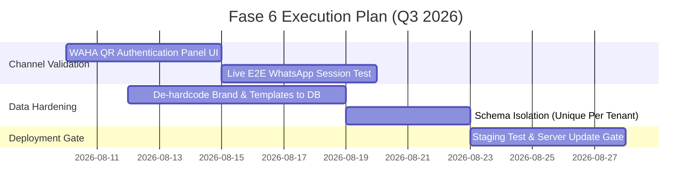
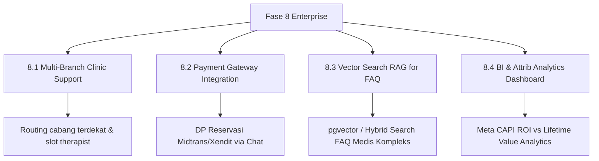

# Project Roadmap — WhatsApp Clinic Bot Engine

**Versi Roadmap:** 1.0  
**Tanggal Diperbarui:** 12 Agustus 2026  
**Status Proyek:** Production-Ready (Fase 1 – 5 Selesai & Tervalidasi) | Persiapan SaaS Multi-Tenant & Live Deployment

---

## 📌 Ringkasan Visi & Status Proyek

WhatsApp Clinic Bot Engine dirancang sebagai platform otomatisasi percakapan klinik berbasis **Node.js (TypeScript), Fastify, Prisma/PostgreSQL, Redis/BullMQ**, serta **WAHA (WhatsApp HTTP API)** dan **Meta WABA (WhatsApp Business API)**. 

Sistem ini membantu klinik mengotomasi percakapan dari sapaan awal, deteksi lokasi & kalkulasi ongkir presisi, pengiriman katalog & pricelist, reservasi layanan, hingga pengingat jadwal dan kampanye follow-up pasca-treatment otomatis.

```
       [ Fase 1 - 5: CORE ENGINE & MULTI-CHANNEL ]  ==> ✅ SELESAI (PASS 100% ~800 Tests)
                            │
                            ▼
       [ Fase 6: STAGING VALIDATION & CLEANUP ]     ==> 🔄 SEDANG BERJALAN (Q3 2026)
                            │
                            ▼
       [ Fase 7: FULL SAAS MULTI-TENANT ENABLEMENT ] ==> 📅 MENDATANG (Q4 2026)
                            │
                            ▼
       [ Fase 8: ENTERPRISE & INTELLIGENCE ]        ==> 🚀 MASA DEPAN (2027)
```

---

## 🛠️ Ringkasan Status Fase (Status Overview)

| Fase | Nama Fase | Focus Target | Status |
|---|---|---|---|
| **Fase 1** | Conversation Engine & Core Pipeline | State machine chat, geocoding, ongkir, FAQ, escalation | ✅ Selesai |
| **Fase 2** | Scheduling & Follow-Up Engine | Google Calendar, pengingat H-1, follow-up +3/+7/+14 & +1/+2/+3 bln | ✅ Selesai |
| **Fase 3** | Chat Hardening & Edge Cases | Anti-shock medical alert, suppression greeting, early location | ✅ Selesai |
| **Fase 4** | AI Router & System Observability | 11-intent classifier, shadow mode evaluation, `/admin/debug` | ✅ Selesai |
| **Fase 5** | Channel Ops & Multi-Landing Page | Dual-gateway WAHA/WABA, landing page + Meta Pixel/CAPI, lifecycle | ✅ Selesai |
| **Fase 6** | Validation & Business Data Cleanup | Staging WAHA QR UI, data brand per-tenant DB, live test gate | 🔄 In Progress |
| **Fase 7** | Full SaaS Multi-Tenant Enablement | Dynamic webhook router, per-tenant session pool, RBAC UI | 📅 Planned |
| **Fase 8** | Enterprise & Intelligence Upgrades | Multi-branch clinic, Payment Gateway, Vector RAG FAQ, BI Analytics | 🚀 Backlog |

---

## ✅ 1. Fase yang Sudah Selesai (Completed Milestones)

### 🟢 Fase 1 — Conversation Engine & Core Pipeline
- **State Machine Chat**: Alur percakapan otomatis (Greeting → Location → Delivery Shipping Calculation → Interest → Reservation → Confirmation).
- **Geocoding & Ongkir**: Integrasi Google Maps Geocoding, OpenRouteService Directions API (jarak rute kendaraan asli) dengan fallback Haversine distance, gazetteer n-gram candidate matching, dan LLM geocoding fallback (DeepSeek V4 Flash).
- **Human Escalation & Auto-Release**: Eskalasi otomatis ke admin jika pertanyaan butuh judgment manusia/jadwal spesifik. Bot senyap untuk nomor tersebut dan aktif kembali otomatis setelah timeout 6 jam idle.
- **Knowledge Base & FAQ**: Menjawab pertanyaan umum (harga, layanan, lokasi) tanpa merusak state percakapan yang sedang berjalan.
- **Anti-Spam & Protection**: Protection flood, duplicate message detection, auto-block spammer, dan rate limiting.

### 🟢 Fase 2 — Scheduling & Follow-Up Automation Engine
- **Google Calendar Sync**: Integrasi reservasi yang dikonfirmasi admin ke Google Calendar.
- **Pengingat H-1 (Morning Reminder)**: Cron harian (06:00 WIB) untuk kirim pengingat ke customer yang berjadwal hari H.
- **Follow-up Pasca-Treatment**: Follow-up kepuasan/review H+1 (07:00 WIB).
- **Follow-up Belum Purchase**: Kampanye otomatis di hari ke-3, 7, dan 14 untuk customer yang berhenti di tengah alur reservasi. Auto-cancel jika ada booking baru.
- **Follow-up Treatment Lanjutan**: Penawaran ulang otomatis di bulan ke-1, 2, dan 3 pasca-treatment terakhir.
- **Lost Customer & Repeat Order Management**: Penandaan status customer `lost` setelah 3 bulan tanpa respon (grace period 3 hari), dan penandaan `repeat_order` untuk booking lanjutan.

### 🟢 Fase 3 — Chat Hardening & UX Enhancements
- **Greeting Suppression**: Meredam greeting "Halo Bunda" jika customer pernah chat <48 jam terakhir.
- **Pricelist Image Auto-Send**: Pengiriman otomatis gambar pricelist saat lokasi terkonfirmasi.
- **Early Location Detection**: Menangkap alamat lengkap pada pesan pertama tanpa menanyakan lokasi berulang.
- **Reservation Form Protection**: Validasi form reservasi tidak dikirim bila lokasi/kelurahan belum jelas.
- **Medical Concern Admin Alert**: Alert instan ke admin (Telegram/emergency log) tanpa mengirim pesan shock ke customer; penanganan medis diserahkan ke bidan/admin.

### 🟢 Fase 4 — AI Router Engine, NLU Layer & System Observability
- **AI Router Engine**: Klasifikasi 11 intent terstruktur (Zod schema validation, 1x retry hint, circuit breaker 5 error/60s).
- **Shadow Mode Evaluator**: Evaluasi akurasi router AI di latar belakang (`AI_ROUTER_SHADOW_MODE=true`) tanpa mempengaruhi produksi.
- **Eskalasi UNKNOWN Berulang**: Eskalasi otomatis ke human jika customer mendapat intent `UNKNOWN` 2x berturut-turut.
- **Shadow Mode Accuracy Gate**: CLI script `check-router-accuracy.ts` untuk mengukur match rate sebelum mematikan shadow mode.
- **System Debug Dashboard**: Real-time observability dashboard di `/admin/debug` (5 tab: Overview, Router, Log Buffer, Message Trace, Conversation Trace).

### 🟢 Fase 5 — Channel Ops, Multi-Landing Page & Multi-Tenant Infrastructure
- **Dual-Gateway WhatsApp**: Driver `WahaGatewayDriver` dan `WabaGatewayDriver` (Meta Cloud API v25) per-tenant dengan enkripsi kredensial AES-256-GCM.
- **Multi-Landing Page System**: Landing page di-serve langsung oleh bot (`/go`, `/promo/:slug`, `/:slug`) dengan dua mode: `RAW_HTML` (17-layer sanitization) & `STRUCTURED_JSON`.
- **Meta Pixel + Server-Side CAPI**: Tracking event (`PageView`, `Lead`, `Purchase`, `Contact`, dll) dengan atribusi same-origin (`fbclid`, `_fbp`, `_fbc`, UTM).
- **Price Answer & Phrasing Services**: Deterministic price answer service dari catalog DB + natural phrasing service LLM dengan fallback template statis & opener tracker.
- **Reservation Lifecycle & Label Reconciliation**: Cron periodik (60 menit) penyelarasan label WA vs DB (`repeat`, `pending payment`, hapus `new customer`).

---

## 🔄 2. Fase Berjalan / Short-Term Focus (Fase 6 — Q3 2026)

Fase ini berfokus pada **pemantapan validasi live, kebersihan data bisnis (de-hardcoding), dan penyempurnaan UI Admin Dashboard**.



### 6.1 Panel Authentikasi WAHA QR di Admin Dashboard UI (Fitur Terencana)
- **Tujuan:** Memungkinkan admin melakukan scan QR code WAHA langsung dari Admin UI tanpa membuka dashboard WAHA terpisah.
- **Komponen**:
  - `WahaClient.getAuthQr()` / `/api/{session}/auth/qr`
  - REST API Admin: `GET /api/admin/whatsapp-provider/qr`
  - Component React: Panel QR render dengan auto-polling status koneksi.

### 6.2 Pembersihan Business Data Hardcoded (Fase 6 Hardening)
- **Tujuan:** Menghilangkan seluruh sisa nilai brand/template bisnis hardcoded agar 100% data bisnis dapat dikonfigurasi per-tenant via DB/Admin UI.
- **Item Pekerjaan**:
  - Migrasi `TEMPLATES` dan 14+ `followup-templates.ts` untuk selalu membaca DB `TenantPersona` / `FollowUpTemplate`.
  - Penyeragaman ejaan brand via `getBrandIdentity(tenantId)`.
  - Isolasi skema DB: Ubah `@unique` global pada `Customer.phone` dan `AdClick.trackingCode` menjadi `@@unique([tenant_id, phone])`.

### 6.3 Validasi & Server Update Gate (Production Deployment)
- **Tujuan:** Menjamin keandalan sebelum dilakukan pembaruan ke server live.
- **Mandat**: Sesuai `.agents/rules/server-update-gate.md`, seluruh eksperimen, simulasi, dan testing dilakukan di `localhost`. Deploy ke server live HANYA dilakukan atas perintah eksplisit user setelah konfirmasi 2x.

---

## 📅 3. Fase Mendatang / Medium-Term (Fase 7 — Q4 2026: Full SaaS Multi-Tenant)

Fase ini akan mengubah arsitektur bot dari **Single-Tenant Slot Pattern** menjadi **Full Multi-Tenant SaaS Platform**.

### 7.1 Dynamic Multi-Tenant Webhook Resolver
- **Masalah Saat Ini:** Route webhook (`/webhook` dan `/api/webhook/waba`) masih menggunakan `DEFAULT_TENANT_ID`.
- **Solusi**:
  - Resolver tenant berbasis WAHA Session ID / WABA Phone Number ID dari payload webhook.
  - Context propagation `tenant_id` ke seluruh pipeline state machine dan BullMQ worker.

### 7.2 Multi-Session WAHA & Connection Pool Manager
- **Solusi**:
  - `WahaClientFactory`: Pengelolaan multiple instance/session WAHA per tenant.
  - Webhooks dispatching dinamis ke tenant workspace yang sesuai.

### 7.3 Multi-Tenant Admin Portal & RBAC (Role-Based Access Control)
- **Fitur Portal**:
  - Autentikasi Admin per-tenant (JWT/Session berbasis tenant).
  - UI Isolation: Admin Tenant A hanya melihat data customer, reservasi, dan landing page miliknya.
  - Role Superadmin untuk manajemen tenant, paket billing, dan sistem monitoring global.

### 7.4 Dynamic Persona & Multi-Language Configuration
- **Fitur Config**:
  - Management UI untuk System Prompt LLM, tone of voice, greeting templates, dan bahasa per tenant.
  - Custom Katalog Treatment & Custom Tier Ongkir editable via UI Admin.

---

## 🚀 4. Fase Masa Depan / Long-Term (Fase 8 — 2027: Enterprise & Intelligence)



### 8.1 Multi-Branch Clinic Support
- Penanganan lokasi multi-cabang untuk satu tenant klinik.
- Auto-routing reservasi berdasarkan ketersediaan therapist dan cabang terdekat dari posisi customer.

### 8.2 Payment Gateway Integration (Midtrans / Xendit)
- Pengiriman link pembayaran DP / Lunas otomatis via chat WhatsApp dan landing page.
- Auto-confirm reservasi setelah webhook payment gate menerima sinyal sukses.

### 8.3 Vector Search (RAG) for Complex Medical FAQ
- Upgrade pencarian Postgres Full-Text Search ke **Vector Search (pgvector)**.
- RAG (Retrieval-Augmented Generation) untuk dokumen medis klinik yang tebal dan pertanyaan customer yang kompleks.

### 8.4 Advanced BI & Attrib Analytics Dashboard
- Measurement ROI kampanye iklan Meta (mengisi gap dari Ad Click → WhatsApp Lead → Reservasi → LTV Purchase).
- Dashboard performa CS/Bidan dan efisiensi konversi bot per periode.

---

## 🛡️ Prinsip Arsitektur & Rules Wajib (Mandatory Rules)

1. **SaaS-Readiness Mandate (`.agents/skills/saas-readiness/SKILL.md`)**:
   - Seluruh fitur baru / tuning TIDAK boleh di-hardcode di file global.
   - Pengecualian wajib lewat **Confirmation Gate** (stop & konfirmasi pros/cons ke user).
2. **Offline-First Test Suite**:
   - Unit test (`npm test`) WAJIB bisa berjalan offline tanpa DB asli atau koneksi internet (menggunakan mock in-memory).
3. **No Native Confirm/Alert di Dashboard (`.agents/skills/no-native-confirm-alert/SKILL.md`)**:
   - Komponen React `packages/admin-dashboard` DILARANG memakai `window.confirm()` / `window.alert()`. Gunakan hook `useUiFeedback`.
4. **QA Test Labeling Mandate (`.agents/skills/qa-test-labeling/SKILL.md`)**:
   - Semua jalur simulasi/chat test (CLI `npm run chat`, sandbox `/api/admin/sandbox/chat`) WAJIB menandai `Customer.is_sandbox_test = true`.
5. **Server Update Gate (`.agents/rules/server-update-gate.md`)**:
   - DILARANG deploy / update langsung ke server live tanpa persetujuan eksplisit 2x dari user. Seluruh testing dilakukan di localhost.

---

## 📊 Indikator Kualitas & Maintenance Matrix

| Metrik Kualitas | Target Threshold | Metode Verifikasi |
|---|---|---|
| **Unit & Integration Test** | 100% PASS (~800 tests) | `npm test` |
| **AI Router Shadow Accuracy** | Match Rate ≥ 85% | `npx tsx src/scripts/check-router-accuracy.ts --days=7` |
| **Unmapped Intent Rate** | ≤ 5% | `check-router-accuracy.ts` |
| **TypeScript Build** | 0 Error | `npm run build` |
| **Database Migration Safety** | Zero Drift | `npx prisma migrate diff` |

---

*Dokumen ini merupakan panduan utama pengembang dan stakeholder untuk arah pengembangan WhatsApp Clinic Bot Engine.*
