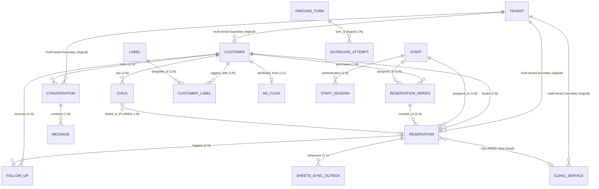
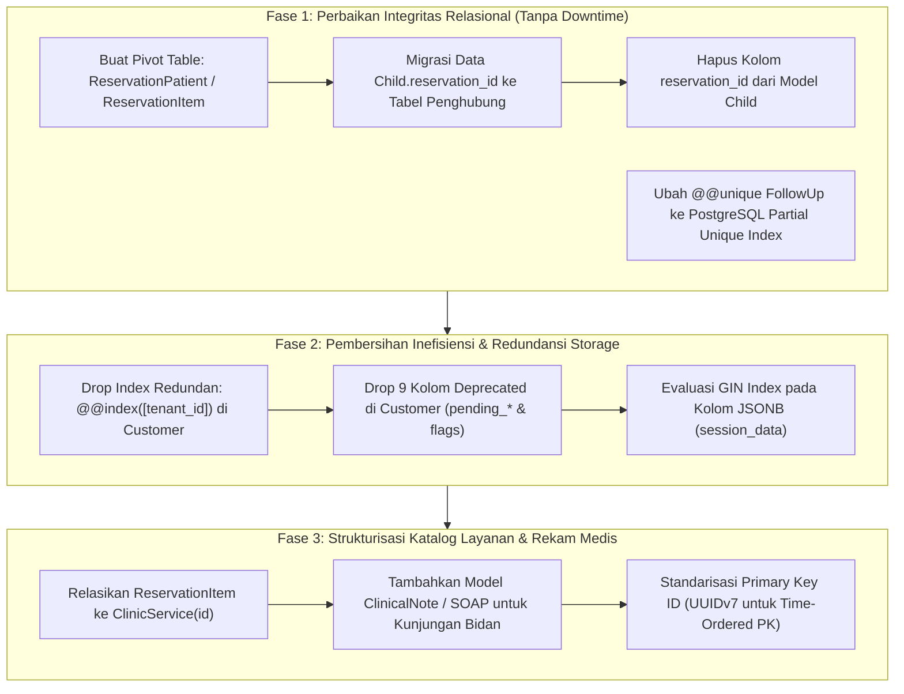

# Laporan Audit & Analisis Entity Relationship Diagram (ERD) Sistem

**Klinik WhatsApp Bot Engine (Fastify, Prisma, PostgreSQL)**  
*Dokumen Hasil Audit Struktur Basis Data, Relasi, Efektivitas Bisnis, dan Efisiensi Performa.*

---

## 1. Visualisasi Diagram Hubungan Entitas (ERD)

Berikut adalah peta relasi entitas inti sistem (*Core Entities*) yang menggambarkan alur operasional klinik: mulai dari pasien (*Customer*), anak (*Child*), percakapan WhatsApp (*Conversation* & *Message*), reservasi (*Reservation* & *Series*), penugasan tenaga medis (*Staff*), hingga katalog layanan & antrean pesan (*Turn & Outbox*).



---

## 2. Ringkasan Eksekutif: Efektif dan Efisienkah ERD Saat Ini?

| Dimensi Evaluasi | Status | Skor | Kesimpulan Utama |
|---|:---:|:---:|---|
| **Efektivitas Bisnis (Domain Fit)** | ⚠️ **Cukup / Perlu Perbaikan** | **7.5 / 10** | Berhasil mendukung transaksi WhatsApp, paket multi-sesi, ongkir dinamis, dan persona AI. Namun memiliki **2 cacat relasi kritis**: relasi terbalik `Child` ↔ `Reservation` dan ketiadaan relasi struktural `Reservation` ↔ `ClinicService`. |
| **Efisiensi Database (Storage & Index)** | ⚠️ **Cukup / Boros di Sisi Tertentu** | **7.0 / 10** | Strategi antrean *outbox* dan pemisahan state episodik via JSONB sangat efisien. Namun terdapat **redundansi index** pada kolom `tenant_id`, **kolom *deprecated* yang belum di-drop**, dan UUIDv4 acak yang berisiko fragmentasi index pada data jutaan baris. |
| **Integritas Relasional (Data Integrity)** | 🔴 **Rentan** | **6.5 / 10** | Tidak adanya *Physical Foreign Key* ke tabel `Tenant`, serta *unique constraint* kaku pada `FollowUp` yang memaksa aplikasi menghapus relasi kunci (`reservation_id: null`) saat pembatalan (*amnesia data*). |

---

## 3. Analisis Mendalam: Aspek yang Sudah Efektif & Efisien

Sistem ini memiliki beberapa fondasi arsitektur basis data yang dirancang sangat matang untuk beban kerja *real-time conversational commerce*:

1. **Pemisahan State Episodik vs Profil Durable (Stage 4 Architecture)**:
   - **Desain**: `Conversation.session_data` (JSONB) menampung keranjang belanja (*cart*), keluhan sementara, dan draft booking. Profil pasien permanen (alamat terverifikasi, nomor HP, riwayat anak) tetap berada di tabel `Customer`.
   - **Efisiensi**: Percakapan baru tidak mewarisi kotoran data lama, dan query profil pasien tidak perlu membedah payload transaksi harian yang berat.
2. **Durable Inbound Turn & Outbox Ledger (Stage 5 Architecture)**:
   - **Desain**: `InboundTurn` mencatat status penerimaan pesan masuk secara idempoten, sedangkan `OutboundAttempt` mencatat keberhasilan pengiriman per-*bubble* chat (`SENDING`, `SENT`, `FAILED`, `UNKNOWN`).
   - **Efisiensi**: Mencegah pengiriman pesan berulang (*duplicate message storm*) saat webhook WhatsApp mengalami *retry*, tanpa perlu membebani tabel bisnis utama (`messages` atau `reservations`).
3. **Arsitektur Antrean Terisolasi (*Non-Blocking Outbox*)**:
   - **Desain**: `SheetsSyncOutbox` dan `AdminNotificationLog` memisahkan proses tulis chat dengan integrasi lambat pihak ketiga (Google Sheets API & Telegram).
   - **Efektivitas**: Webhook merespons WhatsApp dalam hitungan milidetik, sementara sinkronisasi eksternal dikerjakan oleh pekerja latar belakang (*background worker*).
4. **Data-Driven Configuration (Zero Hardcoded Business Rules)**:
   - **Desain**: Seluruh tarif pengiriman (`DeliveryTier`), konfigurasi model AI (`TenantAiConfig`), kepribadian bot (`TenantPersona`), dan aturan SOP (`ClinicPolicy`) berada di tabel database, mendukung multi-tenant SaaS tanpa perlu *redeploy* kode aplikasi.

---

## 4. Temuan Kritis: Titik Cacat Desain & Inefisiensi

### Temuan 1 (Kritis): Cacat Relasi Terbalik `Child` ↔ `Reservation` (Data Overwrite pada Repeat Order)
- **Letak Skema**: `prisma/schema.prisma` baris 158–167:
  ```prisma
  model Child {
    id             String       @id @default(uuid())
    customer_id    String
    reservation_id String?
    reservation    Reservation? @relation(fields: [reservation_id], references: [id], onDelete: SetNull)
    name           String
    @@unique([customer_id, name])
  }
  ```
- **Masalah Arsitektural**:
  - Kolom `reservation_id` ditaruh di dalam tabel `Child` dengan relasi 1:N ke `Reservation`.
  - Pada saat yang sama, tabel `Child` membatasi `@@unique([customer_id, name])` (seorang ibu hanya punya 1 baris untuk anak bernama "Kenzi").
  - **Dampak Fatal**: Ketika "Kenzi" melakukan pemesanan ulang (*Repeat Order*) pada tanggal 15 Oktober setelah sebelumnya pernah terapi pada 1 Oktober:
    `Child.reservation_id` akan **ditimpa** dengan ID reservasi baru (`res-2`).
    Akibatnya, data reservasi lama (`res-1`) kehilangan relasi ke anaknya (`res-1.children` menjadi kosong)!
  - **Bukti di Kode Sumber**: Pada `src/services/staff-reservation.service.ts` baris 110–126, developer terpaksa membuat *workaround* rumit:
    ```ts
    // r.children = anak pada reservasi ini. cust.children = SEMUA anak customer.
    // Dipakai HANYA sebagai fallback untuk reservasi lama yang belum mengaitkan anak.
    const source = reservationList.length > 0 ? reservationList : customerChildren || [];
    ```
    Jika seorang ibu memiliki 2 anak (misal Bayi A 3 bulan dan Kakak B 4 tahun), saat reservasi lama dibuka kembali oleh staf, kartu tugas akan keliru menampilkan *seluruh* anak karena relasi reservasi aslinya telah terputus!
- **Tingkat Keparahan**: **KRITIS** (Merusak integritas riwayat rekam medis dan penugasan terapis).

---

### Temuan 2 (Kritis): Putusnya Foreign Key ke Katalog Layanan (`Reservation` ↔ `ClinicService`)
- **Letak Skema**: `prisma/schema.prisma` baris 277–278:
  ```prisma
  model Reservation {
    treatment_category TreatmentCategory
    treatment_detail   String? // Hanya teks bebas (misal: "Baby Massage Ceria, Tindik")
    // TIDAK ADA foreign key ke ClinicService!
  }
  ```
- **Masalah Arsitektural**:
  - `ClinicService` adalah tabel master katalog layanan dan harga. Namun, `Reservation` dan `ReservationSeries` sama sekali tidak memiliki relasi Foreign Key ke `ClinicService`.
  - Treatment disimpan murni sebagai teks bebas (`treatment_detail String?`).
- **Dampak Sistemik**:
  1. **Melanggar 1NF (Bentuk Normal Pertama)**: Jika pasien memesan kombinasi 2 layanan (misal "Pijat Bayi + Tindik"), data digabung menjadi satu string teks tanpa pemisah atomik.
  2. **Kebutaan Analitik & Laporan**: Manajemen klinik tidak dapat melakukan `GROUP BY service_id` untuk mengetahui layanan terlaris secara akurat karena nama layanan rawan variasi teks atau typo (misal: "Pijat Bayi Ceria" vs "Baby Massage Ceria" vs "Pijat Ceria").
  3. **Tarif Tidak Tervalidasi Relasional**: Harga hanya dicatat sebagai snapshot angka mentah (`purchase_value Int?`) tanpa keterkaitan ke tarif katalog resmi.
- **Tingkat Keparahan**: **TINGGI** (Menghambat analitik bisnis, pelaporan keuangan, dan otomasi durasi per layanan).

---

### Temuan 3 (Tinggi): Constraint `FollowUp` Kaku Memaksa Mutasi "Amnesia" Relasi
- **Letak Skema**: `prisma/schema.prisma` baris 542:
  ```prisma
  model FollowUp {
    @@unique([tenant_id, reservation_id, type, stage])
  }
  ```
- **Masalah Arsitektural**:
  - Constraint ini mengunci kombinasi `(tenant_id, reservation_id, type, stage)` tanpa mempedulikan status follow-up (`PENDING`, `QUEUED`, `CANCELLED`, `SENT`).
  - Ketika sebuah follow-up dibatalkan karena ada reservasi baru yang masuk, jika sistem ingin membuat follow-up baru di masa depan untuk reservasi yang sama, DB akan menolak dengan error `P2002 Unique Constraint Violation`.
  - **Bukti di Kode Sumber**: Pada `src/services/follow-up.service.ts` baris 563–565 dan 740:
    ```ts
    // Neutralkan reservation_id: baris CANCELLED tidak lagi terkait reservasi
    // aktif, menjaga invarian @@unique([tenant_id, reservation_id, type, stage]).
    data: { status: 'CANCELLED', cancel_reason: ..., reservation_id: null }
    ```
    Developer terpaksa menghapus `reservation_id` (diubah menjadi `null`) agar constraint tidak bentrok!
  - **Dampak Fatal**: Data historis follow-up kehilangan rekam jejak mengenai reservasi mana yang memicunya.
- **Tingkat Keparahan**: **TINGGI** (Menghancurkan jejak audit *marketing intelligence* dan analitik konversi follow-up).

---

### Temuan 4 (Sedang): Redundansi Index (Index Bloat) pada Tabel `Customer`
- **Letak Skema**: `prisma/schema.prisma` baris 141–149:
  ```prisma
  @@index([tenant_id])
  @@index([tenant_id, created_at])
  @@index([tenant_id, is_sandbox_test])
  @@index([tenant_id, is_internal_staff])
  @@index([tenant_id, is_mql])
  @@index([tenant_id, is_sandbox_test, created_at])
  @@index([tenant_id, deleted_at])
  @@unique([tenant_id, phone])
  ```
- **Masalah Efisiensi Database**:
  - Pada mesin PostgreSQL, index B-Tree pada kolom gabungan `(A, B)` secara otomatis dapat melayani query yang hanya mencari berdasarkan kolom `(A)` (*Leftmost Prefix Rule*).
  - Karena sistem sudah memiliki `@@index([tenant_id, created_at])` dan `@@unique([tenant_id, phone])`, index mandiri `@@index([tenant_id])` menjadi **100% redundan dan mubazir**.
  - **Dampak**: Setiap operasi `INSERT` atau `UPDATE` data customer membuang komputasi disk I/O dan memori RAM database (*buffer pool*) untuk memelihara index yang tidak pernah dipakai oleh Postgres Query Planner.
- **Tingkat Keparahan**: **SEDANG** (Inefisiensi performa tulis dan pemborosan ruang penyimpanan disk).

---

### Temuan 5 (Sedang): Sampah Kolom Usang (*Deprecated Debt*) pada Model `Customer`
- **Letak Skema**: `prisma/schema.prisma` baris 79–85 dan 104–116:
  - `pending_kelurahan`, `pending_kecamatan`, `pending_kota`, `pending_lat`, `pending_lng`, `pending_zipcode` (6 kolom).
  - `pricelist_sent`, `share_location_sent`, `mql_bubble_count` (3 kolom).
- **Masalah**:
  - Kolom-kolom ini adalah *state* percakapan sementara (*episodic state*) yang sudah berhasil dipindahkan ke `Conversation.session_data`.
  - Menyimpannya di tabel utama `customers` membuat ukuran baris (*row width*) membesar, menurunkan kepadatan halaman data di disk (*page density*), dan memperlambat *full table scan* atau pembacaan daftar pasien di Admin Dashboard.
- **Tingkat Keparahan**: **SEDANG** (Technical debt yang siap dibersihkan / di-drop).

---

### Temuan 6 (Sedang): Ketiadaan *Physical Foreign Key* ke Tabel `Tenant` (*Loose Tenancy*)
- **Letak Skema**:
  - 40+ tabel menyimpan kolom `tenant_id String @default("default-tenant")`, namun **tidak ada satupun** yang memiliki `@relation(fields: [tenant_id], references: [id])` ke tabel `Tenant`.
- **Analisis Pro & Kontra**:
  - *Sisi Positif*: Fleksibel, mempermudah pengujian lokal/mock, dan memudahkan pemisahan basis data per-tenant (*database-per-tenant sharding*) di masa depan.
  - *Sisi Negatif*: Tidak ada penegakan integritas data di level mesin PostgreSQL. Jika terjadi kesalahan ketik atau mutasi yang keliru memasukkan `tenant_id`, database akan menerima baris yatim piatu (*orphan data*) tanpa peringatan.
- **Tingkat Keparahan**: **SEDANG** (Arsitektural: perlu penegasan apakah sistem memilih model *Soft-Tenancy* atau *Hard Referential Multi-Tenancy*).

---

## 5. Rencana Aksi Fondasional (Rekomendasi Solusi)

Untuk menjadikan ERD sistem ini **100% Efektif (Akurat secara Bisnis)** dan **100% Efisien (Optimal secara Performa)**, perbaikan harus dilakukan secara bertahap (*staged migration*) tanpa menimbulkan *downtime*:



### Rincian Perbaikan Desain Skema Rekomendasi:

#### 1. Perbaikan Relasi Anak ↔ Reservasi (Many-to-Many via Pivot):
```prisma
// Menggantikan Child.reservation_id
model ReservationPatient {
  id              String       @id @default(uuid())
  tenant_id       String       @default("default-tenant")
  reservation_id  String
  reservation     Reservation  @relation(fields: [reservation_id], references: [id], onDelete: Cascade)
  child_id        String
  child           Child        @relation(fields: [child_id], references: [id], onDelete: Restrict)
  notes           String?
  created_at      DateTime     @default(now())

  @@unique([reservation_id, child_id])
  @@index([tenant_id, reservation_id])
  @@index([child_id])
  @@map("reservation_patients")
}
```
*Hasil*: Seorang anak dapat memiliki puluhan riwayat reservasi tanpa saling menimpa, dan satu reservasi dapat mencakup lebih dari satu anak (misal: anak kembar) secara rapi.

#### 2. Perbaikan Constraint Follow-Up via Partial Unique Index (SQL Migrasi):
Gantikan unique constraint kaku dengan index kondisional di PostgreSQL:
```sql
-- Hapus constraint lama yang memicu error saat baris di-cancel
ALTER TABLE follow_ups DROP CONSTRAINT IF EXISTS follow_ups_tenant_id_reservation_id_type_stage_key;

-- Buat Partial Unique Index: Unik HANYA untuk status yang masih aktif/berjalan
CREATE UNIQUE INDEX follow_ups_active_lifecycle_uidx 
ON follow_ups (tenant_id, reservation_id, type, stage) 
WHERE status IN ('PENDING', 'QUEUED');
```
*Hasil*: Baris dengan status `CANCELLED` atau `SENT` tetap mempertahankan `reservation_id` aslinya, jejak audit aman, dan aplikasi tidak perlu lagi menjalankan mutasi buatan `reservation_id: null`.

#### 3. Pembersihan Index Redundan pada Customer:
Hapus `@@index([tenant_id])` dari model `Customer`. Query berbasis `tenant_id` akan otomatis dilayani oleh `@@unique([tenant_id, phone])` atau `@@index([tenant_id, created_at])`.

---

## 6. Tabel Evaluasi Komprehensif Seluruh Entitas (44 Model)

| Kategori | Model / Tabel | Efektivitas Bisnis | Efisiensi Teknis | Catatan Evaluasi & Rekomendasi |
|---|---|:---:|:---:|---|
| **Core** | `Customer` | Baik | ⚠️ Perlu Pembersihan | Hapus kolom `pending_*`, hapus index `tenant_id` tunggal. |
| **Core** | `Child` | 🔴 Cacat Relasi | Baik | Pindahkan `reservation_id` ke tabel penghubung (*pivot*). |
| **Core** | `Reservation` | ⚠️ Kurang Terstruktur | Baik | Hubungkan ke `ClinicService`, pisahkan anak ke tabel pivot. |
| **Core** | `ReservationSeries`| Sangat Baik | Baik | Mendukung paket multi-sesi dengan baik. |
| **Core** | `ClinicService` | Baik | Baik | Master katalog layanan & batasan usia. |
| **Core** | `DeliveryTier` | Sangat Baik | Baik | Aturan ongkir dinamis berbasis tiering jarak. |
| **Core** | `Staff` & `Session` | Sangat Baik | Baik | RBAC & manajemen penugasan bidan/terapis. |
| **Chat** | `Conversation` | Sangat Baik | Sangat Baik | Pemisahan `session_data` JSONB sangat efektif. |
| **Chat** | `Message` | Sangat Baik | Baik | Pencatatan status pengiriman dan pesan WhatsApp. |
| **Chat** | `InboundTurn` | Sangat Baik | Sangat Baik | Idempoten per `(tenant, provider, wa_id)`. |
| **Chat** | `OutboundAttempt` | Sangat Baik | Sangat Baik | Ledger per-bubble untuk mencegah double-reply. |
| **Config**| `TenantPromptConfig`| Sangat Baik | Baik | Aturan instruksi dan batasan negatif AI tersimpan di DB. |
| **Config**| `ClinicPolicy` | Sangat Baik | Baik | Knowledge base kebijakan klinik berbasis topik. |
| **Sync** | `SheetsSyncOutbox` | Sangat Baik | Sangat Baik | Antrean non-blocking ke Google Sheets. |
| **Mktg** | `FollowUp` | ⚠️ Cacat Constraint | Cukup | Ubah unique constraint ke PostgreSQL Partial Index. |
| **Mktg** | `AdClick` & `Ctwa` | Baik | Baik | Atribusi kampanye iklan Meta & WhatsApp. |
