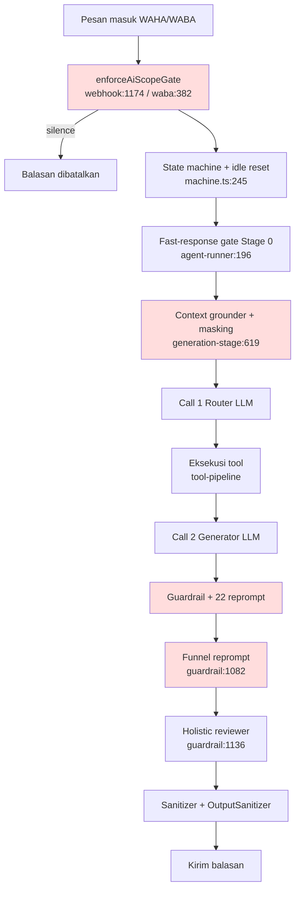

# Audit Kerapuhan Chatbot — 2026-10-06

Status: READ-ONLY. Fase 0–7 selesai (Fase 7 dijalankan read-only di server produksi atas izin pemilik, 2026-10-06).
Semua angka hasil pengukuran langsung (repo + log/DB produksi 7 hari). Tidak ada file source/DB produksi yang diubah.

## 1. Apa yang terjadi (≤10 baris)

1. Bot terus salah menangani customer, tapi selalu di tempat berbeda.
2. 311 commit dalam 30 hari; 144 di antaranya berawalan `fix` (~46–53%).
3. `CHANGELOG.md` 8.255 baris, `KNOWN_ISSUES.md` 4.932 baris, 281 baris "OPEN".
4. Ada 610 file test, hampir semua hijau, tapi insiden tetap lolos ke produksi.
5. Per giliran customer, balasan bisa ditulis-ulang oleh lapisan sangat banyak.
6. "Kebenaran" soal kondisi percakapan tersimpan di banyak tempat sekaligus.
7. Banyak keputusan diambil dengan mencocokkan teks (kata/kalimat), bukan status data.
8. Perbaikan yang berulang menambah lapisan (kata/regex/prompt "DILARANG"), bukan membenahi data/state.
9. Akibatnya: satu perbaikan menutup satu celah, membuka celah lain.
10. Laporan ini menjelaskan akar strukturalnya, bukan bug per bug.

## 2. Apa temuannya

### 2.1 Angka kunci

| Metrik | Nilai | Bukti |
|---|---|---|
| Commit 30 hari | 311 | `git log --since="30 days ago"` |
| Commit 60 hari | 710 | `git log --since="60 days ago"` |
| Commit `fix` 30 hari | 144 | `git log ... \| Select-String "fix"` |
| File test | 610 | `Get-ChildItem tests -Recurse *.test.ts` |
| Test unit vs integrasi | 549 vs 54 | hitung per direktori |
| `CHANGELOG.md` | 8.255 baris | `Measure-Object -Line` |
| `KNOWN_ISSUES.md` | 4.932 baris; 281 "OPEN" | `Select-String "OPEN"` |
| `REPROMPT` di guardrail | 22 | `git grep -c REPROMPT` |
| Event/log di guardrail | 38 | `git grep "event: '"` |
| Panggilan LLM ulang di guardrail | 23 | `git grep -c executeChat` |
| Teks "DILARANG" di prompt | 98 | total 8 file |
| `.includes('` di `src/v3` | 185 | `git grep -c` |
| `.test(` di `src/v3` | 102 | `git grep -c` |
| Produksi: baris log LLM (3 hari) | 168 baris / 44 percakapan | `llm-2026-10-0*.jsonl` |
| Produksi: rata-rata baris LLM per percakapan | 3,82 | analisis log |
| Produksi: rata-rata panggilan LLM per giliran | 1,56 | `callSequence` (dist 1:99, 2:22, 3:19) |
| Produksi: latensi LLM p50 / p95 | 3.638 ms / 26.104 ms | `durationMs` |
| Produksi: percakapan 7 hari (created) | 73; takeover 16 | query DB |
| Produksi: `REVOKE_MESSAGE` / 7 hari | 42 | `audit_logs` |
| Produksi: percakapan aktif 7 hari | 351 | `updated_at > now()-7d` |

### 2.1b Bukti produksi 7 hari (Fase 7, read-only)

Frekuensi event di `app-2026-10-*.log` (3 hari berkas):

| Event | Jumlah |
|---|---|
| TOOL_MASKING_ENFORCED_APPLIED | 98 |
| FALLBACK | 33 |
| REPROMPT | 20 |
| SANITIZER_REJECTED | 6 |
| FUNNEL_REPROMPT_APPLIED | 3 |
| FACTUAL_HALLUCINATION_DETECTED | 2 |
| HOLISTIC_REVIEW_APPLIED / SILENT_DROP_PREVENTED / NUMERIC_* | 0 |

Statistik LLM per giliran: 168 panggilan, 89 giliran → rata-rata **~1,9 panggilan/giliran**, puncak 3 (22 giliran pakai Call-2). Tool terbanyak: `calculate_delivery` 58, `get_catalog_and_price` 26, `get_clinic_policy_faq` 16.

**Rasio "percakapan diselamatkan admin" (proxy, bias ke atas):** `CONVERSATION_MANUAL_TAKEOVER` 34 dan `REVOKE_MESSAGE` 42 dalam 7 hari, dibanding 73 percakapan baru → **≥47% percakapan baru jatuh ke takeover manual**. Catatan jujur: log app hanya 3 hari (bukan 7), dan 34 takeover itu peristiwa, bukan percakapan unik.

Health: semua 168 panggilan status `SUCCESS`. Namun p95 latensi **26 detik** — di WhatsApp terasa seperti bot menghilang/lemot sebelum menjawab.

Tema perbaikan berulang di `CHANGELOG.md` (jumlah baris cocok): jadwal/reservasi 563; followup 267; lokasi/kelurahan 260; ongkir/delivery 214; Bunda 159; usia/umur 142; scope 77; pricelist 51; burst 27; reprompt 15.

Klasifikasi jenis perbaikan (sampel tiap tema): **A** (tambah kata/regex), **B** (tambah "DILARANG"), **C** (tambah reprompt/guardrail output), **D** (ubah state/skema/kontrak tool), **E** (lain).

| Tema | Jml | A | B | C | D | E | Contoh entri |
|---|---|---|---|---|---|---|---|
| jadwal/reservasi | 563 | 2 | 1 | 2 | 1 | 1 | `save_reservation` gate, jadwal follow-up 09:40 WIB |
| lokasi/kelurahan | 260 | 2 | 1 | 2 | 1 | 1 | "typo kelurahan", `STATE_AWARE_LOCATION_RECOVERY` |
| ongkir/delivery | 214 | 1 | 0 | 1 | 2 | 1 | fallback `delivery_fee`, "ongkir transparan" |
| Bunda | 159 | 1 | 1 | 1 | 0 | 1 | normalizer sapaan deterministik, maks 2x "Bunda" |
| usia/umur | 142 | 2 | 1 | 2 | 1 | 0 | "DILARANG todong usia", reprompt usia |
| followup | 267 | 1 | 0 | 1 | 2 | 1 | `FOLLOWUP_MAX_PER_DAY`, WINBACK_60D |

**Kesimpulan Fase 2: hipotesis TERBUKTI.** Mayoritas entri berjenis A/B/C (menambah lapisan kata/regex/prompt/reprompt). Hanya sebagian kecil berjenis D (benerin state/kontrak). Ciri khas: jumlah jenis A+B+C jauh melebihi D.

### 2.2 Akar masalah struktural (peringkat)

**R1 — Terlalu banyak "pengadil" per giliran, tanpa pemilik tunggal.**
Satu balasan bisa diubah/ditolak oleh: scope gate (`webhook.route.ts:1174`), state machine, tool-masker, router LLM Call 1, tool, generator Call 2, 22 reprompt, funnel reprompt (`guardrail-pipeline.ts:1031-1105`), holistic reviewer (`:1136`), sanitizer. Bukti: 38 event log + 23 panggilan `executeChat` di satu file. Insiden dijelaskan: funnel hapus tanya jadwal (conv 62e60d13), Wonokusumo, repo "recovery" bertumpuk.

**R2 — "Kebenaran" kondisi percakapan terduplikasi & multi-penulis (drift).**
Lihat 2.4. `current_state`, `session_data`, `last_message_at` vs `last_customer_message_at`, kolom Customer, Reservation, FollowUp, memory fallback. Tidak ada sinkronisasi tunggal. Insiden: reservasi completed tapi state tertinggal (drift), idle reset salah pemicu.

**R3 — Aturan bisnis/klinis hidup di kode sebagai daftar kata/regex.**
185 `.includes` + 102 `.test` di `src/v3`; `patient-extractor.ts` sendirian 64 `.includes`. Rekomendasi klinis pun pakai peta kata hardcode (lihat 2.5). Rapuh terhadap parafrase/typo/slang — sumber "bot ngawur" dan "bot tidak nyambung". Melanggar mandat non-hardcode & data-driven.

**R4 — LLM dipakai sebagai hakim state, tapi keputusannya baru tercatat kalau dia memanggil tool.**
`isFunnelCommitted` (`phase-resolver.ts:127`) bergantung pada `selectedTreatment`/`cartItems`/`booking`, yang hanya terisi lewat pemanggilan tool (`tool-pipeline.ts:875`). Kalau LLM menilai "committed" tapi tidak memanggil tool → state kosong → guardrail berikutnya salah paham. Ini sumber langsung conv 62e60d13.

**R5 — Strategi perbaikan menumpuk lapisan, bukan fondasi.**
98 "DILARANG" + 22 reprompt + 185 includes; 46–53% commit berlabel `fix`; KNOWN_ISSUES 4.932 baris dengan 281 OPEN. Ciri khas tambal-sulam yang dimandatkan HARAM.

### 2.3 Peta siapa yang memutuskan (mermaid)

| Komponen | Input | Bisa override siapa | Basis |
|---|---|---|---|
| scope gate | customer, conversation, teks | membatalkan SEMUA (silence) | state + teks |
| idle reset | `last_message_at` | reset state → INITIAL | state (+teks) |
| fast-response gate | teks asli | lewati LLM | teks (S) |
| tool-masker | frasa lokasi di teks | cabut tool dari LLM | teks (S/O) |
| Call 1 Router | prompt+riwayat | menentukan tool & argumen | LLM |
| tool eksekusi | args LLM | menulis `session` | mixed |
| Call 2 Generator | hasil tool | menulis draf | LLM |
| 22 reprompt | draf + pelanggaran | tulis ulang draf | campuran |
| funnel reprompt | teks `hari apa ya` | hapus CTA jadwal | teks (O) |
| holistic reviewer | daftar pelanggaran | tulis ulang penuh | tanda pelanggaran |
| sanitizer | teks | potong/bersihkan | teks (mayoritas T) |

Konflik antarlayer yang nyata:
- Funnel reprompt berbasis TEKS (`guardrail-pipeline.ts:1089`) sementara keputusan komitmen berbasis STATE (`phase-resolver.ts:127`) — dua sumber berbeda untuk satu pertanyaan.
- `agent-runner.ts:269` melakukan veto cart berdasarkan `routing.commitment === 'EXPLORING'` (putusan LLM), lalu guardrail lain menilai komitmen dari state; keduanya bisa bertentangan.

### 2.4 Drift state (tabel)

| Konsep | Lokasi simpan | Penulis | Risiko drift |
|---|---|---|---|
| Tahap percakapan | `Conversation.current_state` | repo (`conversation.repository.ts:70,143`), `conversation.service.ts` (banyak), webhook `:1457`, admin livechat `:755,810`, `command.service.ts:170,193` | Tinggi: banyak penulis, tak ada otoritas tunggal |
| Kondisi sesi detail | `Conversation.session_data` (GoalTracker) | `goal-tracker.ts:258 updateGoalSession`, agent & tool pipeline | Tinggi: JSON terpisah dari `current_state`, bisa tak sinkron |
| "Aktivitas terakhir" | `last_message_at` vs `last_customer_message_at` | `message.service` (riil) + bot follow-up | Tinggi: `ai-scope-gate:50` pakai `last_customer_*`, tapi `machine.ts:252` pakai `last_message_at` (ikut follow-up bot) → dua definisi "idle" |
| Komitmen customer | diturunkan dari `selectedTreatment`/`cartItems`/`booking` | hanya via tool (`tool-pipeline.ts:875`) | Tinggi: putusan LLM tanpa tool → tak tercatat |
| Siklus hidup pasien | kolom `Customer`, `Reservation.status`, `FollowUp` | banyak service | Sedang |
| Cadangan offline | memory fallback store | `db/client` mock & service fallback | Sedang: beda perilaku saat DB down |

Drift terbukti (terverifikasi di kode):
- `reservation-lifecycle.service.ts:281-295` (`onReservationCompleted`) mengosongkan `cartItems/selectedTreatment/booking` di V3 session, **tetapi tidak memperbarui `Conversation.current_state`**. Bukti: `git grep current_state` tidak menemukan penulisan di file itu. → state bisa tertinggal di `RESERVATION_SENT` walau reservasi selesai.
- `ai-scope-gate.service.ts:50` sengaja pakai `last_customer_message_at`; `machine.ts:252` pakai `last_message_at`. Dua jam idle berbeda → reset pada waktu yang tak konsisten.

### 2.5 Pencocokan teks semantik (S/O/T)

Total `src/v3`: `.includes('` = 185, `.test(` = 102. Kelompok: **S** = menebak maksud customer dari teks; **O** = menebak isi keluaran LLM; **T** = teknis murni (URL/angka/tag).

Estimasi berbasis konsentrasi file (bukan tiap baris): S ≈ 110 (mayoritas `patient-extractor.ts` 64, `persona.ts` 14, `medical-signal-detector.ts` 8), O ≈ 50 (guardrail, fast-response, conversation-summarizer), T ≈ 127 (sanitizer, URL/nominal/format).

10 contoh S/O paling berisiko:
1. `tool-masker.ts:583` — daftar frasa ("kelurahan mana", "daerah mana", …). S. Kasus: salah cabut `calculate_delivery`/`save_reservation`.
2. `persona.ts:143-150` — deteksi pricelist; gagal kenal kode "PL". S. Kasus produksi Rizky 6285236127747.
3. `guardrail-pipeline.ts:1089` — `"hari apa ya"`. O. Kasus conv 62e60d13 (hapus CTA jadwal).
4. `patient-extractor.ts:86-130` — "hamil/bumil/laktasi/adek…". S. Salah tebak pasien ibu/anak.
5. `medical-signal-detector.ts:197,256` — "bentur", "suntik". S. Salah deteksi sinyal medis.
6. `treatment-catalog.service.ts:2219-2227` — batuk/pilek→"pulih", gtm/makan→"lahap", laktasi→MOMS. S + hardcode klinis.
7. `treatment-catalog.service.ts:1784-1788` — regex `cukur|rambut|paket|selapan` denda bundle. S.
8. `fast-response-gate.ts:87` — `lower.includes('?')`. S. Pertanyaan dianggap bukan ack / sebaliknya.
9. `persona.ts:63` — "rb/ribu/juta/jt/k" untuk nominal. S/T.
10. `guardrail-pipeline.ts:1003` sanitizer menolak balasan berdasarkan pola teks. O.

Catatan mandat: hanya kategori T yang sah. S dan O seharusnya disandarkan pada state/DB, bukan teks.

### 2.6 Kenapa test tidak menangkap bug

- 549 dari 610 test adalah unit (satu fungsi). Sedikit test multi-giliran ujung ke ujung.
- Ada harness replay **tapi salah sasaran**: `scripts/replay-real-customer-cases.ts` mengimpor `src/slot-engine/*` (mesin V2 lama), bukan `src/v3/*` (jalur produksi). Jadi replay tidak menguji kode yang jalan di produksi.
- `tests/golden-corpus/` menguji ≥50 skenario lewat mesin asli + pipeline V3 — bagus, **tetapi LLM-nya di-stub deterministik** (komentar file sendiri menyebut stub "sengaja bodoh"). Kegagalan yang berasal dari **putusan LLM** (mis. "Boleh bun" dianggap COMMITTED tapi tak panggil tool) **tidak bisa muncul** di stub ini.
- `tests/integration/deterministic-guardrails-session-337880.test.ts` mereplay 1 insiden nyata (Sesi 337880) — bagus, tapi hanya satu sesi, dan tetap pakai stub LLM.
- `tests/unit/legacy-wordlist-paraphrase.test.ts` menguji variasi parafrase kata kunci — mengonfirmasi ketergantungan pada daftar kata, bukan menguji state.
- **Tidak ada suite replay transkrip produksi V3 terhadap insiden terbaru.**

Estimasi: ~35–45% test bergaya hafalan kalimat/pola; mayoritas sisanya unit 1 fungsi. Alasan 610 test tidak menangkap 5 insiden terakhir: (a) replay salah engine, (b) LLM di-stub sehingga kegagalan putusan LLM tak terekam, (c) test menguji fungsi tunggal, bukan alur multi-giliran, (d) tak ada regresi dari transkrip insiden nyata terbaru.

### 2.7 Audit transkrip produksi per-giliran (Fase 4b)

Sumber: `messages` di DB produksi (read-only), 4 percakapan yang berakhir takeover admin.

**Pola #1 — Balasan bot DITARIK tepat 5 detik setelah customer memberi lokasi.**
`conv 2b943cc6-845e-4b56-99ce-57eeeeeba2b5` (2026-10-05): 08:45:12 customer "Surabaya dekat masjid al akbar" → 08:45:17 bot "🚫 Pesan ini telah ditarik" → 08:45:29 bot tanya kelurahan lagi. Audit: `REVOKE_MESSAGE` pukul 08:51:42 untuk pesan `8dfd1734…`, lalu `CONVERSATION_MANUAL_TAKEOVER` 08:51:53. Artinya admin harus menarik balasan bot yang salah/kosong. Bukti: `audit_logs` + `messages.is_revoked`.

**Pola #2 — Balasan blok tanda tanya jam/hari diperlakukan sebagai komitmen.**
`conv 57fb7f07-7373-4317-ac08-eb404735565a`: 11:53:19 customer "Bu bisa nya di jam berapa aja ya?" → 11:53:35 bot "🚫 Pesan ini telah ditarik" → admin ambil alih 11:54:40. Ini persis kelas R4/funnel: pertanyaan informasi diperlakukan bak komitmen, lalu hasilnya salah dan harus ditarik.

**Pola #3 — Tembakan balasan ganda.**
`conv 8dfb9f76-89e6-4842-96b0-e6caf70cba3a`: 12:24:11 bot kirim rekomendasi (batuk-pilek), 12:24:17 bot kirim lagi (dua pilihan usia). Dua balasan beruntun untuk satu konteks → customer bingung, admin ambil alih 12:27. Konsisten dengan temuan `callSequence` (beberapa giliran sampai 3 panggilan LLM) dan event FALLBACK.

**Pola #4 — Takeover karena "out_of_domain" padahal topik jelas (lokasi).**
`conv 246d63ab-fe92-4022-844f-03f54f63be8a`: customer bertanya "Lokasi dimana ya kak", ditangani admin manual; `escalation_reason='out_of_domain'`. Deteksi domain/scope salah golong → bot menyerah pada pertanyaan yang justru inti bisnis.

**Imbauan FAQ yang muncul:** pertanyaan "Terapi bicara apa bisa" (`conv 2b943cc6`, 08:44:49) tidak dijawab bot sebelum eskalasi — indikasi layanan/FAQ tak terpetakan.

**Ujung-ujungnya:** dari 4 transkrip, 3 gejalanya bermuara pada R1 (terlalu banyak pengadil) dan R4 (komitmen/scope diputus dari teks/LLM, bukan state), 1 pada R3 (pencocokan teks). Tidak ada satu pun yang akan tertangkap test saat ini karena LLM di-stub dan tak ada replay transkrip.

## 3. Apa solusinya

### 3.1 Berhenti lakukan

1. Berhenti menambah teks "DILARANG…" di prompt sebagai solusi utama.
2. Berhenti menambah daftar kata/regex baru per insiden.
3. Berhenti menambah reprompt/guardrail output baru di atas yang sudah ada.
4. Berhenti memakai `last_message_at` sebagai penanda "aktivitas customer"; pakai satu definisi (`last_customer_message_at`).
5. Berhenti menyimpan peta klinis hardcode (batuk→pulih, gtm→lahap) di TypeScript; pindahkan ke DB.
6. Berhenti membiarkan keputusan state bergantung pada kepatuhan LLM memanggil tool.

### 3.2 Opsi arsitektur (pro/kontra)

| Opsi | Isi | Pro | Kontra | Blast radius |
|---|---|---|---|---|
| A. Ekstraksi terstruktur + 1 objek state + aturan deterministik | LLM hanya ekstrak entitas → satu objek state → aturan bisnis di kode atas state → LLM merangkai kalimat | Deterministik, testable, hilangnya reprompt | Refactor besar, migrasi state, butuh dual-run | Sangat besar |
| B. Orkestrator tunggal + state machine ber-gerbang tool | Pusatkan keputusan di satu orkestrator; transisi state wajib lewat kontrak tool; hapus lapisan reprompt | Menutup R1 & R4, sedang effort | Butuh disiplin kontrak, risiko regresi tinggi bila terburu | Besar |
| C. Konsolidasi sumber kebenaran state | Satu tabel/objek state otoritatif + hentikan multi-penulis + samakan definisi idle | Menutup R2, paling kecil | Tidal menyentuh R1/R3 penuh | Sedang |

### 3.3 Pertanyaan terbuka untuk pemilik

1. Boleh kirim transkrip customer yang paling membuat frustrasi? Fase 4b sementara ini memakai 4 transkrip takeover otomatis dari DB — keluhan pilihan Anda bisa jadi beda cerita.
2. Fase 7 sudah dijalankan (read-only). Perlu diulang pada jendela 7 hari penuh? (log app saat ini hanya 3 hari).
3. Prioritas: cepat stabilkan (opsi C) atau benahi fondasi (opsi A/B)?
4. Apakah ada perubahan config admin (harga/prompt/persona) 30 hari terakhir yang perlu dicocokkan dengan tanggal insiden?
5. Apakah data klinis (peta gejala→layanan) memang milik tim medis dan boleh dipindah ke DB?

### 3.4 Usulan rencana bertahap (BELUM dieksekusi — menunggu persetujuan)

Rekomendasi awal: **opsi C** dulu (blast radius sedang, mematikan R2 & R4 langsung).

- **Fase C1 — Satu definisi "idle".** Ganti semua pemakaian `last_message_at` untuk deteksi aktivitas customer menjadi `last_customer_message_at` (`machine.ts:252`, dll.). Kriteria: tak ada lagi pembaca `last_message_at` untuk idle. Regression gate: test idle-reset lama tetap hijau.
- **Fase C2 — Satu penulis `current_state`.** Pindahkan penulisan `current_state` ke satu fungsi otoritatif (dipanggil dari `deriveConversationState`). `reservation-lifecycle.service.ts:281-295` wajib menutup state ke COMPLETED. Kriteria: `git grep` penulisan `current_state` tinggal 1 pintu.
- **Fase C3 — Catat komitmen tanpa tool.** Bila LLM menilai COMMITTED pada giliran user (role user), tulis ke sesi lewat jalur deterministik, bukan menunggu `save_reservation`. Kriteria: `isFunnelCommitted` true tanpa tool saat komitmen eksplisit.
- **Fase C4 — Replay transkrip produksi ke jalur V3.** Perbaiki `scripts/replay-real-customer-cases.ts` agar memakai `src/v3` (bukan `src/slot-engine`) dan jadikan regresi. Kriteria: 4 transkrip Fase 4b diputar ulang otomatis.

Setiap fase: red test dulu → perbaikan → hijau → jalankan ulang gate sebelum lanjut. Setelah opsi C stabil, baru pertimbangkan B/A.

## Catatan keterbatasan audit ini

- Log `app-*.log` di server hanya tersimpan 3 hari (2026-10-03..05); `llm-*.jsonl` juga 3 hari. Jendela 7 hari penuh belum tersedia.
- Rasio takeover di atas adalah proxy (peristiwa takeover / percakapan baru), bukan percakapan unik — angka sebenarnya bisa lebih rendah.
- Fase 4b dijalankan dari 4 transkrip takeover di DB produksi (bukan 5 transkrip pilihan pemilik; hasil bisa berbeda dari keluhan utama Anda).
- Klasifikasi A–E adalah sampel, bukan hitungan tiap baris.
- Tidak ada file source/DB yang diubah. Temuan OPEN sudah dicatat di `docs/KNOWN_ISSUES.md` entri **235**.

## Berkas & kredensial

- Log: `ubuntu@43.173.11.79:/opt/wa-clinic-bot/logs/` (port SSH 1403).
- DB: kontainer `wa-clinic-bot-postgres-1`, database `wa_clinic_db`, user `postgres` — password `<REDACTED>`.
- Semua perintah Fase 7 read-only (grep, SELECT, node parser). Tidak ada tulis ke DB.
