# Rencana Perbaikan & Audit Menyeluruh: Bank Contoh Chat (Few-Shot Exemplars)

Dokumen ini memuat hasil audit mendalam terhadap halaman Bank Contoh Chat (Few-Shot) (`packages/admin-dashboard/src/pages/tenant/AiPersona.tsx`), backend API (`src/routes/admin/settings.subroute.ts`), dan AI Matching Engine (`src/slot-engine/few-shot-exemplars.ts`), beserta Staged-Based Implementation Plan untuk menyelesaikan seluruh temuan bug dan keterbatasan UX secara permanen.

## 1. Ringkasan Hasil Audit & Temuan Masalah

Berdasarkan investigasi kode frontend, backend routing, Prisma data layer, dan core slot engine, ditemukan 14 masalah utama yang terbagi dalam 3 layer arsitektur:

### A. Layer UI/UX & Styling Dashboard (AiPersona.tsx)

1. **Zero Dark Mode Styling di Tab 2 & Modal (Kritis):** Seluruh kontainer kartu, preview percakapan, kolom pencarian, dan modal form menggunakan class warna terang statis (`bg-white`, `border-[#e9edef]`, `text-[#111b21]`, `bg-[#f8fafc]`, `bg-gray-50/50`) tanpa varian `dark:`. Pada tema Dark Mode klinik (kanvas murni hitam `#000000` / `#111b21`), tab ini menjadi putih menyilaukan, kontras teks rusak, dan modal dialog terlihat patah/unibody putih.
2. **Ketiadaan Filter Status (Semua / Aktif / Nonaktif):** Hanya tersedia search input teks. Admin tidak bisa dengan cepat melihat contoh apa saja yang sedang non-aktif/disabled atau memfilter berdasarkan status tanpa men-scroll seluruh daftar.
3. **Ketiadaan Kontrol Urutan (Sort Order / Reordering UI):** Model database dan interface memiliki properti `sort_order`, namun di frontend tidak ada tombol pemindah posisi (Up / Down) atau drag-and-drop untuk mengatur prioritas kartu.
4. **UX Input Tag Rentan Error:** Tag intent diinput via input teks koma sederhana (`formTags`). Tidak ada visual chip saat mengetik, tidak ada tombol hapus chip langsung, dan spasi ganda atau koma kosong dapat membingungkan admin.
5. **Ketiadaan Penghitung Karakter & Guard Batas Prompt LLM:** Respon ideal dan pesan pasien tidak memiliki character counter ataupun peringatan panjang. Karena contoh ini diinjeksi langsung ke prompt LLM, respon yang terlalu panjang (>500-800 karakter) berisiko memakan budget context window token LLM tanpa disadari admin.
6. **Duplikasi Notifikasi Feedback:** Pada penyimpanan persona, muncul alert banner inline (`successMessage`) sekaligus modal/toast floating secara bersamaan. Sementara di modal dialog hanya toast.

### B. Layer Backend API & Data Persistence (settings.subroute.ts & few-shot-exemplars.ts)

7. **Bug Desinkronisasi ID pada `resetToDefaults()` (Bug Tersembunyi Kritis):** Di `FewShotExemplarBank.resetToDefaults()`: database membuat record baru dengan autogenerated UUID (`id: "xxx-yyy-zzz"`), tetapi fungsi tersebut malah mengembalikan array `DEFAULT_FEW_SHOT_EXEMPLARS` yang menggunakan ID statis (`symptom_flu_consultation`, `price_inquiry`, dll). Akibatnya: Saat admin mengklik Edit atau Delete pada contoh hasil reset, frontend mengirim `PUT /api/admin/few-shots/symptom_flu_consultation` ke Prisma. Prisma merespons record tidak ditemukan / 404 karena ID di database adalah UUID!
8. **Permanent Stale Memory Cache & Resureksi Default yang Tak Diinginkan:** `getAllExemplars` memeriksa `tenantExemplarsCache.get(tenantId)`. Sekali terisi, cache tidak pernah direfresh dari database kecuali server restart. Bila admin sengaja menghapus seluruh contoh (panjang array = 0), `getAllExemplars` mendeteksi kosong dan otomatis menginisialisasi ulang seluruh default exemplars, sehingga contoh default bangkit kembali (resurrect) secara sepihak.
9. **Ketiadaan Endpoint Reorder Batch:** Tidak ada endpoint API untuk memindahkan urutan prioritas atau mengupdate urutan beberapa contoh sekaligus secara efisien.
10. **Validasi Input API Belum Robust:** `scenario`, `customerMessage`, dan `idealResponse` belum divalidasi dengan `.trim()` di sisi Fastify handler (hanya cek truthy). Jika dikirim string spasi kosong, backend menerima tanpa error. Parameter `tags` belum diproteksi terhadap tipe data non-array, yang berisiko memicu crash `t.trim is not a function`.

### C. Layer AI Matching Engine & Aturan Klinis (few-shot-exemplars.ts)

11. **Pelanggaran Anti-Hardcode Mandate pada Skoring AI (`selectRelevantExemplars`):** Skoring pencocokan contoh ke LLM di-hardcode ke string ID spesifik (`ex.id === 'price_inquiry'`, `ex.id === 'schedule_inquiry_anti_affirmation'`). Akibatnya: Jika admin membuat contoh kustom baru untuk harga/jadwal, contoh tersebut TIDAK AKAN PERNAH mendapatkan skor prioritas (+5), karena ID-nya bukan string ID hardcoded tersebut! Ini melanggar mandat Dynamic Architecture.
12. **Sub-word False Positive Matching pada Tags:** Pengecekan tag menggunakan `inputLower.includes(tag)` mentah. Tag pendek seperti "flu", "ibu", "cash" akan false positive cocok dengan kata seperti "fluktuasi", "influence", "ribuan", "cashback".
13. **Contoh SOP Bawaan Masih Mengandung Pelanggaran Aturan Emas September 2026:** `DEFAULT_FEW_SHOT_EXEMPLARS[1]` (`schedule_inquiry_anti_affirmation`) memuat balasan yang menanyakan: *"Kira-kira Bunda lebih nyaman di jam berapa yaa (pagi/siang/sore)?"* Ini melanggar Aturan Emas #6 / V3 Golden Rules ("Jangan menanyakan jam kunjungan (pagi/siang/sore) karena jam diatur oleh Admin CS"). Jika admin menekan Reset SOP, bot kembali melanggar aturan operasional klinik.
14. **Kelengkapan Mock Unit Test (`tests/setup.ts`):** `tests/setup.ts` belum mendaftarkan mock Prisma untuk `fewShotExemplar`, sehingga saat unit test berjalan tanpa database, muncul peringatan `Cannot read properties of undefined (reading 'count')`.

## 2. User Review Required

### Penyelarasan SOP Default dengan Aturan Emas September 2026

Kami akan menyelaraskan `DEFAULT_FEW_SHOT_EXEMPLARS` bawaan sistem dengan standar terbaru V3 (`v3/agent/persona.ts`), yaitu:

- Tidak lagi menanyakan jam (pagi/siang/sore) pada contoh jadwal anti-afirmasi, melainkan menyerahkan penetapan jam ke Admin CS saat cek ketersediaan bidan.
- Format cetak tebal harga dan single closing question yang konsisten.
- Contoh custom yang dibuat oleh admin akan tetap aman dan tidak terhapus kecuali admin menekan "Reset SOP".

### Pencegahan Resureksi Default Exemplar

Jika admin sengaja menghapus semua contoh hingga kosong, sistem akan mencatat state tabel kosong secara persisten, bukan otomatis memunculkan kembali 7 contoh default tanpa izin admin.

## 3. Staged Based Implementation Plan

```mermaid
flowchart LR
    subgraph S1["Stage 1: Backend Data Layer & ID Consistency"]
        A1[few-shot-exemplars.ts<br/>ID sync reset, cache invalidation,<br/>reorderExemplars, update defaults]
        A2[settings.subroute.ts<br/>trim validation, tags sanitasi,<br/>PUT /few-shots/reorder]
        A3[tests/setup.ts<br/>mock fewShotExemplar]
    end
    subgraph S2["Stage 2: Core AI Engine & Dynamic Intent Scoring"]
        B1[Hapus hardcode ID → tag-based scoring]
        B2[Word-boundary matching tags]
    end
    subgraph S3["Stage 3: Frontend UI/UX, Dark Mode & Reordering"]
        C1[Paritas Dark Mode AMOLED]
        C2[Filter Status Pill Toolbar]
        C3[Kontrol posisi Up / Down]
        C4[Tag Editor chip interaktif]
        C5[Character counter respon ideal]
        C6[Unifikasi feedback UX → toast]
    end
    subgraph S4["Stage 4: Verification & Testing"]
        D1[New few-shot-reorder.test.ts]
        D2[Update few-shot-api.test.ts]
        D3[Update few-shot-exemplar-selection.test.ts]
        D4[Update CHANGELOG.md]
    end
    S1 --> S2 --> S3 --> S4
```

### Stage 1: Backend Data Layer & ID Consistency (`few-shot-exemplars.ts`, `settings.subroute.ts`, `tests/setup.ts`)

**[MODIFY] `few-shot-exemplars.ts`**

- **Perbaikan ID Sync di `resetToDefaults()`:** Saat `prisma.fewShotExemplar.create` dijalankan, simpan ID riil yang dihasilkan database ke objek hasil kembalian dan in-memory cache, BUKAN menimpanya dengan static mock ID.
- **Pembersihan Cache Invalidation:** `getAllExemplars` diberi parameter opsional `forceRefresh: boolean = false`. Pada `createExemplar`, `updateExemplar`, `deleteExemplar`, dan `resetToDefaults`, pastikan cache per-tenant disinkronkan secara presisi dengan data yang ada di DB.
- **Dukungan Reorder Posisi:** Tambahkan method `reorderExemplars(orderedIds: string[], tenantId: string): Promise<FewShotExemplar[]>` yang mengupdate kolom `sort_order` secara sekuensial (1, 2, 3, ...).
- **Update Default Exemplars:** Selaraskan `DEFAULT_FEW_SHOT_EXEMPLARS` agar mematuhi Aturan Emas V3 (hapus tanya jam pagi/siang/sore, format tebal nominal `*Rp 70.000*`, 1 closing question).

**[MODIFY] `settings.subroute.ts`**

- **Validasi String & Trim:** Periksa `scenario.trim()`, `customerMessage.trim()`, dan `idealResponse.trim()`. Tolak payload jika kosong dengan status 400.
- **Normalisasi tags:** pastikan jika dikirim berupa array, lakukan sanitasi elemen string, atau kosongkan bila bukan array.
- **Endpoint Baru: `PUT /api/admin/few-shots/reorder`:** Menerima payload `{ orderedIds: string[] }`. Memanggil `FewShotExemplarBank.reorderExemplars(orderedIds, tenantId)`. Log audit action `FEW_SHOT_REORDER`.

**[MODIFY] `tests/setup.ts`**

- Tambahkan mock method `fewShotExemplar` (`findMany`, `findUnique`, `create`, `update`, `deleteMany`, `count`) ke prisma mock di `tests/setup.ts` agar test berjalan rapi dan deterministik.

### Stage 2: Core AI Engine & Dynamic Intent Scoring (`few-shot-exemplars.ts`)

**[MODIFY] `few-shot-exemplars.ts`**

- **Hapus Hardcode ID di `selectRelevantExemplars` (Anti-Hardcode Mandate):**
  - Ganti perbandingan `ex.id === 'schedule_inquiry_anti_affirmation'` dengan periksa tag: `ex.tags.some(t => ['ask_schedule', 'schedule', 'jadwal'].includes(t))`
  - Ganti perbandingan `ex.id === 'price_inquiry'` dengan: `ex.tags.some(t => ['ask_price', 'price', 'harga', 'tarif', 'biaya'].includes(t))`
  - Ganti perbandingan `ex.id === 'symptom_flu_consultation'` dengan: `ex.tags.some(t => ['consult_symptom', 'flu', 'batuk', 'pilek', 'grok', 'gejala'].includes(t))`
  - Ganti perbandingan `ex.id === 'post_delivery_treatment_continuation'` dengan: `ex.tags.some(t => ['follow_up', 'after_ongkir', 'select_treatment'].includes(t))`
  - **Dampak Positif:** Admin kini dapat membuat contoh dialog kustom apa pun dan contoh tersebut akan diprioritaskan secara cerdas oleh AI berdasarkan tag intent tanpa harus mengutak-atik kode TypeScript.
- **Word-Boundary Matching untuk Tags:** Ganti `inputLower.includes(tag)` dengan regex batas kata `new RegExp(`(?:^|[^a-z0-9])${escapeRegex(tag)}(?:$|[^a-z0-9])`, 'i')`. Mencegah false-positive kecocokan kata seperti "flu" di dalam "fluktuasi".

### Stage 3: Frontend UI/UX, Dark Mode & Reordering Controls (`AiPersona.tsx`)

**[MODIFY] `AiPersona.tsx`**

- **Paritas Penuh Dark Mode (AMOLED `#000000` & `#202c33`):**
  - Header & Tab: `dark:text-white`, `dark:border-[#222e35]`.
  - Search Input: `dark:bg-[#202c33] dark:border-[#374248] dark:text-[#e9edef] dark:placeholder-[#8696a0]`.
  - Info Banner: `dark:bg-emerald-950/40 dark:border-emerald-900/60 dark:text-emerald-300`.
  - Kartu Contoh Chat: `dark:bg-[#111b21] dark:border-[#222e35] dark:hover:border-[#008069]/60`.
  - Dialogue Box: `dark:bg-[#202c33]/60 dark:border-[#222e35]`.
  - Bubble Pasien: `dark:bg-[#202c33] dark:border-[#2a3942] dark:text-[#e9edef]`.
  - Bubble Respon Bidan: `dark:bg-emerald-950/50 dark:border-emerald-900/50 dark:text-emerald-200`.
  - Tag Chips: `dark:bg-[#202c33] dark:text-[#8696a0] dark:border-[#374248]`.
  - Tombol Aksi (Power, Edit, Delete, Up, Down): `dark:hover:bg-[#202c33] dark:text-[#8696a0]`.
  - Modal Form: kontainer `dark:bg-[#111b21] dark:border-[#222e35] dark:text-[#e9edef]`; Input & Textarea `dark:bg-[#202c33] dark:border-[#374248] dark:text-[#e9edef]`; Tombol Batal `dark:bg-[#202c33] dark:text-[#e9edef] dark:hover:bg-[#2a3942]`.
- **Filter Status Pill Toolbar:** Tambahkan tombol pill di samping search bar: `Semua ({total})`, `Aktif ({activeCount})`, `Nonaktif ({inactiveCount})`. State filter: `statusFilter: 'all' | 'active' | 'inactive'`.
- **Kontrol Posisi & Reordering (Up / Down):** Pada setiap kartu contoh chat, tambahkan tombol panah ke atas (`ArrowUp`) dan panah ke bawah (`ArrowDown`). Klik panah menukar urutan secara lokal dengan optimistik UI dan memanggil endpoint `PUT /api/admin/few-shots/reorder` untuk persistensi urutan sekuensial.
- **Penyempurnaan Tag Editor di Modal:** Menampilkan badge chip interaktif saat mengetik tag. Setiap chip dapat dihapus dengan klik tombol silang (x). Terdapat tombol chip cepat (quick suggested tags: `tanya_jadwal`, `tanya_harga`, `batuk_pilek`, `laktasi`, `metode_bayar`, `diskon_promo`) untuk mempermudah admin baru.
- **Character Counter & Prompt Budget Hint:** Textarea Respon Ideal menampilkan counter: `{formIdealResponse.length} / 500 karakter disarankan`. Bila >500 karakter, teks counter berwarna kuning/amber sebagai peringatan ramah bahwa respon ringkas lebih disukai customer WhatsApp.
- **Unifikasi Feedback UX:** Hapus alert banner inline ganda; gunakan toast terpusat dari `useUiFeedback()` untuk konsistensi seluruh aplikasi.

### Stage 4: Verification & Automated Testing

**[NEW] `few-shot-reorder.test.ts`**

- Pengujian unit untuk endpoint `PUT /api/admin/few-shots/reorder`.
- Verifikasi bahwa urutan ID tersimpan dengan benar dan dikembalikan terurut berdasarkan `sort_order`.

**[MODIFY] `few-shot-api.test.ts`**

- Uji alur `reset-defaults -> update exemplar`: pastikan ID yang dikembalikan oleh reset dapat di-update tanpa 404 / ID mismatch.

**[MODIFY] `few-shot-exemplar-selection.test.ts`**

- Tambahkan pengujian kustom exemplar: buat contoh buatan admin tanpa ID bawaan dan verifikasi bahwa AI tetap memilihnya berdasarkan tag intent.
- Verifikasi bahwa kata parsial seperti "fluktuasi" atau "influence" tidak mencocokkan tag "flu".

**[MODIFY] `CHANGELOG.md`**

- Catat seluruh perbaikan secara komprehensif mengikuti changelog-mandate.

## 4. Verification Plan

### Automated Tests

- Unit Tests: `npx vitest run tests/unit/few-shot-api.test.ts tests/unit/few-shot-exemplar-selection.test.ts tests/unit/few-shot-reorder.test.ts`
- Backend Typecheck & Build: `npm run build` (tsc root)
- Frontend Dashboard Build: `npm --prefix packages/admin-dashboard run build` (memastikan bundle Vite dan Tailwind dark mode berhasil dikompilasi ke dist/)

### Manual Verification

1. Buka dashboard `/admin/persona` pada browser.
2. Alihkan ke tema Dark Mode (klik ikon bulan di header).
3. Verifikasi Tab Bank Contoh Chat (Few-Shot): seluruh kartu, dialog, search input, dan modal terlihat elegan dengan tema hitam pekat tanpa ada elemen putih menyilaukan.
4. Filter kartu menggunakan pill: klik "Aktif", "Nonaktif", dan "Semua".
5. Uji tombol panah Up dan Down pada kartu untuk mengubah urutan prioritas, lalu refresh halaman untuk memastikan urutan tersimpan persisten.
6. Klik Tambah Contoh Chat, masukkan data dengan chip tag dan perhatikan character counter respon ideal.
7. Klik Reset SOP: pastikan dialog konfirmasi muncul, data kembali ke standar SOP klinis V3 yang mutakhir, dan contoh dialog hasil reset dapat langsung diedit tanpa error.
