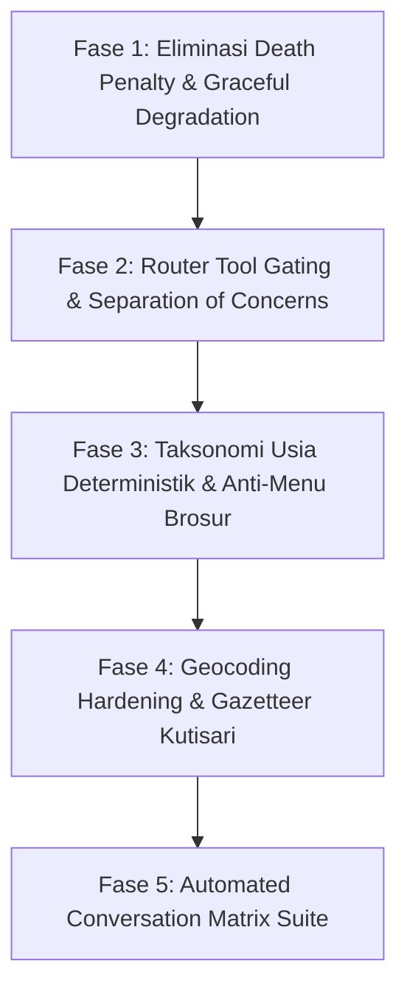

# Pelan Transformasi Arsitektur Fondasional Chatbot: Menghentikan Siklus Tambal-Sulam & Arsitektur Anti-Silent Bot

**Dokumen Rujukan:** Sesi 477412 (2026-09-16)  
**Tujuan Strategis:** Menghentikan siklus perbaikan simptomatik / tambal-sulam kalimat (*case-by-case*), mengeliminasi fenomena bot diam (*silent death penalty*), merapikan gating pemanggilan tool di Router, mengunci taksonomi batas usia, dan mentransformasi alur pengujian dari simulasi manual anekdotal menjadi *Automated Conversation Matrix Test Suite*.

---

## 1. Diagnosis Akar Masalah: Mengapa Masalah Tidak Pernah Habis?

Audit terhadap 16+ sesi simulator (dari sesi 188034 hingga 477412) membuktikan bahwa sistem terjebak dalam lingkaran setan akibat 5 cacat arsitektur:

1. **The Death Penalty Guardrail (Vonis Mati Sunyi)**:
   Di `GuardrailPipeline.verifyAndReprompt`, ketika validator faktual menemukan mismatch nama paket sekunder (walaupun jawaban inti customer sudah terjawab benar), sistem mengeksekusi `isEscalated = true; shouldSendReply = false; finalReply = ''`. Ini membungkam bot secara sepihak dan menampilkan pesan `[Bot sedang diam]`. Bagi customer, menerima jawaban yang sedikit kepanjangan jauh lebih baik daripada bot tiba-tiba bisu dan mogok.

2. **Perangkap "Negative Engineering" (Overload Larangan di Prompt)**:
   Penumpukan 21 Aturan Emas dengan puluhan batasan "DILARANG..." membebani kapasitas penalaran model ringkas (`gpt-4o-mini`). Akibatnya terjadi *attention dilution*: model bingung menentukan prioritas sehingga melanggar batasan 2–3 kalimat dan memuntahkan brosur menu bertingkat.

3. **Kopling Berlebih (*Over-Calling*) Tool di Router**:
   Pada pertanyaan persiapan atau minyak pijat (Turn 5), router memanggil `search_knowledge_faq` SEKALIGUS `get_catalog_and_price`. Masuknya katalog yang tidak diminta ke konteks generasi memicu model menyalin nama paket, yang kemudian disemprit oleh validator faktual.

4. **Ambiguitas Taksonomi Batas Usia (Kasus 24 Bulan: BABY vs KIDS)**:
   Angka 24 bulan berada tepat di perbatasan skema `BABY (0–24 bln)` vs `KIDS (2–4 thn)`. Inkonsistensi router yang berpindah-pindah kategori antar-turn menyebabkan paket KIDS dianggap fiktif saat katalog BABY aktif.

5. **Debugging Berbasis Anekdot (Anecdotal Fixing Flow)**:
   Menguji chat secara manual kalimat demi kalimat tidak akan pernah selesai karena kombinasi bahasa alami manusia tak terbatas. Menambal satu variasi kalimat melahirkan regresi di variasi kalimat lain.

---

## 2. Rencana Eksekusi Bertahap (Staged-Phase Execution Plan)

### Fase 1: Eliminasi "Death Penalty" Guardrail & Graceful Degradation
- **Tujuan**: Bot DILARANG MATI MEMBISU (*never silent*). Balasan yang sudah menjawab kebutuhan customer tidak boleh dibuang.
- **Tugas Mikro**:
  1. Modifikasi `src/v3/agent/pipeline/guardrail-pipeline.ts` pada blok penanganan `!factRepromptOk`:
     - Jika reprompt faktual gagal, jangan langsung kosongkan balasan (`finalReply = ''`).
     - Lakukan *surgical cleanup*: jika pelanggaran hanya berupa penyebutan nama paket katalog yang tidak cocok sementara ada konten edukasi/FAQ yang valid di balasan tersebut, buang paragraf paket tersebut dan pertahankan jawaban FAQ-nya.
     - Jika balasan benar-benar rusak total, fallback ke template sapaan hangat informatif, BUKAN membisu (`shouldSendReply = true`).
  2. Buat unit test adversarial: `tests/unit/v3/guardrail-never-silent.test.ts`.

### Fase 2: Strict Router Tool Gating (Separation of Concerns)
- **Tujuan**: Menjamin bahwa pertanyaan SOP/Persiapan HANYA memanggil tool pengetahuan, tidak memanggil katalog layanan.
- **Tugas Mikro**:
  1. Perbarui panduan pemilihan tool di `src/v3/agent/persona.ts` dan tool description:
     - `search_knowledge_faq`: Eksklusif untuk pertanyaan persiapan, alat, minyak, SOP mandi/susu, dan aturan klinik.
     - `get_catalog_and_price`: HANYA diizinkan jika pesan customer SAAT INI eksplisit memuat indikasi harga/biaya, menanyakan ketersediaan paket, atau mengeluhkan gejala fisik baru. DILARANG dipanggil jika customer hanya menanyakan persiapan/alat.
  2. Tambahkan router pre-filter / intent guard di `src/v3/agent/pipeline/generation-stage.ts`.
  3. Buat unit test: `tests/unit/v3/router-tool-separation.test.ts`.

### Fase 3: Taksonomi Usia Deterministik & Anti-Menu Brosur di Level Data
- **Tujuan**: Menghilangkan ambiguitas usia 24 bulan dan memotong suplai data yang memicu format brosur menu.
- **Tugas Mikro**:
  1. Kunci ambang batas matematis di seluruh sistem:
     - Usia `< 24 bulan` = Kategori `BABY` murni.
     - Usia `>= 24 bulan` = Kategori `KIDS` murni.
     - Terapkan di `src/v3/state/patient-extractor.ts`, `src/v3/tools/get-catalog.tool.ts`, dan skema routing.
  2. Pangkas output `get_catalog_and_price`:
     - Jika customer tidak menanyakan pricelist lengkap, kembalikan HANYA 1 rekomendasi terbaik + maksimal 1 alternatif singkat. Jangan menyuplai 5–11 layanan sekaligus agar LLM tidak terdorong membuat daftar menu panjang.
  3. Buat unit test: `tests/unit/v3/deterministic-age-taxonomy.test.ts`.

### Fase 4: Geocoding Hardening & Gazetteer Wilayah Utama
- **Tujuan**: Memastikan nama kelurahan/perumahan resmi seperti "Kutisari Indah" langsung dikenali oleh sistem lokal tanpa bergantung pada tebakan LLM.
- **Tugas Mikro**:
  1. Daftarkan variasi "Kutisari", "Kutisari Indah", "Tenggilis Mejoyo" ke dalam kamus gazetteer lokal Surabaya di `src/v3/tools/calculate-delivery.tool.ts` / data gazetteer.
  2. Cegah halusinasi kecamatan keliru ("Sukomanunggal") untuk wilayah Surabaya Selatan.
  3. Perbaiki template respon jika lokasi belum presisi: DILARANG meminta share location sesuai Aturan Emas 21.

### Fase 5: Automated Conversation Matrix Test Suite
- **Tujuan**: Menggantikan simulasi manual di CLI dengan rangkaian uji otomatis multi-turn yang dapat dijalankan dalam 5 detik via `npm test`.
- **Tugas Mikro**:
  1. Bangun file test terintegrasi: `tests/integration/v3-conversation-matrix.test.ts`.
  2. Uji 20 alur percakapan realistis secara deterministik:
     - Alur Balita 2 Tahun (Tanya Harga → Sebut Kutisari → Tanya Durasi → Tanya Minyak/Persiapan → Booking).
     - Alur Bayi Newborn (Tanya Aman → Konsul Kembung → Cek Ongkir → Jadwalkan).
     - Alur Ibu Hamil / Nifas (Prenatal vs Laktasi).
     - Alur Same-Day Request (Ada Lokasi vs Belum Ada Lokasi).
     - Alur Darurat & Penolakan Jarak Jauh (>30 km).

---

## 3. Komitmen & Larangan Mutlak Arsitektur

1. **DILARANG MENGOSONGKAN BALASAN KEPADA CUSTOMER**:
   Tidak ada kondisi di mana bot boleh membiarkan customer membaca `[Bot sedang diam]` dalam percakapan operasional normal, kecuali customer secara eksplisit meminta berbicara dengan manusia (*human handoff request*).
2. **DILARANG MEMPERBAIKI KODE HANYA UNTUK SATU CONTOH KALIMAT**:
   Setiap perbaikan wajib menyelesaikan akar di State Machine, Tool Contract, atau Data Tier, bukan menambahkan kata kunci hafalan atau larangan negatif baru di prompt persona.
3. **PENGUJIAN WAJIB LEWAT AUTOMATED MATRIX TEST**:
   Kriteria rilis stabil ditentukan oleh kelulusan seluruh matriks skenario di `tests/integration/v3-conversation-matrix.test.ts`, bukan perasaan subjektif saat mengetik manual di simulator.
