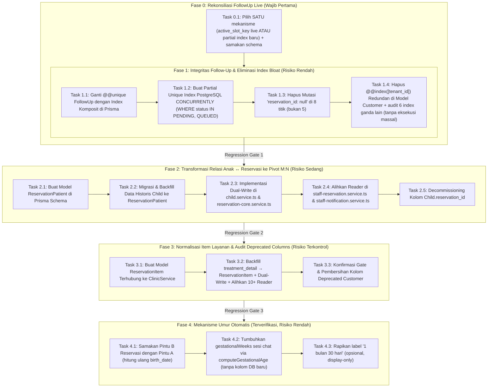

# Implementation Plan: Foundational ERD Hardening & Relational Integrity

**Target Repositori:** WhatsApp Clinic Bot Engine (`prisma/schema.prisma`, PostgreSQL)  
**Tipe Perbaikan:** Fondasional (Arsitektur Basis Data, Relasi M:N, Partial Indexing, Pembersihan Technical Debt)  
**Status:** REVISI-1 (2026-10-06). FASE 4 (mekanisme umur) **DIEKSEKUSI** (lihat KNOWN_ISSUES #238). FASE 0–3 **BELUM** — menunggu keputusan Opsi A/B Fase 0 + env ber-DB. DILARANG eksekusi Fase 1–3 tanpa Fase 0 selesai.  
**Ringkas revisi:** tambah Fase 0 rekonsiliasi `active_slot_key` live, lengkapi 8 titik amnesia + `CONCURRENTLY`, lengkapi reader pivot + `ON CONFLICT` target + backup/restore, lengkapi backfill/dual-write `ReservationItem`, tambah Fase 4 mekanisme umur (terverifikasi 43/43 test + simulasi tanggal 2026-08-06→2026-11-06). Lihat `docs/audit/ERD_AUDIT_AND_ANALYSIS.md` untuk bukti horizontal/vertikal/kolateral.  

---

## 1. Analisis Akar Masalah & Bukti Lapangan (Multi-Layer Audit)

| ID Isu | Gejala & Lokasi Kode | Bukti Kode Riil (`file:line`) | Dampak Nyata di Produksi |
|---|---|---|---|
| **RC-ERD-01** | Cacat Relasi 1:N Terbalik `Child` ↔ `Reservation` | `prisma/schema.prisma:158-167`<br>`src/services/child.service.ts:58`<br>`src/services/staff-reservation.service.ts:110-125` | Repeat order pasien anak bernama sama menimpa `reservation_id` lama. Reservasi lama kehilangan identitas anak yang diterapi. Fallback darurat menampilkan *seluruh* anak pasien. |
| **RC-ERD-02** | Constraint Kaku `FollowUp` Memaksa Mutasi "Amnesia" | `prisma/schema.prisma:542`<br>`src/services/follow-up.service.ts:565, 740, 1188, 1238, 1757` | PostgreSQL menolak baris follow-up baru bila ada baris `CANCELLED` lama. Kode aplikasi terpaksa menghapus `reservation_id = null`, memusnahkan jejak audit marketing. |
| **RC-ERD-03** | Index Bloat Redundan pada Model `Customer` | `prisma/schema.prisma:141`<br>`@@index([tenant_id])` | Mubazir 100% karena sudah ada index komposit `@@index([tenant_id, created_at])` dan `@@unique([tenant_id, phone])`. Menambah beban disk I/O setiap ada pasien baru. |
| **RC-ERD-04** | Pelanggaran 1NF: Treatment Bebas Tanpa Relasi Katalog | `prisma/schema.prisma:277-278`<br>`treatment_detail String?` | Reservasi tidak terhubung ke `ClinicService`. Pemesanan multi-layanan digabung dalam satu teks string, membuat pelaporan omzet dan analitik layanan terlaris tidak atomik. |

---

## 2. Peta Tahapan Perbaikan (Staged-Phase Roadmap)



---

## 3. Rincian Prosedural Tugas Mikro (Micro-Tasks)

### FASE 0: Rekonsiliasi FollowUp Live (JANGAN DILEWATI)
* **Latar (bukti):** live `43.173.11.79` sudah punya migrasi `20261006000000_fix_followup_unique_and_indexes` (kolom `active_slot_key` + trigger + unique aktif) per `docs/KNOWN_ISSUES.md #234`, tetapi kolom itu TIDAK ada di `schema.prisma` saat ini = drift. Plan awal mengusulkan mekanisme kedua (partial index baru) tanpa menyebutnya = tabrakan.
* **Task 0.1 — Pilih SATU, catat di KNOWN_ISSUES:**
  * Opsi A (disarankan): teruskan `active_slot_key` live → tambahkan kolom ke `schema.prisma` + `prisma generate` + buktikan `migrate diff --from-url --to-schema` kosong untuk objek follow-up.
  * Opsi B: cabut `active_slot_key` live, baru jalankan Fase 1 partial-index. Butuh jendela maintenance + backup tabel `follow_ups_backup_pre_v1`.
* **Acceptance:** `npx prisma validate` hijau + diff kosong + keputusan tertulis. Tanpa ini DILARANG lanjut Fase 1.

### FASE 1: Integritas Follow-Up & Eliminasi Index Bloat

#### Task 1.1 — Modifikasi Schema FollowUp & Customer
* **File:** `prisma/schema.prisma`
* **Baris 141 (Customer):** Hapus baris `@@index([tenant_id])`.
* **Baris 542 (FollowUp):**
  * **Kode Lama:**
    ```prisma
    @@unique([tenant_id, reservation_id, type, stage])
    ```
  * **Kode Pengganti:**
    ```prisma
    @@index([tenant_id, reservation_id, type, stage])
    ```
* **Alasan:** Prisma tidak mendukung sintaks partial index (`WHERE`) secara deklaratif native. Untuk membuat partial index di PostgreSQL, kita menurunkan constraint di Prisma menjadi index biasa, lalu membuat partial unique index via file migrasi SQL mentah.

#### Task 1.2 — Migrasi SQL PostgreSQL untuk Partial Unique Index (HANYA bila Opsi B menang di Fase 0)
* **File Baru:** `prisma/migrations/20261006000000_partial_unique_followups/migration.sql`
* **Kode SQL (wajib CONCURRENTLY, dilarang kunci tulis):**
  ```sql
  ALTER TABLE "follow_ups" DROP CONSTRAINT IF EXISTS "follow_ups_tenant_id_reservation_id_type_stage_key";
  CREATE UNIQUE INDEX CONCURRENTLY IF NOT EXISTS "follow_ups_active_lifecycle_uidx"
  ON "follow_ups" ("tenant_id", "reservation_id", "type", "stage")
  WHERE "status" IN ('PENDING', 'QUEUED');
  DROP INDEX CONCURRENTLY IF EXISTS "customers_tenant_id_idx";
  ```
* **Perintah Terminal (di env ber-DB, bukan unit offline):**
  ```bash
  npx prisma migrate deploy
  npm run prisma:generate
  npx prisma migrate diff --from-url "$DATABASE_URL" --to-schema-datamodel prisma/schema.prisma --script
  ```
  *Kriteria: output `-- This is an empty migration.` kecuali item pra-eksisting yang sudah dicatat.*

#### Task 1.3 — Hapus Mutasi "Amnesia" pada 8 titik (audit 2026-10-06: plan awal hanya 5)
* **File:** `src/services/follow-up.service.ts` — baris 482 (`rescheduleNoPurchaseOnInboundChat`), 565 (`onReservationCreated`), 740 (`onReservationCancelled`), 1188 (`cancelFollowUp`), 1238 (`bulkCancelFollowUps`), 1757 (worker `HAS_ACTIVE_RESERVATION`).
* **Plus 2 file luput:** `src/services/broadcast-queue.service.ts:207`, `src/services/waba-optout.service.ts:61`.
* **Pola pengganti (contoh):** `data: { status: 'CANCELLED', cancel_reason: X }` (hapus `reservation_id: null`, pertahankan alasan).
* **Dilarang:** menambah teks "DILARANG..." di prompt sebagai pengganti gerbang kode (mandat anti-make-up).

#### Task 1.4 — Index bloat: hapus 1, audit 6+ (tanpa eksekusi massal)
* Hapus `Customer @@index([tenant_id])` (`schema.prisma:141`) karena terlayani `:142` + `:149`.
* 6 pola sejenis (ClinicService:439, WabaTemplate:400, FollowUpTemplate:517, Label:953, QuickReply:1014, AdClick:583 + `token_hash` ganda Staff/Session/Admin) HANYA diaudit + `EXPLAIN`, tidak di-drop sekaligus. Catat ke KNOWN_ISSUES.

#### Regression Gate 1 (perintah riil, bukan `follow-up.test.ts` yang tidak ada):
* `npx vitest run tests/unit/follow-up-engine.test.ts tests/unit/follow-up-lead-repeat.test.ts tests/unit/follow-up-inbound-sliding.test.ts`
* `npx prisma validate`
* Kriteria: hijau + `reservation_id` tetap terisi setelah cancel + diff drift kosong.

---

### FASE 2: Transformasi Relasi Anak ↔ Reservasi ke Pivot M:N (`ReservationPatient`)

#### Task 2.1 — Tambahkan Model `ReservationPatient` di Schema
* **File:** `prisma/schema.prisma`
* **Penambahan Model (setelah model Child / Reservation):**
  ```prisma
  model ReservationPatient {
    id             String      @id @default(uuid())
    tenant_id      String      @default("default-tenant")
    reservation_id String
    reservation    Reservation @relation(fields: [reservation_id], references: [id], onDelete: Cascade)
    child_id       String
    child          Child       @relation(fields: [child_id], references: [id], onDelete: Restrict)
    notes          String?
    created_at     DateTime    @default(now())

    @@unique([reservation_id, child_id])
    @@index([tenant_id, reservation_id])
    @@index([child_id])
    @@map("reservation_patients")
  }
  ```
* **Update Relasi di `Reservation`:** Tambahkan `patients ReservationPatient[]`.
* **Update Relasi di `Child`:** Tambahkan `patientReservations ReservationPatient[]`.
* **Wajib dipertahankan selama transisi:** kolom lama `Child.reservation_id` JANGAN di-drop di fase ini (aditif). Drop hanya di Task decommission terpisah setelah dual-read terbukti.

#### Task 2.2 — Backfill Data Historis
* **File Migrasi:** `prisma/migrations/20261006000001_add_reservation_patients/migration.sql`
* **Kode SQL:**
  ```sql
  -- 1. Buat tabel reservation_patients
  CREATE TABLE IF NOT EXISTS "reservation_patients" (
      "id" TEXT NOT NULL,
      "tenant_id" TEXT NOT NULL DEFAULT 'default-tenant',
      "reservation_id" TEXT NOT NULL,
      "child_id" TEXT NOT NULL,
      "notes" TEXT,
      "created_at" TIMESTAMP(3) NOT NULL DEFAULT CURRENT_TIMESTAMP,
      CONSTRAINT "reservation_patients_pkey" PRIMARY KEY ("id")
  );

  -- 2. Backfill data dari relasi lama (wajib target konflik eksplisit)
  INSERT INTO "reservation_patients" ("id", "tenant_id", "reservation_id", "child_id", "created_at")
  SELECT
      gen_random_uuid()::text,
      c."tenant_id",
      c."reservation_id",
      c."id",
      c."created_at"
  FROM "children" c
  WHERE c."reservation_id" IS NOT NULL
  ON CONFLICT ("reservation_id", "child_id") DO NOTHING;

  -- 3. Tambahkan Foreign Keys & Indexes
  CREATE UNIQUE INDEX "reservation_patients_reservation_id_child_id_key" ON "reservation_patients"("reservation_id", "child_id");
  CREATE INDEX "reservation_patients_tenant_id_reservation_id_idx" ON "reservation_patients"("tenant_id", "reservation_id");
  CREATE INDEX "reservation_patients_child_id_idx" ON "reservation_patients"("child_id");
  ALTER TABLE "reservation_patients" ADD CONSTRAINT "reservation_patients_reservation_id_fkey" FOREIGN KEY ("reservation_id") REFERENCES "reservations"("id") ON DELETE CASCADE ON UPDATE CASCADE;
  ALTER TABLE "reservation_patients" ADD CONSTRAINT "reservation_patients_child_id_fkey" FOREIGN KEY ("child_id") REFERENCES "children"("id") ON DELETE RESTRICT ON UPDATE CASCADE;
  ```

#### Task 2.3 — Implementasi Dual-Write pada `src/services/child.service.ts`
* **File:** `src/services/child.service.ts`
* **Metode:** `upsertChildrenFromBabies`
* **Logika:** Setelah melakukan `prisma.child.upsert`, jika terdapat `reservationId`, lakukan upsert ke `prisma.reservationPatient`:
  ```ts
  if (reservationId) {
    await prisma.reservationPatient.upsert({
      where: {
        reservation_id_child_id: {
          reservation_id: reservationId,
          child_id: childRecord.id,
        },
      },
      create: {
        tenant_id: tenantId,
        reservation_id: reservationId,
        child_id: childRecord.id,
      },
      update: {},
    });
  }
  ```

#### Task 2.4 — Perbarui Reader 3-sumber (plan awal hanya 2 file, audit temukan 9+ situs)
* **File wajib:** `staff-reservation.service.ts:120-148,620,915,1078` (ubah signature `selectTaskChildren` terima pivot), `staff-notification.service.ts:124,349,594,783`, `reservations.subroute.ts:113,343,352,721,1115,1394,1606,1937,2328`, `sheets-sync.service.ts:210` (jangan lagi `children[0]` buta), `follow-up.service.ts:1620,1776`, `google-contacts.service.ts:413`, `backup.service.ts:348-369` (tambah tabel pivot ke backup/restore atau data pivot hilang saat restore).
* **Perubahan:** sertakan `patients: { include: { child: true } }` + filter `tenant_id` wajib di semua query pivot (anti bocor lintas tenant).
* **Prioritas:** (1) pivot `ReservationPatient`, (2) legacy `Child.reservation_id`, (3) `cust.children`.
* **Catat horizontal:** asumsi `children[0]` di 5 situs (`sheets-sync`, `follow-up greeting`, `google-contacts-formatter:40`, dst.) wajib dipecah eksplisit bila 1 reservasi multi-anak.

#### Task 2.5 — Decommission `Child.reservation_id` (DITAHAN, bukan sekarang)
* Syarat: dual-write + dual-read hijau ≥1 siklus rilis + backfill terverifikasi + rollback teruji. Penghapusan kolom butuh migrasi + Confirmation Gate tersendiri.

#### Regression Gate 2 (anti-overfitting: multi-frasa, bukan 1 kalimat hafalan):
* Test Kenzi #1/#2 dengan ≥3 variasi frasa ("jadwal pijat Kenzi", "mau booking buat Kenzi dong", "Kenzi pijat lagi minggu depan") + kasus kembar nama-identik (constraint `@@unique([customer_id,name])` menggabung — catat sebagai limitasi).
* `npm test` offline TIDAK cukup (mock DB sembunyikan gagal pivot) → wajib uji ber-DB staging: buat #1, buat #2, pastikan #1 tetap pegang Kenzi.

---

### FASE 3: Normalisasi Item Layanan & Konfirmasi Kolom Deprecated

#### Task 3.1 — Model `ReservationItem`
* **Tujuan:** Memenuhi 1NF dan menghubungkan pemesanan ke katalog master [`ClinicService`](file:///c:/Users/User/Documents/chatbot%20AG/prisma/schema.prisma#L418).
* **Model Schema:**
  ```prisma
  model ReservationItem {
    id               String         @id @default(uuid())
    tenant_id        String         @default("default-tenant")
    reservation_id   String
    reservation      Reservation    @relation(fields: [reservation_id], references: [id], onDelete: Cascade)
    service_id       String?
    service          ClinicService? @relation(fields: [service_id], references: [id], onDelete: SetNull)
    custom_name      String
    price            Int
    duration_minutes Int?
    created_at       DateTime       @default(now())

    @@index([tenant_id, reservation_id])
    @@index([service_id])
    @@map("reservation_items")
  }
  ```

#### Task 3.2 — Backfill + Dual-Write + Alihkan Reader `ReservationItem` (wajib, bukan opsional)
* **Backfill:** pecah `treatment_detail` lama (`split /,|;|\n/`, ambil `[0]` = perilaku lama `financial-analytics.service.ts:293`) menjadi N baris item; harga via `resolveTreatmentValue` (`capi.service.ts:121`), `service_id` via cocok `ClinicService.service_id/nama` (tak cocok → `service_id=null` + `custom_name` mentah, jangan buang data).
* **Dual-write:** `reservation-core.service.ts` + `save-reservation.tool.ts` tulis `Reservation` + `ReservationItem` atomik (transaksi); `SheetsSyncOutbox` tetap 1 baris per reservasi (bukan N).
* **Reader wajib dialihkan satu per satu:** `financial-analytics.service.ts:216-217,293`, `daily-report.service.ts:307-328`, `staff-notification.service.ts:211,249`, `live-chat.service.ts:219,354`, `meta-performance-analytics.service.ts:497-503`, `purchase-detection.service.ts:192`, `sheets/row-formatter.ts:132`, `google-calendar.service.ts:48-59`.
* **Catat horizontal (tanpa eksekusi):** `ReservationSeries.treatment_name` (`schema.prisma:352`) + `Conversation.last_discussed_treatment` (`:185`) pola bebas yang sama — masuk KNOWN_ISSUES, bukan scope fase ini.

#### Task 3.3 — Confirmation Gate: Audit Kolom Deprecated Customer
Sebelum mengeksekusi penghapusan 9 kolom `pending_*` dan flags di `Customer`, lakukan verifikasi *read-sites*:
- `pending_lat`, `pending_lng`, `pending_kelurahan`, `pending_kecamatan`, `pending_kota`, `pending_zipcode`: Pastikan seluruh pembaca di `src/services/customer.service.ts` dan `src/services/human-background-enrichment.service.ts` telah 100% beralih ke `Conversation.session_data.pendingLocation`.
- `share_location_sent`: Mengingat kolom ini masih dipakai sebagai penanda GPS asli di 6 file service, kolom ini dipertahankan atau dimigrasikan ke enum `location_source = 'gps_pin'` secara aman sebelum di-drop.

---

### FASE 4: Mekanisme Umur Otomatis (bukti uji 2026-10-06: 43/43 hijau + simulasi 2026-08-06→2026-11-06)
* **Bukti jalan:** tulis "2 bulan" 6 Agu → tampil "1 bulan 30 hari" hari itu, "3 bulan 29 hari" 6 Okt, "4 bulan 30 hari" 6 Nov (`computeCurrentAge`, `age-calculator.ts:305-327`). Hamil 30 minggu 1 Sep → "35 minggu (Trimester 3)" 6 Okt (`computeGestationalAge:335-348` + badge `resolveMomGestationalInfo` di `reservations.subroute.ts:710-714`).
* **Task 4.1 — Bug Pintu B (wajib):** `reservations.subroute.ts:2259-2281` + `reservation-series.service.ts:193` hanya tulis `raw_age_text`, tidak hitung ulang `birth_date`. Anak lama yang sudah punya `birth_date` → tulisan admin "2 bulan" diabaikan (tampil tetap umur lama, terbukti simulasi C = "8 bulan"). Samakan dengan Pintu A (`customer.service.ts:902-920`): hitung `parseAgeTextToBirthDate` + `monthsBetween` saat `ageText` berubah. Sementara: koreksi umur lewat Edit Profil Customer, bukan Edit Reservasi.
* **Task 4.2 — Hamil di chat tidak tumbuh (ditahan, butuh keputusan):** `momProfile.gestationalWeeks` hanya snapshot (`patient-extractor.ts:238-239`, tempel mentah `goal-tracker.ts:616`), tanpa `+ minggu_berlalu`. Badge admin tumbuh, balasan chat bisa basi. Fix = tampilkan `computeGestationalAge(registeredAt=waktu pertama disebut)` di prompt (tanpa kolom DB baru, tanpa regex baru, tanpa prompt "DILARANG" baru).
* **Task 4.3 — Label `1 bulan 30 hari` (opsional display-only):** 1 bulan = 30,44 hari → "2 bulan" terbaca "1 bulan 30 hari". Rapikan di `formatClinicalAge`/`formatAgeFromMonths` + cermin frontend `clinicalAge.ts`, tanpa ubah penyimpanan.
* **Regression Gate 4:** `npx vitest run tests/unit/age-calculator.test.ts tests/unit/dynamic-age-and-gestational-calculator.test.ts tests/unit/child-service.test.ts` + simulasi tanggal di atas + uji Pintu A vs Pintu B multi-frasa.

## 4. Rencana Rollback (Safety & Contingency)

1. **Rollback Fase 0/1**: putuskan dulu Opsi A/B. Bila partial index gagal: `DROP INDEX CONCURRENTLY IF EXISTS follow_ups_active_lifecycle_uidx;` + kembalikan service dari commit git + pastikan `active_slot_key` live tidak rusak. Dilarang `DROP` non-concurrently di jam sibuk.
2. **Rollback Fase 2**: pivot aditif (kolom lama dipertahankan) → alihkan reader kembali ke `Child.reservation_id`. Pastikan backup/restore sudah mencakup `reservation_patients` atau rollback kehilangan relasi baru.
3. **Rollback Fase 3/4**: `ReservationItem` aditif (kolom lama dipertahankan); reader lama tetap jalan. Koreksi umur Pintu B dapat di-revert per-file tanpa migrasi.

---

## 5. Ringkasan File yang Terpengaruh

| Modul | File yang Dimodifikasi | Peran Perubahan |
|---|---|---|
| **Database Schema** | `prisma/schema.prisma` | Menambahkan model `ReservationPatient`, ubah constraint `FollowUp`, hapus index redundan `Customer`. |
| **Migrations** | `prisma/migrations/*` | Script SQL deklaratif partial index dan pembuatan tabel pivot. |
| **Follow-Up Engine** | `src/services/follow-up.service.ts` | Menghentikan penghapusan `reservation_id = null` saat pembatalan. |
| **Child Engine** | `src/services/child.service.ts` | Dual-write relasi anak ke pivot `ReservationPatient`. |
| **Staff & Task** | `src/services/staff-reservation.service.ts` | Membaca anak dari relasi M:N `ReservationPatient`. |
| **Notification** | `src/services/staff-notification.service.ts` | Membaca kartu brief terapis dari relasi M:N. |
