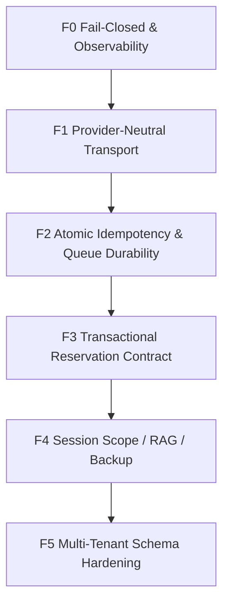

# IMPLEMENTATION PLAN — HARDENING FONDASIONAL CHATBOT WA CLINIC

> **Status:** Menunggu eksekusi (belum ada perubahan kode)
> **Tanggal:** 2026-09-13
> **Basis:** Audit menyeluruh (read-only) arsitektur V3 pada working tree saat ini — 6 klaster akar masalah fondasional.
> **Scope:** `src/v3/**`, `src/services/**`, `src/integrations/whatsapp/**`, `src/state-machine/**`, `src/routes/**`, `prisma/schema.prisma`
> **Prinsip eksekusi:** **1 fase = 1 commit/PR**, dengan *regression gate* wajib sebelum lanjut fase berikutnya.

---

## 0. RINGKASAN EKSEKUTIF

Audit menemukan bahwa mayoritas anomali produksi **bukan bug per-kasus**, melainkan **kebocoran abstraksi dan default yang fail-open** pada lapisan fondasi:

1. **Dualitas provider bocor ke domain** — kode percakapan memanggil `wahaClient` singleton, sehingga balasan tenant WABA keluar lewat jalur WAHA.
2. **Resolusi tenant non-deterministik** — `DEFAULT_TENANT_ID` dipakai sebagai *fallback diam* di jalur bisnis; `phone_number_id` tak dikenal tetap diproses sebagai tenant default.
3. **Idempotensi non-atomik** — dedup pesan berbasis `Set` memori + query DB terpisah (bukan constraint unik DB).
4. **State sesi di entitas berkardinalitas salah** — goal session disimpan di `Customer.preferences`, padahal seharusnya per-`Conversation`.
5. **Kontrak tool tidak transaksional** — `save_reservation` tidak punya *proposal/idempotency key*, dan pipeline lanjut mengeksekusi tool lain setelah komit.
6. **Observability mati & default fail-open** — `recordTurn()` tidak pernah dipanggil, health "0 turn" dianggap `HEALTHY`, availability mengembalikan "semua slot tersedia" saat DB error, dan mutilasi tengah kalimat masih dilakukan regex.

Dokumen ini menyelesaikan **akar masalah di lapisan terdasar** (Data/Schema, State Machine, Tool Contract, Provider Abstraction, Observability), bukan tambalan per-skenario kalimat.

### Peta Fase & Ketergantungan

| Fase | Fokus Fondasional | Migrasi? | Blast Radius | Ketergantungan |
|---|---|:---:|:---:|---|
| **F0** | Fail-closed default & observability | Tidak | Rendah | — |
| **F1** | Abstraksi transport provider-netral + tenant resolution | Tidak | Sedang | F0 |
| **F2** | Idempotensi atomik & durability queue | **Ya** | Sedang–Tinggi | F1 |
| **F3** | Kontrak reservasi transaksional | **Ya** | Tinggi | F2 |
| **F4** | Session scope, retrieval parity, backup isolation | **Ya** | Sedang | F3 |
| **F5** | Schema multi-tenant hardening | **Ya** | Tinggi | F4 |



### Golden Rules (dari AGENTS.md)

1. **Zero New Runtime Dependencies** — pakai `zod`, `crypto`, `fastify`, `@prisma/client` yang sudah ada.
2. **Non-Hardcode / Data-Driven** — tidak menambah daftar kata kunci hafalan, katalog, tarif, atau template ke TS runtime.
3. **Minimal-Regex / Anti Mid-Sentence Mutilation** — regex hanya untuk pembersihan teknis non-semantik.
4. **Tenant-Aware / SaaS-Ready** — data bisnis & config dari DB.
5. **Known Issues Mandate** — setiap temuan ditunda/catatan dicatat di `docs/KNOWN_ISSUES.md`.
6. **Changelog Mandate** — baca `CHANGELOG.md` sebelum mulai; catat hasil setelah selesai.
7. **Test Offline** — `npm test` harus jalan tanpa DB/network (`tests/setup.ts` mematikan DB).
8. **Investigation Gate** — verifikasi log/DB sebelum mengklaim perilaku produksi.

---

## 1. ANALISIS AKAR MASALAH LINTAS LAPISAN (MULTI-LAYER ROOT CAUSE)

| # | Gejala Permukaan | Akar Fondasional | Lapisan | Dampak |
|---|---|---|---|---|
| RC-1 | Balasan tenant WABA terkirim via WAHA | `TypingService` mengimpor `wahaClient` singleton (`typing.service.ts:1,28,433,500`); pemanggil tidak menyuntik gateway | Provider Abstraction | Pesan gagal/salah jalur; typing indicator hilang |
| RC-2 | `phone_number_id` asing diproses sebagai default tenant; data bisnis tercampur | `resolveTenantByPhoneNumberId` fallback ke `DEFAULT_TENANT_ID` saat tidak ketemu/DB down (`waba-tenant.service.ts:29,37`); webhook WAHA hardcode default (`webhook.route.ts:300-301,349-354`) | Tenant Resolution | Kebocoran data lintas tenant; salah layanan |
| RC-3 | Pesan ganda diproses setelah restart; dedup gagal saat DB error | `memoryWaMessageIds` ditulis SEBELUM query DB (`message.service.ts:144-154`); unique `wa_message_id` global, bukan per-tenant (`schema.prisma:221`) | Data/DB Schema | Double-reply; catatan ganda |
| RC-4 | Goal/cart hilang atau bocor antar-percakapan customer yang sama | Session tersimpan di `Customer.preferences` (`goal-tracker.ts:245,322,338`), `formatGoalSessionForPrompt` tanpa `tenantId` | State/Data Model | Amnesia sesi, cross-conversation leak |
| RC-5 | Reservasi tercatat `confirmed` padahal slot belum dicek; double-booking | `verifyDayMentioned` hanya bukti "kata hari pernah ada" (`save-reservation.tool.ts:83-140`); status non-same-day `confirmed` (`:484`); tool pipeline lanjut setelah komit (`tool-pipeline.ts:216-229`) | Tool Contract | Janji palsu, mutasi ganda |
| RC-6 | Bot "terlihat sehat" padahal buta; janji slot saat DB down; kalimat terpotong | `recordTurn()` tanpa pemanggil (`telemetry.service.ts:29`); health `HEALTHY` saat 0 turn (`:60-67`); availability fallback "all available" (`reservations.subroute.ts:167-175`); regex strip (`guardrail-pipeline.ts:450`) | Observability & Fail-Safe | Insiden tak terdeteksi; pelanggaran rules |

**Implikasi ke depan (future risks):** tanpa perbaikan RC-1..RC-6, setiap penambahan tenant baru akan memperbanyak jalur kebocoran; setiap fitur baru di atas `Customer.preferences` akan mewarisi cardinality bug; dan setiap perubahan prompt berisiko regresi tak terdeteksi karena telemetri mati.

---

## 2. FASE 0 — FAIL-CLOSED DEFAULTS & OBSERVABILITY (tanpa migrasi)

**Tujuan:** mengembalikan kemampuan mendeteksi kegagalan dan menghentikan default yang fail-open.

### T0.1 — Aktifkan Telemetri + Status `NO_DATA`

**Masalah & akar:** `TelemetryService` sudah ada (dirancang di `docs/plans/PHASE_2_TELEMETRY_OBSERVABILITY.md`) tetapi `recordTurn()` tidak punya pemanggil; `getHealthSummary()` mengembalikan `HEALTHY` saat buffer kosong → *fail-open*.

**Lokasi:**
- `src/types/telemetry.ts:32`
- `src/services/telemetry.service.ts:53-67`
- `src/v3/agent/agent-runner.ts` (akhir `V3AgentRunner.processMessage`)
- `src/v3/agent/pipeline/generation-stage.ts:81-91` (`TurnTelemetry`)

**Perubahan:**
1. `src/types/telemetry.ts:32` — ubah union:
   ```ts
   status: 'HEALTHY' | 'DEGRADED' | 'CRITICAL' | 'NO_DATA';
   ```
2. `src/services/telemetry.service.ts:60-67` — pada `totalTurns === 0`, kembalikan `status: 'NO_DATA'`.
3. `src/v3/agent/agent-runner.ts` — sebelum `return` di akhir `processMessage`, panggil `telemetryService.recordTurn({...})` dengan mapping:
   - `rawLlmReply` / `sanitizedReply` dari hasil generation+guardrail
   - `mutilationRatio = telemetryService.calculateMutilationRatio(raw, sanitized)`
   - `isSilentDrop = (shouldSendReply === false && isEscalated === false)`
   - `isUnjustifiedRsqr` dari hasil guardrail
   - `nluErrorCode` dari kegagalan parsing/HTTP
   - `latencyMs`, `modelName`, `tenantId`, `conversationId`, `customerPhone`
   > **Catatan:** `V3AgentRunner` saat ini ±258 LOC (lihat `HANDOVER_SESSION_STATUS.md`); instrumentasi cukup 1 titik di akhir `processMessage`, bukan di tiap sub-pipeline.

**Acceptance criteria (otomatis):** `tests/unit/telemetry.test.ts` baru:
- buffer kosong → `status === 'NO_DATA'`
- setelah `recordTurn` dengan latency/SDR normal → `HEALTHY`
- SDR ≥ 0.5 → `CRITICAL`

**Verifikasi:**
```powershell
npm run build
npx vitest run tests/unit/telemetry.test.ts
```

---

### T0.2 — Hapus Mutilasi Tengah Kalimat (Age-Solicitation Strip)

**Masalah & akar:** `finalReply.replace(/.../, '')` memotong klausa di tengah kalimat — melanggar **Mandat Minimal-Regex & Mid-Sentence Mutilation Ban**.

**Lokasi:** `src/v3/agent/pipeline/guardrail-pipeline.ts:447-451`

**Perubahan:** hapus blok `.replace(...)`. Ganti dengan pola *reprompt-only* yang sudah dipakai validator kata ganti (`:454-479`):
```ts
if (!ageRepromptOk && hasAgeQuestion(finalReply)) {
  // Anti-mutilasi: kirim balasan asli (pelanggaran gaya, bukan halusinasi),
  // catat untuk kurasi prompt. DILARANG memotong kalimat.
  violationsDetected.push('age_solicitation_unresolved');
  console.warn(JSON.stringify({
    event: 'AGE_SOLICITATION_UNRESOLVED_KEEP_ORIGINAL',
    tenantId, conversationId, timestamp: new Date().toISOString(),
  }));
}
```

**Acceptance criteria:** `tests/unit/v3/guardrail-no-mutilation.test.ts` baru:
- input balasan 2 kalimat dengan pertanyaan usia di tengah → output tetap utuh (jumlah kalimat & makna tidak berkurang)
- tidak ada `replace` destruktif yang tersisa di blok ini (assert via snapshot)

**Verifikasi:** `npm run build; npx vitest run tests/unit/v3/guardrail-no-mutilation.test.ts`

---

### T0.3 — Availability Fail-Closed

**Masalah & akar:** saat query DB gagal, endpoint mengembalikan **semua slot `available`** → admin/bot menjanjikan slot yang tidak diketahui kebenarannya.

**Lokasi:** `src/routes/admin/reservations.subroute.ts:167-175`

**Perubahan:** ganti payload catch menjadi:
```ts
} catch (err: any) {
  console.error(JSON.stringify({
    event: 'AVAILABILITY_QUERY_FAILED',
    tenantId: DEFAULT_TENANT_ID,
    error: err?.message, timestamp: new Date().toISOString(),
  }));
  return reply.status(503).send({
    success: false,
    error: 'AVAILABILITY_UNAVAILABLE',
    message: 'Ketersediaan slot tidak dapat diverifikasi saat ini. Coba lagi.',
  });
}
```

**Acceptance criteria:** test injeksi error Prisma → response `503`, `success:false`, TIDAK ada `slots` berisi `available`.

**Verifikasi:** `npx vitest run tests/unit` (tambah test di `reservations` terkait bila ada).

---

### T0.4 — Halt-After-Commit pada Tool Pipeline

**Masalah & akar:** `save_reservation` sukses hanya menandai `scheduleHandoff` (`tool-pipeline.ts:216-221`) tetapi loop `for (const tc of toolCalls)` lanjut mengeksekusi tool berikutnya → risiko mutasi ganda/double-booking.

**Lokasi:** `src/v3/agent/pipeline/tool-pipeline.ts:95-229` (blok `:216-221`)

**Perubahan:**
1. Tambah `let reservationCommitted = false;` sebelum loop (dekat `executedTools`).
2. Di blok `save_reservation && toolResult?.success`, setelah set `scheduleHandoff` & `scheduleHandoffMessage`, push tool message lalu:
   ```ts
   reservationCommitted = true;
   break; // batas akhir otomasi: jangan eksekusi tool lain di batch yang sama
   ```
3. Untuk tool yang datang setelah komit (jika LLM mengirim >1 call), catat:
   ```ts
   console.warn(JSON.stringify({ event: 'V3_TOOL_POST_COMMIT_IGNORED', tool: fnName, tenantId, conversationId }));
   ```

**Acceptance criteria:** perluas `tests/unit/v3/tool-pipeline.test.ts`:
- batch `[save_reservation(success), save_reservation(...)]` → `executedTools.length === 1`
- `scheduleHandoff === true`, `scheduleHandoffMessage` terisi.

**Verifikasi:** `npm run build; npx vitest run tests/unit/v3/tool-pipeline.test.ts`

---

### Regression Gate FASE 0

```powershell
npm run build
npm test
```
Kriteria lulus: `tsc` 0 error; seluruh suite hijau (baseline ±2058 passed / 19 skipped); 4 test baru hijau. Catat hasil di `CHANGELOG.md`.

---

## 3. FASE 1 — PROVIDER-NEUTRAL TRANSPORT & TENANT RESOLUTION (tanpa migrasi)

**Tujuan:** domain percakapan tidak lagi tahu `wahaClient`; transport dipilih per-tenant; resolusi tenant yang gagal berhenti *fail-closed*.

> **Konteks scope:** deploy saat ini **single-tenant WAHA**. Karena itu T1.4 (resolusi tenant dari nomor di webhook WAHA) **ditunda** tanpa migrasi; fokus pada abstraksi transport (T1.1–T1.3) dan fail-closed WABA (T1.5–T1.6) yang sudah relevan untuk jalur Meta Cloud.

### T1.1 — Abstraksi `MessageTransport`

**Masalah & akar:** `src/services/typing.service.ts:1,23-30` mengikat `wahaClient` singleton; `:433` `this.client.sendText(...)` — domain percakapan tercemar oleh implementasi provider.

**Lokasi:** `src/services/typing.service.ts:1,23-30,341-500`; interface baru `src/integrations/whatsapp/transport.ts` (NEW).

**Perubahan — file baru `src/integrations/whatsapp/transport.ts`:**
```ts
import { IWahaClient, wahaClient } from '../waha/client';
import type { WhatsAppGateway } from './gateway.types';

export interface MessageTransport {
  sendSeen(chatId: string, messageId?: string): Promise<void>;
  startTyping(chatId: string): Promise<void>;
  stopTyping(chatId: string): Promise<void>;
  sendText(chatId: string, text: string): Promise<boolean>;
}

export function createWahaTransport(client: IWahaClient = wahaClient): MessageTransport {
  return {
    sendSeen: (chatId, messageId) => (messageId ? client.sendSeen(chatId, messageId).then(() => {}) : Promise.resolve()),
    startTyping: (chatId) => client.startTyping(chatId).then(() => {}),
    stopTyping: (chatId) => client.stopTyping(chatId).then(() => {}),
    sendText: (chatId, text) => client.sendText(chatId, text),
  };
}

export function createGatewayTransport(gateway: WhatsAppGateway): MessageTransport {
  return {
    sendSeen: (chatId, messageId) => gateway.markAsRead(chatId, messageId),
    // WABA tidak punya typing indicator persisten → kirim indikator berdurasi (best-effort)
    startTyping: (chatId) => gateway.sendTypingIndicator(chatId).catch(() => {}),
    stopTyping: async () => {},
    sendText: async (chatId, text) => {
      const res = await gateway.sendTextMessage(chatId, text);
      return res.success;
    },
  };
}
```

**Perubahan `src/services/typing.service.ts`:**
- Hapus impor `IWahaClient, wahaClient`; impor `MessageTransport, createWahaTransport`.
- Constructor (`:24-30`):
  ```ts
  private transport: MessageTransport;
  private transportResolver?: (tenantId: string) => Promise<MessageTransport>;

  constructor(transport?: MessageTransport, speedFactor = 1, resolver?: (tenantId: string) => Promise<MessageTransport>) {
    this.transport = transport || createWahaTransport();
    this.speedFactor = speedFactor;
    this.transportResolver = resolver;
  }
  ```
- Di `simulateHumanReply` (`:341-343`), setelah `effectiveTenantId` dihitung, pilih transport:
  ```ts
  const activeTransport = this.transportResolver
    ? await this.transportResolver(effectiveTenantId).catch(() => this.transport)
    : this.transport;
  ```
  Lalu ganti **semua** `this.client.*` (`:376,398,406,419,427,433,468`) → `activeTransport.*`.
- Singleton `:500` tetap `new TypingService()` untuk kompatibilitas; pemanggil tenant-aware menyuntik resolver.

**Acceptance criteria:** `tests/unit/typing-transport.test.ts` baru:
- `createGatewayTransport` (mock gateway) → `sendText` memanggil `gateway.sendTextMessage`, TIDAK memanggil `wahaClient.sendText`.
- `createWahaTransport` tetap berperilaku seperti sebelumnya (regresi).

**Verifikasi:** `npm run build; npx vitest run tests/unit/typing-transport.test.ts tests/unit/typing.test.ts`

---

### T1.2 — `machine.ts` Menyuntik Resolver Transport

**Lokasi:** `src/state-machine/machine.ts:7,15-18,491,672`

**Perubahan:**
- Konstruksi `typingSvc` (`:15-18`) menerima resolver tenant-aware:
  ```ts
  this.typingSvc = typingSvc || new TypingService(undefined, 1, async (tid) => {
    const { resolveGatewayForTenant } = await import('../integrations/whatsapp/factory');
    const { createGatewayTransport } = await import('../integrations/whatsapp/transport');
    const gw = await resolveGatewayForTenant(tid);
    return gw.providerType === 'WABA' ? createGatewayTransport(gw) : createWahaTransport();
  });
  ```
  > `resolveGatewayForTenant` sudah dipakai di file yang sama (`:8,77,604`).
- Pastikan `simulateHumanReply` di `:491` dan `:672` mengirim `tenantId` (parameter sudah tersedia di `HumanReplyParams`).

**Acceptance criteria:** test regresi machine: untuk tenant `whatsapp_provider='WABA'`, pemanggilan normal reply tidak menyentuh `wahaClient` (spy).

---

### T1.3 — Propagasi `tenantId` di Cron/Follow-Up/Broadcast

**Lokasi:**
- `src/services/cron.service.ts:228,318`
- `src/services/follow-up.service.ts:1240`
- `src/services/broadcast-queue.service.ts:260`

**Perubahan:** pastikan setiap pemanggilan `typingService.simulateHumanReply({...})` memuat `tenantId` yang benar (bukan default implisit). Bila sumber tenant belum tersedia, ambil dari entitas (`followUp.tenant_id`, `reservation.tenant_id`) dan teruskan.

**Acceptance criteria:** audit grep — tidak ada `simulateHumanReply(` tanpa `tenantId` di ketiga file.

**Verifikasi:** `npx vitest run tests/unit` (follow-up & broadcast tests).

---

### T1.4 — (DITUNDA) Resolusi Tenant Webhook WAHA

**Status:** **Ditunda** — deploy masih single-tenant WAHA (`whatsapp_provider` default `WAHA`).
**Aksi minimal saat ini:** jangan menambah ketergantungan baru pada `DEFAULT_TENANT_ID` di jalur WABA; semua operasi baru WAJIB menerima/menurunkan `tenantId` dari context. Catat di `docs/KNOWN_ISSUES.md` sebagai *tech debt multi-tenant*.

---

### T1.5 — WABA Fail-Closed untuk `phone_number_id` Tak Dikenal

**Masalah & akar:** `resolveTenantByPhoneNumberId` mengembalikan `DEFAULT_TENANT_ID` saat tenant tak ditemukan atau DB down → pesan tenant asing/belum terdaftar diproses sebagai tenant default.

**Lokasi:** `src/services/waba-tenant.service.ts:15-38`; pemanggil `src/routes/waba-webhook.route.ts:40,83,124`

**Perubahan:**
- `waba-tenant.service.ts` — ubah signature & perilaku:
  ```ts
  public async resolveTenantByPhoneNumberId(phoneNumberId?: string | null): Promise<string | null> {
    if (!phoneNumberId) return null;
    const cached = tenantCache.get(phoneNumberId);
    if (cached !== undefined) return cached; // cache null juga agar tidak query berulang
    try {
      const { prisma } = await import('../db/client');
      const tenant = await prisma.tenant.findFirst({
        where: { waba_phone_number_id: phoneNumberId }, select: { id: true },
      });
      if (!tenant) {
        console.warn(JSON.stringify({ event: 'WABA_UNKNOWN_PHONE_NUMBER_ID', phoneNumberId }));
        tenantCache.set(phoneNumberId, null as any);
        return null;
      }
      tenantCache.set(phoneNumberId, tenant.id);
      return tenant.id;
    } catch (err: any) {
      // FAIL-CLOSED: DB down TIDAK boleh menebak tenant.
      console.error(JSON.stringify({ event: 'WABA_TENANT_RESOLVE_DB_DOWN', phoneNumberId, error: err.message }));
      return null;
    }
  }
  ```
- `waba-webhook.route.ts` — pada `:40,:83,:124`, bila hasil `null`: untuk status webhook `skip`/tidak update; untuk pesan → balas `200 { status: 'IGNORED_UNKNOWN_PHONE_NUMBER_ID' }` + alert (jangan proses).

**Acceptance criteria:** `tests/integration/waba-webhook.test.ts`:
- `phone_number_id` tak dikenal → `resolveTenantByPhoneNumberId` = `null`; webhook tidak membuat customer/message.
- DB error → `null` (bukan default tenant).

**Verifikasi:** `npx vitest run tests/integration/waba-webhook.test.ts`

---

### T1.6 — Factory Fail-Closed

**Masalah & akar:** `resolveGatewayForTenant` (`factory.ts:20-42`) menelan error dan fallback ke `WahaGatewayDriver` untuk **tenant apa pun**; `getGateway()` (`:44-51`) selalu WAHA. Untuk tenant yang dikonfigurasi WABA, ini mengirim lewat provider salah.

**Lokasi:** `src/integrations/whatsapp/factory.ts:13-51`

**Perubahan:**
- Pada `resolveGatewayForTenant`: bedakan `tenant === null` (tidak ketemu) vs error config.
  - tenant WABA tapi `waba_phone_number_id`/`waba_access_token` kosong → `throw new Error('WABA_CONFIG_INCOMPLETE:<tenantId>')` (caller fail-closed), **bukan** fallback WAHA.
  - tenant tidak ditemukan → fallback WAHA hanya jika `tenantId === DEFAULT_TENANT_ID`; selain itu `throw`.
- Dokumentasikan `getGateway()` sebagai *WAHA-only helper* dan tandai untuk audit pemakaian (jangan dipakai di jalur tenant-aware). Catat di `docs/KNOWN_ISSUES.md`.

**Acceptance criteria:** test unit factory:
- tenant WABA config lengkap → `WabaGatewayDriver`.
- tenant WABA config kosong → throw (tidak diam-diam WRAP WAHA).
- tenant default tidak ditemukan → WAHA.

**Verifikasi:** `npx vitest run tests/unit` (cari test gateway/factory yang ada).

---

### Regression Gate FASE 1

```powershell
npm run build
npm test
```
Kriteria: tsc 0 error; tidak ada regresi typing; test transport/gateway/waba-webhook hijau. Catat `CHANGELOG.md`.

---

## 4. FASE 2 — IDEMPOTENSI ATOMIK & DURABILITY QUEUE (⚠️ Confirmation Gate: migrasi)

**Tujuan:** menjadikan database sebagai *source of truth* idempotensi (bukan memori), dan antrian tidak diam-diam kehilangan pesan.

### T2.1 — Unique Per-Tenant + Dedup Atomik

**Masalah & akar:** `wa_message_id` di-unique **global** (`schema.prisma:221`) sehingga pesan berbeda tenant dengan id sama (atau id kosong) berpotensi bentrok; `isDuplicateMessage` menulis ke `memoryWaMessageIds` **sebelum** query DB (`message.service.ts:144-154`) sehingga setelah restart status dedup hilang, dan saat DB error pesan dianggap baru.

**Lokasi:**
- `prisma/schema.prisma:216-241` (model `Message`), khusus `:221`
- `src/services/message.service.ts:7-8,135-179`

**Perubahan schema:**
```prisma
model Message {
  // ...
  wa_message_id String?
  // ...
  @@unique([tenant_id, wa_message_id])
  @@index([tenant_id])
  @@index([conversation_id, tenant_id, created_at])
  @@map("messages")
}
```

**Perubahan service:** jadikan insert sebagai operasi atomik:
- Hapus penulisan `memoryWaMessageIds` sebagai jalur utama sebelum DB.
- Sediakan `tryInsertInbound(...)` yang melakukan `prisma.message.create(...)` dan menangkap `P2002` → berarti duplikat (return `true`). Bila DB error → **jangan** mengembalikan `false` (pesan baru) secara membabi buta; gunakan kebijakan *at-least-once* dengan penanda dan alert (lihat T2.2). Untuk `isDuplicateMessage` yang tidak melakukan insert, ganti dengan `findFirst` ber-`tenant_id` (sudah benar) dan buang memory-first.

**Migrasi (gate):** `prisma/migrations/<timestamp>_message_tenant_wa_message_unique/migration.sql`
- **Pre-check wajib** (jalankan sebelum `migrate deploy`):
  ```sql
  SELECT tenant_id, wa_message_id, COUNT(*) FROM messages
  WHERE wa_message_id IS NOT NULL GROUP BY 1,2 HAVING COUNT(*) > 1;
  ```
- Bila ada duplikat → script dedup (pilih baris terlama, hapus/sisakan satu) sebelum menambah constraint.
- **Rollback plan:** `DROP INDEX messages_tenant_id_wa_message_id_key;` + `CREATE UNIQUE INDEX messages_wa_message_id_key ON messages(wa_message_id);`

**Acceptance criteria:** `tests/unit/message-idempotency.test.ts` baru:
- dua panggilan paralel id sama → tepat satu `false` (bukan-duplikat) & satu `true`.
- tenant berbeda, id sama → keduanya boleh masuk.

**Verifikasi:**
```powershell
npx prisma migrate diff --from-url "$env:DATABASE_URL" --to-schema-datamodel prisma/schema.prisma --script
npm run build
npx vitest run tests/unit/message-idempotency.test.ts
```
> Drift check harus `-- This is an empty migration.` **setelah** migrasi diterapkan.

---

### T2.2 — Kontrak Durability Queue

**Masalah & akar:** fallback in-memory `queue.shift()` (`queue.service.ts:273`) menghapus job sebelum selesai; restart = pesan hilang. `isPaused` hanya mem-pause BullMQ (`:354`), jalur memori (`:261-307`) mengabaikan pause (`pauseQueue`/`resumeQueue` hanya iterasi `bullQueues`).

**Lokasi:** `src/services/queue.service.ts:25-33,221-259,261-307,348-393`; boot `src/app.ts` (sekitar `:193-196`)

**Perubahan fondasional:**
1. Tambah env `QUEUE_REQUIRE_REDIS` (default `false` dev, `true` produksi). Di `app.ts` boot, bila `true` dan Redis gagal → **batalkan boot** dengan pesan CRITICAL (fail-fast), bukan lanjut ke memori.
2. Bila `QUEUE_REQUIRE_REDIS=false` (dev/test) dan masuk jalur memori, kirim alert CRITICAL + `event: QUEUE_MEMORY_FALLBACK_ACTIVE` (observability).
3. Hormati pause di jalur memori: sebelum `processNextInMemory`, cek `this.isPaused` → tahan (requeue/unshift) hingga resume.
4. (Opsional, jika ingin durable penuh) DB outbox: simpan payload ke tabel `pending_inbound_messages` sebelum proses & hapus setelah sukses. **Butuh Confirmation Gate terpisah** (LOC besar) — catat sebagai opsi di `docs/KNOWN_ISSUES.md`.

**Acceptance criteria:** `tests/unit/queue-durability.test.ts`:
- `isPaused=true` → pesan di jalur memori tidak diproses hingga `resumeQueue`.
- `QUEUE_REQUIRE_REDIS=true` + Redis mati → boot melempar error.

**Verifikasi:** `npm run build; npx vitest run tests/unit/queue-durability.test.ts`

---

### Regression Gate FASE 2

```powershell
npm run build
npm test
npx prisma migrate diff --from-url "$env:DATABASE_URL" --to-schema-datamodel prisma/schema.prisma --script
```
Kriteria: suite hijau; drift check kosong; dedup test hijau. Catat migrasi di `CHANGELOG.md` + `docs/KNOWN_ISSUES.md`.

---

## 5. FASE 3 — KONTRAK RESERVASI TRANSAKSIONAL (⚠️ Confirmation Gate: migrasi + ubah perilaku)

**Tujuan:** reservasi menjadi *two-phase commit* (proposal → konfirmasi) dengan idempotency key dan canonical treatment ID; tidak ada `confirmed` tanpa kesepakatan eksplisit.

### T3.1 — Proposal, Idempotency Key & Canonical Treatment ID

**Masalah & akar:** `SaveReservationArgsSchema` (`tool-schemas.ts:20-34`) tidak punya idempotency key / canonical ID / konfirmasi eksplisit; `reservationCoreService.saveReservation` (`reservation-core.service.ts:145`) menerima `treatmentDetail` string bebas dan `status`. Akibat: dobel-simpan, layanan salah-match, status `confirmed` prematur.

**Lokasi:**
- `prisma/schema.prisma:257-285` (model `Reservation`)
- `src/v3/tools/tool-schemas.ts:20-34`
- `src/v3/tools/save-reservation.tool.ts:353-508` (khusus `:471-485`)
- `src/services/reservation-core.service.ts:145` (`saveReservation`)
- `src/v3/agent/pipeline/tool-pipeline.ts` (penyedia argumen)

**Perubahan schema:**
```prisma
model Reservation {
  // ...
  idempotency_key   String?
  proposal_id       String?
  proposal_revision Int      @default(0)
  treatment_ids     String[] @default([])
  // ...
  @@unique([tenant_id, idempotency_key])
}
```

**Perubahan schema Zod (`tool-schemas.ts`):**
```ts
export const SaveReservationArgsSchema = z.object({
  idempotencyKey: z.string().min(8),
  customerConfirmed: z.boolean(),
  treatmentIds: z.array(z.string()).min(1),
  // ...field lama tetap...
});
```
> Canonical `treatmentIds` berasal dari `TreatmentCatalogService` (data-driven, bukan hafalan).

**Perubahan `saveReservation` (`reservation-core.service.ts`):**
- Terima `idempotencyKey`, `treatmentIds`, `proposalRevision`, `customerConfirmed`.
- Lakukan `upsert`/`create` dengan `where: { tenant_id_idempotency_key: {...} }`; bila sudah ada → kembalikan reservasi yang sama (idempoten).
- `status = customerConfirmed ? 'confirmed' : 'pending_confirmation'`.

**Perubahan `save-reservation.tool.ts` (`:471-485`):**
- Teruskan `idempotencyKey`, `treatmentIds`, `customerConfirmed`.
- Bila `customerConfirmed === false` → jangan klaim "terjadwal"; `message` menyatakan proposal ditampung untuk dicek.

**Acceptance criteria:** `tests/unit/v3/save-reservation-idempotency.test.ts`:
- dua panggilan `idempotencyKey` sama → 1 baris reservasi (`reservationId` sama).
- `customerConfirmed=false` → status `pending_confirmation`.
- `treatmentIds` tidak ada di katalog tenant → ditolak.

**Verifikasi:** `npm run build; npx vitest run tests/unit/v3/save-reservation-idempotency.test.ts`

---

### T3.2 — Day-Evidence Gate → Agreement Gate

**Masalah & akar:** `verifyDayMentioned` (`save-reservation.tool.ts:83-140`) hanya membuktikan "kata waktu pernah muncul di riwayat". LLM masih bisa mengarang `bookingDate` yang tidak disepakati. Non-same-day otomatis `confirmed` (`:484`).

**Lokasi:** `src/v3/tools/save-reservation.tool.ts:83-140,375-385,432-443,477-485`; `src/v3/agent/pipeline/tool-pipeline.ts:137-150` (`recentUserTexts`, `preferredDateSnapshot`).

**Perubahan fondasional:**
1. Simpan `booking.proposedDate` + `booking.agreedDate` di session (`GoalTracker`) sebagai sumber kebenaran.
2. `bookingDate` yang dikirim tool harus **konsisten** dengan `agreedDate` (parse via `parseIndonesianDate` dan bandingkan tanggal), bukan string bebas.
3. Gate menolak bila `agreedDate` belum ada; `bookingDate` yang tidak sama dengan `agreedDate` → tolak (`success:false`) tanpa tulis DB.
4. Status `confirmed` HANYA jika `customerConfirmed === true` **dan** `agreedDate` valid.

**Acceptance criteria:** test:
- LLM memanggil `bookingDate:"besok"` padahal `agreedDate` belum ada → ditolak.
- `agreedDate` di-set customer, LLM mengirim tanggal berbeda → ditolak.
- `agreedDate` cocok + `customerConfirmed` → `confirmed`.

---

### T3.3 — Numeric Fact Validator Tuple-Scoped

**Masalah & akar:** `numeric-fact-validator.ts:88-109` memasukkan **semua** harga katalog tenant ke `authorizedNumbers` (union global). Akibat: angka harga layanan A bisa lolos untuk klaim layanan B. (Terkait `PLAN_6` Issue #26.)

**Lokasi:** `src/v3/guardrails/numeric-fact-validator.ts:88-109,126-229`

**Perubahan fondasional:** bangun otorisasi berbasis **tuple**:
- Ambil layanan yang benar-benar ada di `session.cartItems` / `toolResults[get_catalog]` turn ini.
- Hanya masukkan `promoPrice`/`originalPrice` layanan tersebut + `ongkir` sesi.
- Harga katalog penuh hanya boleh dipakai bila tool `get_catalog_and_price` menampilkan katalog pada turn yang sama.

**Acceptance criteria:** test: harga layanan di luar keranjang/turn → ditandai halusinasi; kombo 2–3 layanan yang benar di keranjang → tidak false-positive.

---

### Regression Gate FASE 3

```powershell
npm run build
npm test
```
Plus test baru T3.1–T3.3. Catat `CHANGELOG.md` + `docs/KNOWN_ISSUES.md`.

---

## 6. FASE 4 — SESSION SCOPE, RETRIEVAL PARITY & BACKUP ISOLATION (⚠️ Confirmation Gate: migrasi)

### T4.1 — State Sesi Conversation-Scoped

**Masalah & akar:** goal session disimpan di `Customer.preferences` (`goal-tracker.ts:245,322,338`) — satu customer dengan beberapa percakapan berbagi cart/lokasi/booking. `formatGoalSessionForPrompt()` tidak menyertakan `tenantId`.

**Lokasi:**
- `src/v3/state/goal-tracker.ts:230-287,292-354,377-408`
- `prisma/schema.prisma` — model `Customer:52-99` (`preferences` di `:99`), model `Conversation` (cari definisinya)

**Perubahan fondasional:**
1. Tambah kolom `preferences Json?` pada `Conversation` (atau tabel `conversation_state` baru). Simpan goal session di sana.
2. `getGoalSession`/`updateGoalSession` membaca/menulis berdasarkan `conversation_id`, dengan fallback migrasi sekali dari `Customer.preferences` (backfill script).
3. `formatGoalSessionForPrompt(..., tenantId)` — sertakan `tenantId` agar retrieval/format tenant-aware.

**Migrasi (gate):** backfill `conversation.preferences` dari `customer.preferences` untuk percakapan aktif; verifikasi jumlah baris; rollback dengan menghapus kolom.

**Acceptance criteria:** test: 1 customer, 2 percakapan → cart/goal terpisah; tidak ada silang.

---

### T4.2 — Retrieval Parity (RAG)

**Masalah & akar:** fallback in-memory `text.includes` (`knowledge.service.ts:304-315`) berbeda semantik & threshold dari PostgreSQL FTS (`:190-273`). Offline vs online menghasilkan jawaban berbeda (non-deterministik).

**Lokasi:** `src/services/knowledge.service.ts:186-317`

**Perubahan fondasional:**
- Jadikan Postgres FTS sebagai *satu-satunya* retrieval produksi. Tambah env `KNOWLEDGE_REQUIRE_FTS` (default `true` produksi).
- Bila FTS tidak tersedia di produksi → kembalikan `[]` + alert (fail-closed), **bukan** substring match yang menyerupai jawaban valid.
- Fallback substring hanya aktif saat test/dev dengan flag eksplisit.

**Acceptance criteria:** test: `KNOWLEDGE_REQUIRE_FTS=true` + DB error → `[]` + alert; test dev → fallback tetap ada.

---

### T4.3 — Backup Tenant Isolation

**Masalah & akar:** `createProgrammaticDump` memakai `findMany()` tanpa filter `tenant_id` (`backup.service.ts:99-123`) → export memuat PII tenant lain; restore memakai `$executeRawUnsafe` (`:549-557`).

**Lokasi:** `src/services/backup.service.ts:87-123,549-557`

**Perubahan fondasional:**
- Semua query export wajib `where: { tenant_id: tenantId }` (atau mapping kolom tenant yang sesuai).
- Restore: validasi setiap baris milik tenant target; ganti `$executeRawUnsafe` dengan `Prisma.sql` parameterized / `createMany`.
- Backup yang sudah ada tanpa filter dianggap tidak valid → jangan dipakai restore lintas tenant.

**Acceptance criteria:** test: export tenant A tidak memuat baris tenant B; restore menolak baris tenant lain.

---

### Regression Gate FASE 4

```powershell
npm run build
npm test
```

---

## 7. FASE 5 — SCHEMA MULTI-TENANT HARDENING (⚠️ Confirmation Gate: migrasi berisiko)

**Tujuan:** constraint unik global menjadi per-tenant, dan relasi FK konsisten tenant.

### T5.1 — Composite Unique per Tenant

**Masalah & akar:** `Customer.phone @unique` (`schema.prisma:55`), `Staff.phone`, `LandingPage.slug`, `Tenant.waba_phone_number_id` belum unik → dua tenant tidak bisa punya nomor/slug sama, dan resolusi WABA bisa ambigu.

**Lokasi:** `prisma/schema.prisma:55`, model `Staff`, model `LandingPage`, `:618` (`Tenant.waba_phone_number_id`)

**Perubahan:**
```prisma
model Customer {
  // ...
  phone String
  // ...
  @@unique([tenant_id, phone])
}

model Tenant {
  // ...
  waba_phone_number_id String? @unique
}
```
(Sama untuk `Staff.phone` → `@@unique([tenant_id, phone])`, `LandingPage.slug` → scope tenant.)

**Migrasi (gate):**
- Pre-check duplikat global per tabel:
  ```sql
  SELECT phone, COUNT(*) FROM customers GROUP BY phone HAVING COUNT(*) > 1;
  ```
- Script dedup/merge tenant-aware sebelum constraint.
- Rollback: restore unique global + hapus composite index.

**Acceptance criteria:** test: nomor sama di dua tenant boleh; `phone_number_id` ganda ditolak DB.

---

### T5.2 — Konsistensi FK Tenant

**Lokasi:** `prisma/schema.prisma` relasi lintas tenant (`:138-167,216-241,257-293,586-602,757-762`).

**Perubahan fondasional:** audit setiap relasi `customer_id`/`conversation_id`/`staff_id` agar baris yang direferensikan berada di `tenant_id` yang sama. Tambah:
- Validasi aplikatif pada penulisan (guard `resolveFreshContext`, `saveReservation`).
- (Opsional) composite FK `@@unique([id, tenant_id])` + FK berpasangan bila Prisma/DB mendukung.

**Acceptance criteria:** test integrasi: mencoba menautkan `reservation.customer_id` tenant A ke `tenant_id` B → ditolak.

---

### Regression Gate FASE 5

```powershell
npm run build
npm test
npx prisma migrate diff --from-url "$env:DATABASE_URL" --to-schema-datamodel prisma/schema.prisma --script
```
Kriteria: drift check kosong; suite hijau; test isolasi tenant hijau.

---

## 8. CONFIRMATION GATES (WAJIB KONFIRMASI SEBELUM EKSEKUSI)

| Gate | Fase | Yang butuh persetujuan | Risiko | Mitigasi |
|---|---|---|---|---|
| **G1** | F2 | Migrasi `@@unique([tenant_id, wa_message_id])` | Gagal bila ada duplikat data live | Pre-check SQL + script dedup + rollback plan |
| **G2** | F2 | `QUEUE_REQUIRE_REDIS` fail-fast saat boot | Deploy gagal bila Redis belum siap | Default `false` di dev; aktifkan bertahap di staging |
| **G3** | F3 | Kolom proposal/idempotency + perubahan alur `confirmed` | Mengubah perilaku booking produksi | Feature flag + shadow test + rollback status |
| **G4** | F4 | Pindah state ke `Conversation.preferences` | Backfill sesi aktif | Script backfill + verifikasi baris + rollback drop kolom |
| **G5** | F4 | `KNOWLEDGE_REQUIRE_FTS` fail-closed | Jawaban FAQ bisa kosong saat DB down | Alert Telegram + fallback terkontrol |
| **G6** | F5 | Ubah unique global → composite | Dedup data live + potensi downtime | Migrasi bertahap + staging + backup pra-migrasi |

---

## 9. MATRIKS VERIFIKASI GLOBAL

| Area | Perintah | Kriteria |
|---|---|---|
| Typecheck | `npm run build` | `tsc` 0 error |
| Suite penuh | `npm test` | Semua hijau (baseline ±2058 pass / 19 skip) |
| Test per fase | `npx vitest run <file>` | Test baru hijau + tidak merusak test lama |
| Prisma drift | `npx prisma migrate diff --from-url "$env:DATABASE_URL" --to-schema-datamodel prisma/schema.prisma --script` | `-- This is an empty migration.` |
| Simulator | `npm run chat` | Skenario booking/FAQ tidak regresi |
| WS check | `npx tsx src/scripts/check-router-accuracy.ts --days=7` | Memenuhi ambang README |
| Mock WA | `WAHA_MOCK=true` | Jalur tanpa WhatsApp tetap jalan |

**Catatan flaky yang sudah ada:** `tests/integration/waha-webhook.test.ts:190-261` (image test) timeout 5s saat suite penuh (lulus 6/6 saat diisolasi). Pertimbangkan menaikkan timeout & catat di `docs/KNOWN_ISSUES.md` pada F0.

---

## 10. DOD (DEFINITION OF DONE)

- [x] F0: telemetri aktif, health `NO_DATA` benar, tidak ada mutilasi tengah kalimat, availability fail-closed, tool halt-after-commit.
- [x] F1: `TypingService` provider-netral (tanpa `wahaClient` di domain), WABA unknown `phone_number_id` fail-closed, factory fail-closed.
- [x] F2: dedup atomik berbasis unique DB per-tenant, queue fail-fast/terobservasi.
- [ ] F3: reservasi idempotent (proposal + idempotency key + canonical treatment ID), gate kesepakatan tanggal, validator angka tuple-scoped.
- [ ] F4: state sesi conversation-scoped, retrieval parity fail-closed, backup terisolasi tenant.
- [ ] F5: unique constraint per-tenant + FK tenant konsisten.
- [ ] Semua fase: `npm run build` 0 error, `npm test` hijau, `CHANGELOG.md` & `docs/KNOWN_ISSUES.md` diperbarui.

---

## 11. KETERKAITAN DENGAN RENCANA LAMA (ANTI-DUPLIKASI)

| Rencana lama | Status | Hubungan dengan plan ini |
|---|---|---|
| `docs/plans/PHASE_2_TELEMETRY_OBSERVABILITY.md` | Service & tipe sudah ada | **T0.1** melengkapi *wiring* `recordTurn` yang hilang |
| `docs/plans/PLAN_5_WAHA_LABEL_BAN_ENFORCEMENT_AND_GATEWAY_DECOUPLING.md` | Sebagian | **F1** melanjutkan dekoupling gateway ke domain pesan |
| `docs/plans/PLAN_6_GEOCODING_RESILIENCE_COMBO_ARITHMETIC_AND_BACKLOG_HARDENING.md` | Belum | **T3.3** menyempurnakan aritmatika kombo (Issue #26) |
| `docs/plans/PLAN_3_GOAL_TRACKER_DECOMPOSITION_AND_SYMPTOM_SCORER.md` | Belum | **T4.1** menangani akar cardinality state |
| `docs/plans/PLAN_4_MULTI_TENANT_PERSONA_NON_DESTRUCTIVE_RAG_AND_PHRASING.md` | Belum | **T4.2** retrieval parity + fail-closed |
| `docs/KNOWN_ISSUES.md` | Aktif | Semua item ditunda (T1.4, T2.2 opsi outbox) wajib dicatat di sini |

---

## 12. URUTAN EKSEKUSI YANG DISEPAKATI

1. **FASE 0** → 1 commit/PR → regression gate.
2. **FASE 1** → 1 commit/PR → regression gate.
3. **FASE 2** → Confirmation Gate G1–G2 → 1 commit/PR → regression gate.
4. **FASE 3** → Confirmation Gate G3 → 1 commit/PR → regression gate.
5. **FASE 4** → Confirmation Gate G4–G5 → 1 commit/PR → regression gate.
6. **FASE 5** → Confirmation Gate G6 → 1 commit/PR → regression gate.

> Eksekusi dilakukan di sesi lain. Dokumen ini tidak mengubah kode apa pun.
