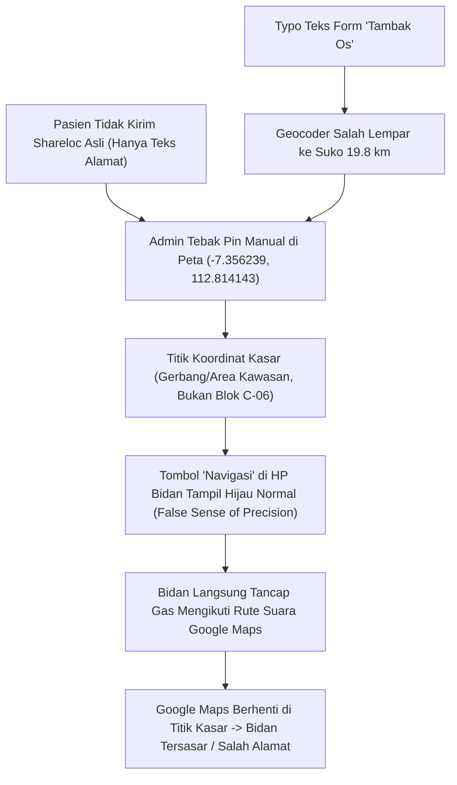

# 🗺️ AUDIT FORENSIK INSIDEN & RENCANA PERBAIKAN FONDASIONAL
## Kasus: Bidan Thabita Tersasar / Salah Alamat pada Tugas Homecare (30 September 2026)

> **Status Dokumen:** EXECUTED-ULANG (2026-10-02, Fase 0-4) — implementasi sebelumnya sempat hilang dari tree (hanya tes tersisa); kode di-apply ulang & seluruh 14 tes `navigation-accuracy-preflight.test.ts` HIJAU. Menunggu uji perangkat nyata + deploy.  
> **Tanggal Kejadian:** 30 September 2026, 15:00 – 15:48 WIB  
> **Tanggal Audit:** 01 Oktober 2026  
> **Target Staf:** Bidan Thabita (ID: `2eef2d61-747d-4756-a93f-512ee1d16f81`, Role: `THERAPIST`)  
> **Target Pasien:** Bunda Ifa (`6280000000958`), Perumahan The Oso, Sidoarjo  

---

## 📌 BAGIAN 1: AUDIT FORENSIK 5 DIMENSI LENGKAP

### 1.1. Ringkasan Insiden Nyata
Pada hari Rabu, 30 September 2026, Bidan Thabita ditugaskan melakukan kunjungan *homecare* pukul 15.00 WIB untuk pasien **Bunda Ifa** dengan treatment *Kala Baby – Pijat Pulih Ceria* di alamat tercatat:
> **"The Oso, The Wise Blok C-06, Kel. Tambakoso, Kec. Waru, Kabupaten Sidoarjo"**

Namun pada pukul **15:26:41 WIB** (26 menit setelah jam mulai), Bidan Thabita mengirimkan pesan permintaan maaf melalui WhatsApp ke Bunda Ifa:
> *"Selamat sore bunda mohon maaf ini, sya slah alamat bunda, 10mnt lgi sya smpe nggih, mohon maaf atas keterlambatannya🙏🙏"*  
> *(~ Bidan Thabita)*

Bidan Thabita baru tiba di rumah pasien pada pukul **15:48 WIB** (terlambat ~48 menit), baru menekan tombol OTW pada 15:48:48 WIB, dan langsung menekan tombol Sampai pada 15:48:51 WIB. Pada pukul 16:41 WIB, Bidan Thabita memperbarui titik lokasi customer di aplikasi.

---

### 1.2. Hasil Investigasi Log Mesin & Database (Forensic Evidence)

```
[KRONOLOGI PERJALANAN DATA KOORDINAT]

1. 29 Sep 2026 13:08:14 WIB [Database Audit]
   - Form booking diisi CS dengan teks kecamatan terpotong: "Kec : Tambak Os".
   - Sistem auto-geocoder gagal mencocokkan "Tambak Os" ke Waru -> Fallback otomatis ke Desa Suko, Kec. Sidoarjo.
   - Koordinat tersimpan: Lat -7.44615, Lng 112.678558 (Jarak 19.79 km dari klinik, ongkir melonjak).

2. 30 Sep 2026 02:49 - 02:50 UTC (09:49 - 09:50 WIB) [Database Audit]
   - Admin CS merefresh data dan melihat anomali jarak 19.79 km.

3. 30 Sep 2026 05:15 - 05:18 UTC (12:15 - 12:18 WIB) [Database Audit]
   - Admin (admin@kalamomsspa.com) membuka CustomerEditForm / LocationPickerModal.
   - Admin mengubah kelurahan menjadi "Tambakoso" dan kecamatan "Waru".
   - Karena pasien TIDAK PERNAH mengirimkan shareloc WhatsApp asli (share_location_sent = false),
     Admin menyetel titik pin manual (location_source = 'manual_staff'):
     Lat: -7.356239, Lng: 112.814143.
   - Koordinat ini adalah titik area umum/gerbang kawasan Tambakoso, BUKAN rumah Blok C-06.

4. 30 Sep 2026 08:00 UTC (15:00 WIB) [Staff Portal StaffToday]
   - Bidan Thabita membuka tugas di HP dan menekan tombol hijau "Navigasi".
   - Aplikasi membuka URL Google Maps terarah:
     https://www.google.com/maps/dir/?api=1&destination=-7.356239,112.814143&travelmode=two-wheeler
   - Bidan mengikuti arahan suara Google Maps hingga titik tersebut.
   - Titik tersebut ternyata BUKAN Blok C-06 (berbeda gang/blok sejauh ratusan meter di dalam perumahan The Oso).

5. 30 Sep 2026 08:26:41 UTC (15:26:41 WIB) [WhatsApp Outbound Log]
   - Bidan Thabita mengirim chat: "Selamat sore bunda mohon maaf ini, sya slah alamat bunda..."

6. 30 Sep 2026 08:48:48 UTC (15:48:48 WIB) [Staff Action Audit]
   - Bidan Thabita baru tiba, klik STAFF_SEND_OTW disusul STAFF_ARRIVED (3 detik kemudian).

7. 30 Sep 2026 09:41:33 UTC (16:41:33 WIB) [Staff Action Audit]
   - Bidan Thabita mengunci koordinat riil di lapangan (STAFF_UPDATE_CUSTOMER_LOCATION).
```

---

### 1.3. Multi-Layer Root Cause Audit (Analisa Akar Masalah Berlapis)



| Layer | Akar Masalah Sistemik | Dampak |
|---|---|---|
| **Data Provenance** | Pasien tidak pernah diverifikasi shareloc GPS-nya (`share_location_sent: false`). Nilai `location_source` adalah `'manual_staff'`, bukan `'gps_pin'`. | Titik koordinat yang tersimpan hanya estimasi kasar staf, bukan lokasi fisik rumah pasien. |
| **UI/UX Affordance (Portal Staf)** | Tombol **"Navigasi"** di `StaffToday.tsx` berwujud sama persis (hijau `#008069`) untuk semua jenis titik koordinat. Tidak ada pembeda visual mencolok antara titik presisi pasien vs titik tebakan staf. | Bidan mengalami *False Sense of Precision*: mengira titik peta sudah 100% akurat di depan pagar rumah, sehingga tidak mengecek nomor blok atau meminta shareloc sebelum berangkat. |
| **Safety Interstitial Gate** | Tidak ada dialog peringatan pra-navigasi (*pre-flight safety check*) ketika Bidan hendak membuka peta untuk titik yang bukan berstatus `gps_pin`. | Sistem langsung melempar Bidan ke aplikasi Google Maps tanpa peringatan bahwa titik tersebut hanya estimasi kawasan. |
| **Parameter Google Maps** | URL navigasi Google Maps hanya menggunakan koordinat angka murni (`destination=-7.356239,112.814143`) tanpa menyertakan teks pelengkap alamat/perumahan (`The Oso Blok C-06`). | Google Maps memandu ke koordinat tanpa peduli nama blok atau nama cluster. |
| **Workflow CS (Live Chat)** | Tidak ada peringatan proaktif atau tombol cepat (1-klik) bagi CS di Live Chat Monitor untuk meminta shareloc WhatsApp resmi pada H-1 / hari H bagi reservasi yang belum memiliki `gps_pin`. | Reservasi lolos ke hari H dengan koordinat tebakan manual. |

---

## 💡 BAGIAN 2: DESAIN SOLUSI FONDASIONAL (ANTI-TAMBAL SULAM)

Solusi ini mematuhi **Mandat Solusi Fondasional & Larangan Solusi Kosmetik**:
Bukan sekadar melarang atau menambal teks, melainkan membangun **Gerbang Kode Deterministik (*Hard Code-Level Guards*)**:

### 1. Dual-State Navigation CTA (Pembeda Visual Tegas di HP Bidan)
* **Status Presisi (`locationSource === 'gps_pin'`)**:
  * Tombol berwarna Hijau `#008069`: `📍 Navigasi Presisi`
  * Sekali klik langsung memicu telemetry + membuka rute navigasi.
* **Status Estimasi (`locationSource === 'estimated_area' || 'manual_staff' || null`)**:
  * Tombol berwarna Kuning/Amber `#d97706`: `⚠️ Navigasi (Titik Estimasi)`
  * Badge peringatan tegas: *"Titik Staf / Estimasi Wilayah"*.

### 2. Pre-Flight Navigation Interstitial Modal (Gerbang Konfirmasi Pra-Keberangkatan)
Ketika tombol `⚠️ Navigasi (Titik Estimasi)` ditekan, aplikasi **DILARANG LANGSUNG MEMBUKA GOOGLE MAPS**. Sistem wajib memunculkan modal dialog pengaman:
* **Peringatan Klinis**:  
  *"⚠️ Perhatian: Titik ini merupakan estimasi wilayah/staf, BUKAN titik GPS presisi dari pasien. Google Maps hanya akan memandu ke area umum perumahan."*
* **Detail Alamat Lapangan**:  
  Menampilkan teks blok, nomor rumah, dan patokan (`addressDetail`, `landmark`).
* **Aksi Penyelamat 1-Klik**:
  1. `💬 Minta Shareloc ke Bunda`: Membuka chat WA dengan draft pesan ramah:  
     *"Halo Bunda Ifa, Bidan Thabita izin konfirmasi untuk persiapan treatment jam 15.00.. Boleh minta tolong kirimkan shareloc WhatsApp terkini dan patokan rumahnya ya Bun agar Bidan tidak tersasar? Terima kasih Bunda 🤗"*
  2. `🗺️ Tetap Buka Peta`: Membuka Google Maps dengan teks alamat lengkap.

### 3. Smart Google Maps Navigation Destination Fallback
Peningkatan fungsi `buildMapsUrls` dan `getGoogleMapsDirectionUrl`:
* Jika titik adalah `gps_pin`: Gunakan koordinat langsung `destination=lat,lng`.
* Jika titik adalah `manual_staff` / `estimated_area` dan ada nama perumahan/alamat teks:
  Gunakan gabungan koordinat dan query pencarian alamat agar Google Maps membuka kartu lokasi dengan konteks nama perumahan, bukan sekadar pin mati di tengah jalan.

### 4. CS Live Chat Dispatch Quick Shareloc Trigger
Di `LiveChatDispatchWidget.tsx`, jika ada reservasi hari ini dengan `locationSource !== 'gps_pin'`:
* Tampilkan kartu peringatan: *"📍 Lokasi Pasien Masih Berstatus Estimasi (Belum Ada Shareloc Presisi)"*.
* Sediakan tombol 1-klik: *"Minta Shareloc Sekarang"* untuk mengirim template WhatsApp resmi ke pasien.

---

## 🛠️ BAGIAN 3: STAGED PHASES & MICRO-TASK IMPLEMENTATION PLAN

```
Phase 0: Baseline & Regression Gate
   │
Phase 1: Pre-Flight Navigation Safety Modal & Accuracy-Aware CTA (StaffToday.tsx)
   │
Phase 2: Smart Destination Builder (staff-reservation.service.ts & geoUtils.ts)
   │
Phase 3: Live Chat Dispatch Standby & Quick Shareloc Widget (LiveChatMonitor.tsx)
   │
Phase 4: Automated Testing & Verification Gate (Vitest)
```

---

### 🔹 Fase 0: Baseline & Regression Gate
- [ ] **0.1** Verifikasi kebersihan build TypeScript admin dashboard:
  ```bash
  cd packages/admin-dashboard
  npm run build
  cd ../..
  ```
- [ ] **0.2** Jalankan test eksisting terkait dispatch:
  ```bash
  npx vitest run tests/unit/dispatch-map-projection.test.ts
  ```

---

### 🔹 Fase 1: Pre-Flight Navigation Safety Modal & Accuracy-Aware CTA
**File Target:**
1. `packages/admin-dashboard/src/components/staff/NavigationPreflightModal.tsx` *(Komponen Baru)*
2. `packages/admin-dashboard/src/pages/staff/StaffToday.tsx`

#### Micro-Task 1.1: Buat Komponen `NavigationPreflightModal.tsx`
Komponen modal pop-up independen, ramah layar sentuh HP (thumb-zone), tanpa library eksternal baru:
* Menerima props: `isOpen`, `task`, `onClose`, `onProceedNavigation`, `onRequestShareloc`.
* Menampilkan alert amber cerah, ringkasan alamat lengkap pasien, nomor blok/patokan, dan 2 tombol aksi utama.

#### Micro-Task 1.2: Integrasikan Accuracy-Aware CTA di `StaffToday.tsx`
* Ubah tombol navigasi di kartu tugas (`StaffToday.tsx:2952`), header chat (`3134`), dan modal detail (`4693`):
  * Cek `const isPrecise = task.address?.locationSource === 'gps_pin'`.
  * Jika `isPrecise`: Tombol hijau langsung memicu `handleStartNavigation`.
  * Jika `!isPrecise`: Tombol beraksen amber dengan label `"Navigasi (Estimasi)"` yang memicu pembukaan `NavigationPreflightModal`.

---

### 🔹 Fase 2: Smart Google Maps Destination Fallback
**File Target:**
1. `src/services/staff-reservation.service.ts`
2. `packages/admin-dashboard/src/utils/geoUtils.ts`

#### Micro-Task 2.1: Perluas `buildMapsUrls` di Backend
Tambahkan parameter `locationSource` dan `fullAddress`:
```typescript
export function buildMapsUrls(
  lat?: number | null,
  lng?: number | null,
  locationSource?: string | null,
  fullAddress?: string | null
): { mapsUrl: string | null; navigationUrl: string | null }
```
Jika `locationSource !== 'gps_pin'` dan terdapat `fullAddress`, generate URL navigasi yang ramah pencarian nama klaster perumahan.

#### Micro-Task 2.2: Sinkronisasi dengan Frontend `geoUtils.ts`
Perbarui fungsi `getGoogleMapsDirectionUrl` agar seragam dengan backend.

---

### 🔹 Fase 3: CS Live Chat Dispatch Quick Shareloc Trigger
**File Target:**
1. `packages/admin-dashboard/src/components/livechat/LiveChatDispatchWidget.tsx`
2. `packages/admin-dashboard/src/pages/tenant/LiveChatMonitor.tsx`

#### Micro-Task 3.1: Tambahkan Indikator Akurasi Koordinat di Radar CS
Tampilkan badge status akurasi lokasi di widget radar CS. Jika `locationSource !== 'gps_pin'`, munculkan tombol cepat *"Minta Shareloc"* yang mengisi composer livechat dengan draf pesan permintaan shareloc santun.

---

### 🔹 Fase 4: Automated Testing & Verification Gate
**File Target:**
1. `tests/unit/navigation-accuracy-preflight.test.ts` *(File Test Baru)*

#### Micro-Task 4.1: Unit Test Pengujian Skenario Adversarial
* Menguji bahwa `buildMapsUrls` membedakan URL untuk `gps_pin` vs `manual_staff`.
* Menguji bahwa `resolveLocationSource` mengembalikan `manual_staff` untuk customer yang koordinatnya hasil edit manual staf.
* Menguji bahwa tombol estimasi tidak langsung membocorkan rute tanpa konfirmasi modal.

Perintah eksekusi:
```bash
npx vitest run tests/unit/navigation-accuracy-preflight.test.ts
cd packages/admin-dashboard && npm run build && cd ../..
```

---

## 🎯 ACCEPTANCE CRITERIA
1. **Tidak Ada Ilusi Presisi**: Bidan di portal `StaffToday` dapat melihat dengan jelas perbedaan antara titik presisi pasien (`📍 Titik Presisi`) dan titik estimasi (`⚠️ Titik Estimasi`).
2. **Safety Gate Aktif**: Bidan tidak bisa langsung membuka Google Maps untuk titik estimasi tanpa melewati dialog konfirmasi patokan dan opsi minta shareloc WA.
3. **Pemberdayaan CS**: CS di Live Chat dapat mendeteksi pasien H-1 / hari H yang belum memiliki pin GPS presisi dan mengirimkan permintaan shareloc dalam 1 klik.
4. **Zero Regressions**: Seluruh test vitest dan build TypeScript admin-dashboard tetap 100% hijau.
