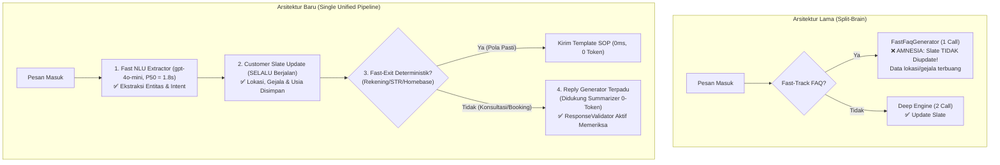

# FASE 3: UNIFIKASI ARSITEKTUR PIPELINE & OPTIMASI KONTEKS

## 1. Tujuan & Filosofi
Menghapus arsitektur "otak terbelah" (*split-brain*) akibat pemisahan jalur *Fast-Track 1-Call* dan *Deep 2-Call*. Menyatukan alur pemrosesan pesan menjadi satu sumber kebenaran tunggal (*Single Unified Pipeline*) yang selalu menyimpan entitas ke `CustomerSlate`, mengoptimalkan ringkasan konteks 0-token, mengamankan latensi NLU pada `gpt-4o-mini`, dan mengaktifkan jaring pengaman `ResponseValidator` di produksi.

---

## 2. Masalah Arsitektur yang Dibereskan

---

## 3. Breakdown Mikro-Task Fase 3

### 🔹 Mikro-Task 3.1: Penguncian Model NLU & Ketahanan Parsing JSON
- **Tujuan:** Mengamankan latensi P50 = 1.8 detik dan mencegah error parsing JSON terpotong yang memicu degradasi ke `chitchat`.
- **File Target:** `src/config/ai-models.config.ts` & `src/slot-engine/entity-extractor.ts`
- **Tindakan:**
  - Kunci task `INTENT_CLASSIFICATION` secara eksplisit ke `gpt-4o-mini` (dilarang fallback ke model lambat seperti MiniMax/DeepSeek untuk NLU).
  - Pasang *resilient JSON parser*: jika JSON terpotong di akhir (seperti kasus baris 12: `{"intents":["provide_location"]...`), parser otomatis memperbaiki kurung kurawal tutup `}` sebelum dilempar ke `JSON.parse`.

### 🔹 Mikro-Task 3.2: Koreksi & Relaksasi Gerbang Medis
- **Tujuan:** Menghilangkan *silent ghosting* pada pelanggan yang menanyakan keluhan umum anak/ibu.
- **File Target:** `src/config/medical-keywords.ts` & `src/state-machine/machine.ts`
- **Tindakan:**
  - Keluarkan keluhan komplementer (`kolik`, `kembung parah`, `ruam`, `nyeri pinggang`, `batuk pilek`) dari `MEDIUM_SEVERITY_MEDICAL_KEYWORDS`.
  - Arahkan keluhan tersebut ke menu resmi klinik: *Pijat Bayi Pulih Ceria* / *Terapi Kolik*.
  - Silent drop (`shouldSendReply: false`) **HANYA** dipertahankan untuk kegawatdaruratan mutlak: `kejang`, `pendarahan hebat`, `tidak sadarkan diri`, `kebiruan`, `sesak parah`.

### 🔹 Mikro-Task 3.3: Unifikasi Alur Pemrosesan di `slot-engine.ts`
- **Tujuan:** Menghapus jalur paralel `FastFaqGenerator` dan menyatukan alur menjadi satu pipa sekuensial terpercaya.
- **File Target:** `src/slot-engine/slot-engine.ts`
- **Tindakan:**
  - Hapus pemanggilan `FastFaqDetector.isFastFaqCandidate()` dan `FastFaqGenerator.process()`.
  - Seluruh pesan masuk diproses seragam:
    1. Ekstraksi NLU via `EntityExtractor`.
    2. Pembaruan `CustomerSlate` via `SlateStore.updateSlateWithExtraction()`.
    3. Evaluasi keputusan via `DecisionMatrix`.
    4. Penyusunan balasan via `ReplyGenerator`.

### 🔹 Mikro-Task 3.4: Fast-Exit Deterministik (Non-Blocking & Amdahl Safe)
- **Tujuan:** Menyediakan respon instan (<50ms, 0 token) untuk pertanyaan operasional murni yang sudah memiliki SOP baku.
- **File Target:** `src/slot-engine/decision-matrix.ts`
- **Tindakan:**
  - Pattern matcher presisi untuk 3 domain statis:
    - Rekening bank resmi klinik (BCA/Mandiri).
    - Legalitas STR & sertifikasi Bidan Yusi.
    - Lokasi homebase klinik (Waru, Sidoarjo).
  - **Prinsip Degradasi Anggun:** Jika pesan mengandung unsur konsultasi keluhan atau negosiasi jadwal, fast-exit **TIDAK BOLEH aktif** dan otomatis meloloskan pesan ke generator penuh.

### 🔹 Mikro-Task 3.5: Dual-Layer Cache Invalidation & Zero-Cache Policy
- **Tujuan:** Mencegah *cache staleness* tanpa single point of failure.
- **File Target:** `src/services/knowledge-base.service.ts` & `src/services/cache.service.ts`
- **Tindakan:**
  - Pasang TTL fallback otomatis **6 jam** pada seluruh cache respons.
  - Hubungkan event hook mutasi Admin Dashboard (`onCatalogUpdate`, `onSettingsUpdate`).
  - **Zero-Cache Guard:** Pesan yang menyentuh harga, promo, ongkir, jarak km, jadwal, atau keluhan DILARANG KERAS disajikan dari cache.

### 🔹 Mikro-Task 3.6: Penguatan `ConversationStateSummarizer` & Aktivasi `ResponseValidator`
- **Tujuan:** Menjamin memori multi-turn tanpa membesarkan raw history window, serta mengaktifkan jaring pengaman anti-halusinasi di produksi.
- **File Target:** `src/slot-engine/conversation-summarizer.ts` & `src/slot-engine/reply-generator.ts`
- **Tindakan:**
  - Perkuat ekstraksi fakta `ConversationStateSummarizer` (fakta lokasi, ongkir promo, usia, gejala, dan treatment yang disepakati).
  - Hubungkan `ResponseValidator.validate(finalReply, slate, options)` yang sebelumnya mati ke alur akhir `ReplyGenerator.generate`.
  - Pertahankan `history.slice(-4)` agar input token tetap hemat dan latensi P50 < 4.5 detik.

---

## 4. Kriteria Sukses (Definition of Done) Fase 3
- Amnesia entitas tereliminasi 100%: kelurahan/gejala yang disebut di turn awal tidak pernah ditanyakan lagi.
- Skenario keluhan kolik/kembung tidak lagi memicu silent drop.
- Latensi end-to-end P50 tetap berada di < 4.5 detik (NLU 1.8s + Generator 2.6s).
- Eksekusi `npm run test:golden` (Fase 1) mencapai kelulusan minimal **45 dari 50 kasus (90%)**.
