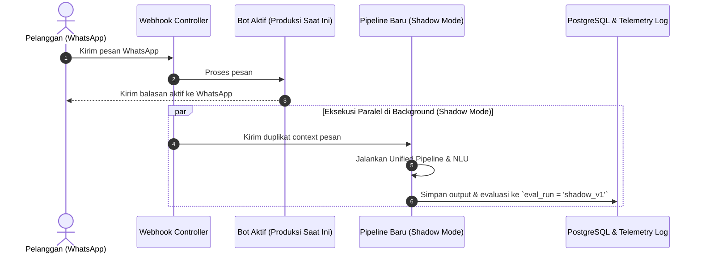

# FASE 4: SHADOW-MODE ROLLOUT, CUTOVER & PEMANGKASAN PROMPT/REGEX

## 1. Tujuan & Filosofi
Menguji pipeline baru secara bertahap pada **trafik nyata tanpa risiko operasional (*zero-risk rollout*)** menggunakan mode bayangan (*shadow mode*). Setelah terbukti stabil di lapangan selama 3–5 hari, lakukan cutover penuh ke produksi, lalu pangkas 71 larangan di prompt menjadi contoh percakapan ideal (*Positive Exemplars*), serta hapus regex destruktif yang memutilasi tata bahasa kalimat.

---

## 2. Alur Rollout Bertahap (*Shadow Mode Execution*)

---

## 3. Breakdown Mikro-Task Fase 4

### 🔹 Mikro-Task 4.1: Implementasi Shadow Engine Runner
- **Tujuan:** Menjalankan pipeline baru di background tanpa memblokir balasan bot aktif dan tanpa mengirim pesan apa pun ke WhatsApp pelanggan.
- **File Target:** `src/slot-engine/shadow-engine.ts`
- **Tindakan:**
  - Fungsi `runShadowTurn(ctx)`: mengeksekusi Unified Pipeline di worker terpisah / background Promise.
  - Mencatat hasil balasan, mutasi slate, dan latensi ke tabel `llm_audit_logs` dengan label `eval_run = 'shadow_unified_v1'`.
  - Try/catch isolasi mutlak: error pada shadow engine **dilarang mempengaruhi** alur chat produksi.

### 🔹 Mikro-Task 4.2: Pemasangan Switch Shadow di Webhook
- **Tujuan:** Mengaktifkan shadow execution berbasis environment variable.
- **File Target:** `src/routes/webhook.route.ts`
- **Tindakan:**
  - Tambahkan pengecekan `if (process.env.SHADOW_PIPELINE_ENABLED === 'true') { shadowEngine.run(ctx); }` setelah pesan aktif diproses.

### 🔹 Mikro-Task 4.3: Observasi Drift & Skrip Evaluasi 3–5 Hari
- **Tujuan:** Membandingkan kualitas balasan bot aktif vs shadow pipeline pada percakapan live server yang sesungguhnya.
- **File Target:** `scripts/check-shadow-accuracy.ts`
- **Fitur Skrip:**
  - Mengambil N percakapan terakhir yang memiliki data shadow run.
  - Membandingkan:
    - Apakah bot aktif lupa kelurahan sedangkan shadow mengingatnya?
    - Apakah latensi shadow konsisten <4.5 detik?
    - Apakah ada kalimat aneh atau kegagalan parsing?
- **Durasi Evaluasi:** 3–5 hari kerja operasional klinik.

### 🔹 Mikro-Task 4.4: Production Cutover (Pengalihan Penuh)
- **Tujuan:** Mengalihkan alur pesan utama WhatsApp ke Unified Pipeline secara aman.
- **File Target:** `src/state-machine/machine.ts` & `src/routes/webhook.route.ts`
- **Tindakan:**
  - Jadikan Unified Pipeline sebagai eksekutor primer.
  - Matikan runner lama dan nonaktifkan flag shadow mode.
  - Verifikasi live chat pertama: pastikan balasan mengalir normal.

### 🔹 Mikro-Task 4.5: Pemangkasan 71 Larangan Prompt & Regex Destruktif
- **Tujuan:** Menghentikan siklus pengekangan berlebihan (*over-constraint*) dan menyembuhkan tata bahasa bot.
- **File Target:** `src/slot-engine/persona-composer.ts` & `src/utils/language-sanitizer.ts`
- **Tindakan Pembersihan:**
  1. Di `persona-composer.ts`:
     - Pangkas daftar 71 `DILARANG KERAS` menjadi aturan inti ringkas.
     - Suntikkan 5–7 contoh percakapan ideal dari `src/slot-engine/few-shot-exemplars.ts`.
     - Naikkan rasio knowledge vs restriction dari `1:1.4` menjadi minimal `2:1`.
  2. Di `language-sanitizer.ts`:
     - Hapus `sanitizeScheduleAffirmations` yang memotong awal kalimat (penyebab kalimat buntung *"untuk hari Sabtu..."*).
     - Hapus pemotong harga dan durasi kasar yang memotong kalimat di tengah jalan (`sanitizeUnsolicitedPriceAndDuration`).
     - Pertahankan sanitizer kritis: anti-monolog CoT AI, anti-duplikasi greeting, dan validasi markdown tebal.

---

## 4. Kriteria Sukses Akhir (Definition of Done) Fase 4
- Shadow mode berjalan 3–5 hari dengan 0 insiden regresi.
- Cutover produksi selesai tanpa downtime atau chat tersangkut.
- Seluruh 50 skenario di Golden Regression Suite (Fase 1) mencapai kelulusan mutlak: **50/50 PASSED (100%)**.
- Seluruh unit test lama (`npm test`) tetap hijau (158 test suites).
- Dashboard telemetri live server menunjukkan:
  - *Silent Drop Rate* = 0% pada kasus non-darurat.
  - *Unjustified RSQR* = 0%.
  - *NLU Failure Rate* < 1.5%.
  - *P50 Latency* < 4.5 detik.
