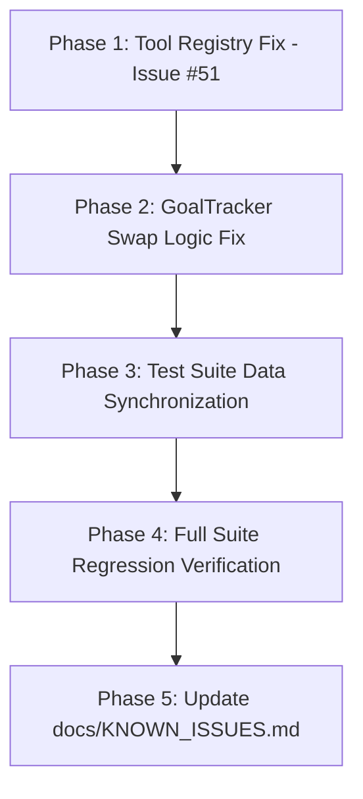

# Implementation Plan — Rekomendasi Utama: Penyatuan Konteks Tool (Issue #51), Perbaikan Logika Swap Keranjang, & Pemulihan Test Suite ke 100% Green

Dokumen ini merinci rencana implementasi fondasional untuk **Rekomendasi Utama (Candidate 2 + Candidate 4)** yang dihasilkan dari audit arsitektur mikro. Perbaikan ini menyelesaikan bug laten produksi pada registri tool, memperbaiki bug logika pertukaran keranjang pada `GoalTracker`, dan menyinkronkan seluruh suite pengujian dengan katalog aktif sehingga mencapai status **100% Green (0 Failures)**.

---

## 📌 Root Cause Analysis & Ringkasan Temuan Audit

### 1. Bug Laten Produksi (Issue #51): `targetPrice` Terpangkas di `tool-registry.ts`
- **Lokasi**: [src/v3/tools/tool-registry.ts](file:///c:/Users/User/Documents/chatbot%20AG/src/v3/tools/tool-registry.ts#L57-L68)
- **Akar Masalah**: Skema Zod [tool-schemas.ts](file:///c:/Users/User/Documents/chatbot%20AG/src/v3/tools/tool-schemas.ts#L16) memvalidasi `targetPrice?: number`, dan tool [get-catalog.tool.ts](file:///c:/Users/User/Documents/chatbot%20AG/src/v3/tools/get-catalog.tool.ts#L12) siap menerima `targetPrice` untuk klarifikasi harga (misal customer sebut "100rb"). Namun pada `executeToolByName`, `targetPrice` tidak disalin ke objek `input: GetCatalogInput`. Akibatnya, `executeGetCatalog` selalu menerima `targetPrice: undefined`.
- **Solusi**: Teruskan `targetPrice: args.targetPrice` di `tool-registry.ts`.

### 2. Bug Logika Pertukaran Keranjang pada `GoalTracker.resolveAffirmativeSwap`
- **Lokasi**: [src/v3/state/goal-tracker.ts](file:///c:/Users/User/Documents/chatbot%20AG/src/v3/state/goal-tracker.ts#L856-L881)
- **Akar Masalah**: Pada pengujian `tests/unit/v3/treatment-swap-cart-sync.test.ts:77`, asisten mengatakan: *"Baik, Pijat Bayi Pulih Ceria ya Bunda. Rencana hari apa?"* dan user menjawab *"iya"*. Keranjang sudah memuat `Pijat Bayi Pulih Ceria`.
  Fungsi `resolveAffirmativeSwap` mengecualikan `Pijat Bayi Pulih Ceria` dari kandidat karena sudah ada di keranjang. Namun, pada pencocokan fuzzy token (baris 865–867), layanan saudara se-famili `Pijat Kids Pulih Ceria` memiliki token `pulih`, `ceria`, `terapi`, `bapil` yang cocok dengan kalimat asisten. Akibatnya, `Pijat Kids Pulih Ceria` terpilih sebagai tawaran baru dan menggantikan `Pijat Bayi Pulih Ceria` di keranjang!
- **Solusi**: Proteksi *Covered Tokens* dari item keranjang yang sudah disebutkan secara eksplisit oleh asisten. Jika asisten hanya menyebut nama layanan yang **sudah ada di keranjang**, token dari layanan tersebut tidak boleh memicu pencocokan fuzzy untuk layanan varian lain yang belum ada di keranjang.

### 3. Price Drift & Test Suite Synchronization (Issue #50)
- **Lokasi**: 10 berkas pengujian (`16 failing tests` dari 1.955 pengujian).
- **Akar Masalah**: 
  1. Revisi harga klinik: `Pijat Bayi Pulih Ceria` memiliki harga promo Rp 75.000 (bukan Rp 70.000) dan `Sinar Moksa` memiliki promo Rp 25.000 (bukan Rp 10.000). Hal ini menyebabkan kegagalan pada `agent-tools.test.ts`, `cart-single-primary-domain.test.ts`, `catalog-session-total.test.ts`, `consultation-mode-no-premature-price.test.ts`, `treatment-swap-cart-sync.test.ts`, dan `v3-fondasional-pilar.test.ts`.
  2. Nomenklatur katalog & follow-up: `treatment-followup-personal.test.ts` masih menguji nama lama `Sinar Moksa (Add-on)` bukannya `Sinar Moksa (Infrared / Moxa)`.
  3. Gatekeeper anti-premature invoicing pada `calculate_delivery`: `tests/unit/v3/cart-dedup-total.test.ts` membutuhkan `priceDiscussed: true` agar rekap nota total keseluruhan dimunculkan.
  4. Nomenklatur layanan bundle pada test `cart-dedup-total.test.ts`: test menggunakan string fiktif `Paket Laktasi (Breast + Oksitosin)` bukannya layanan katalog aktual `Breast + Oksitosin Fullbody Massage`.
  5. Pengujian `v3-audit-homecare-fix.test.ts`: menggunakan nama non-katalog `Induksi Massage Fullbody` tanpa mock catalog di Layer 1 (seharusnya `Oksitosin Massage Fullbody`), dan assert copy respon reservasi masih mengharapkan kata `terjadwal` padahal sudah disempurnakan menjadi `tampung`.
  6. Pengujian `v3-persona-rules.test.ts`: regex batas kalimat sanitasi perlu mengakomodasi emoji penutup.

---

## 🛠️ Staged Implementation Phases



### Phase 1: Penyatuan Parameter Tool Registry (`targetPrice`)
**Tujuan**: Menghilangkan bug hilangnya `targetPrice` saat LLM memanggil `get_catalog_and_price`.

#### [MODIFY] [tool-registry.ts](file:///c:/Users/User/Documents/chatbot%20AG/src/v3/tools/tool-registry.ts)
- Pada `case 'get_catalog_and_price':`, tambahkan baris:
  ```ts
  targetPrice: args.targetPrice,
  ```
  ke dalam inisialisasi `input: GetCatalogInput`.

---

### Phase 2: Perbaikan Bug Logika Pertukaran Keranjang (`GoalTracker.resolveAffirmativeSwap`)
**Tujuan**: Mencegah salah swap pada varian famili (Baby vs Kids) ketika asisten hanya menyebut layanan yang sudah berada di keranjang.

#### [MODIFY] [goal-tracker.ts](file:///c:/Users/User/Documents/chatbot%20AG/src/v3/state/goal-tracker.ts)
- Di dalam `resolveAffirmativeSwap`:
  1. Kumpulkan token dari item keranjang yang namanya (lengkap atau bersih) muncul di `offerText` ke dalam `cartCoveredTokens`.
  2. Saat memfilter kandidat swap B pada baris 865–868: kandidat yang hanya cocok lewat token fuzzy harus memiliki token yang **belum tercakup** (`uncoveredTokens`) oleh item keranjang yang disebutkan asisten. Jika semua token kandidat adalah token dari item keranjang yang sudah ada (seperti `pulih` dan `ceria` dari `Pijat Bayi Pulih Ceria`), abaikan kandidat tersebut.

---

### Phase 3: Sinkronisasi Seluruh Berkas Pengujian yang Terdampak

#### [MODIFY] [tests/v3/agent-tools.test.ts](file:///c:/Users/User/Documents/chatbot%20AG/tests/v3/agent-tools.test.ts)
- Perbarui ekspektasi promoPrice `Pijat Bayi Pulih Ceria` dari `70000` menjadi `75000`.

#### [MODIFY] [tests/unit/v3/cart-single-primary-domain.test.ts](file:///c:/Users/User/Documents/chatbot%20AG/tests/unit/v3/cart-single-primary-domain.test.ts)
- Perbarui ekspektasi subtotal promo `Pijat Bayi Pulih Ceria` dari `70000` menjadi `75000`.

#### [MODIFY] [tests/unit/v3/catalog-session-total.test.ts](file:///c:/Users/User/Documents/chatbot%20AG/tests/unit/v3/catalog-session-total.test.ts)
- Perbarui ekspektasi total (75k promo + 20k ongkir) dari `'90.000'` menjadi `'95.000'`.

#### [MODIFY] [tests/unit/v3/consultation-mode-no-premature-price.test.ts](file:///c:/Users/User/Documents/chatbot%20AG/tests/unit/v3/consultation-mode-no-premature-price.test.ts)
- Perbarui ekspektasi total (75k promo + 20k ongkir) dari `'90.000'` menjadi `'95.000'`.

#### [MODIFY] [tests/unit/v3/treatment-swap-cart-sync.test.ts](file:///c:/Users/User/Documents/chatbot%20AG/tests/unit/v3/treatment-swap-cart-sync.test.ts)
- Perbarui ekspektasi promoPrice `Pulih` dari `70000` menjadi `75000`.

#### [MODIFY] [tests/unit/v3-fondasional-pilar.test.ts](file:///c:/Users/User/Documents/chatbot%20AG/tests/unit/v3-fondasional-pilar.test.ts)
- Perbarui nominal add-on `Sinar Moksa` dari `10.000` (lama) menjadi `25.000` (katalog aktif) dan totalnya menjadi `95.000`.

#### [MODIFY] [tests/unit/treatment-followup-personal.test.ts](file:///c:/Users/User/Documents/chatbot%20AG/tests/unit/treatment-followup-personal.test.ts)
- Sesuaikan ekspektasi pencarian `Sinar Moksa` menjadi `Sinar Moksa (Infrared / Moxa)` dan penyesuaian nama hasil pencarian untuk `Pijat Bayi Ceria Newborn` serta `Pijat Ibu Hamil / Prenatal Gentle Massage`.

#### [MODIFY] [tests/unit/v3/cart-dedup-total.test.ts](file:///c:/Users/User/Documents/chatbot%20AG/tests/unit/v3/cart-dedup-total.test.ts)
- Pada test "inflasi warisan DB", gunakan nama resmi `Breast + Oksitosin Fullbody Massage` dan `Pijat Laktasi / Breast Care Massage`.
- Pada test "delivery tool + cartSnapshot", sertakan `priceDiscussed: true` agar rekap grand total dimunculkan sesuai kontrak baru anti-premature invoicing.

#### [MODIFY] [tests/unit/v3-audit-homecare-fix.test.ts](file:///c:/Users/User/Documents/chatbot%20AG/tests/unit/v3-audit-homecare-fix.test.ts)
- Gunakan layanan resmi `Oksitosin Massage Fullbody` (promo Rp 105.000) pada pengujian Layer 1 dan sesuaikan ekspektasi kata `tampung` / `cekkan` pada pesan balasan.

#### [MODIFY] [tests/unit/v3-persona-rules.test.ts](file:///c:/Users/User/Documents/chatbot%20AG/tests/unit/v3-persona-rules.test.ts)
- Perbarui regex akhir kalimat pada test 11 untuk mendukung emoji penutup: `/[.!?…\p{Extended_Pictographic}]\s*$/u`.

---

### Phase 4: Full Suite Regression Verification
- Jalankan pemeriksaan tipe statis: `npm run build` (`tsc`).
- Jalankan seluruh rangkaian tes: `npx vitest run`.
- **Kriteria Keberhasilan**: 263/263 test files pass, 1.955/1.955 tests pass (0 failures).

---

### Phase 5: Dokumentasi & Penutupan Issue
#### [MODIFY] [docs/KNOWN_ISSUES.md](file:///c:/Users/User/Documents/chatbot%20AG/docs/KNOWN_ISSUES.md)
- Perbarui status **Issue #50** (Test Suite Price Drift) menjadi `RESOLVED`.
- Perbarui status **Issue #51** (`targetPrice` missing in `executeToolByName`) menjadi `RESOLVED`.

---

## 🧪 Verification Plan

### Automated Tests
1. `npx vitest run tests/unit/v3/treatment-swap-cart-sync.test.ts`
2. `npx vitest run tests/v3/agent-tools.test.ts`
3. `npx vitest run tests/unit/v3/cart-dedup-total.test.ts`
4. `npx vitest run tests/unit/v3-fondasional-pilar.test.ts`
5. `npx vitest run tests/unit/treatment-followup-personal.test.ts`
6. `npx vitest run` (seluruh 263 test files)
7. `npm run build` (typecheck)

### Manual Verification
- Verifikasi bahwa `targetPrice` pada pemanggilan `get_catalog_and_price` di CLI simulator (`npm run chat`) dapat diterima dan diproses untuk mengklarifikasi harga tanpa kehilangan konteks.
