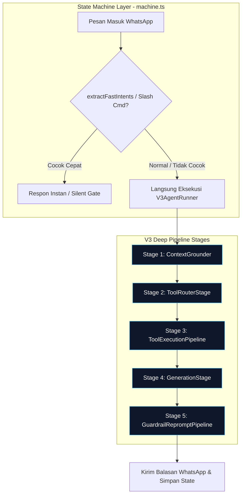

# Implementation Plan — Dekomposisi Monolitik AI Orchestrator (V3AgentRunner) & Kolaps Split-Brain NLU

Dokumen ini merinci rencana implementasi arsitektur fondasional tahap berikutnya (**Candidate 1 + Candidate 3**): mendekomposisi monolitik `src/v3/agent/agent-runner.ts` (>1.900 baris) menjadi 4 *Deep Pipeline Stages* ber-antarmuka murni, serta mengolaps *split-brain NLU* di `src/state-machine/machine.ts` dengan memensiunkan panggilan LLM ganda `EntityExtractor` yang redundan demi memangkas latensi respon ~2 detik per putaran percakapan.

---

## 📌 Root Cause Analysis & Masalah Desain Sistemik

### 1. Monolitik "God Module" pada `V3AgentRunner` (1.929 LOC)
- **Lokasi**: [src/v3/agent/agent-runner.ts](file:///c:/Users/User/Documents/chatbot%20AG/src/v3/agent/agent-runner.ts)
- **Gejala Masalah**:
  1. Satu berkas memikul 6 tanggung jawab berbeda sekaligus: transport HTTP OpenAI/CircuitBreaker, ekstraksi sinyal & RAG pre-grounding, Call 1 router prompt & tool dispatch, reduksi mutasi status session, Call 2 persona synthesis, dan 3 *nested reprompt loops* (numeric, factual, pronoun).
  2. Setiap perbaikan bug (misal bug ongkir, bug nama anak, bug kuotasi) terpaksa mengedit berkas raksasa yang sama, meningkatkan risiko regresi lintas domain (*high blast radius*).
  3. Pengujian terisolasi (*unit testing*) sangat sulit dilakukan tanpa melakukan mock penuh terhadap OpenAI network, database, dan session store sekaligus.
- **Prinsip Deep Module (Matt Pocock / John Ousterhout)**:
  - Sebuah modul harus memiliki *surface area* antarmuka publik yang kecil dan jelas (*shallow interface*), namun menyembunyikan kompleksitas implementasi yang kaya (*deep implementation*).
  - Menguraikan tahapan proses menjadi pipa sekuensial linear:
    $$\text{Inbound} \longrightarrow \text{Grounder} \longrightarrow \text{Router} \longrightarrow \text{ToolPipeline} \longrightarrow \text{Generator} \longrightarrow \text{GuardrailPipeline} \longrightarrow \text{Outbound}$$

### 2. Split-Brain NLU di `machine.ts` (Redundansi 2–3 Panggilan LLM per Turn)
- **Lokasi**: [src/state-machine/machine.ts](file:///c:/Users/User/Documents/chatbot%20AG/src/state-machine/machine.ts#L433-L488)
- **Gejala Masalah**:
  1. Sebelum pesan masuk ke `V3AgentRunner`, `machine.ts` memanggil `EntityExtractor.extract` via OpenAI (panggilan LLM terpisah) hanya untuk mendeteksi `out_of_domain`, `complaint`, dan `human_agent`.
  2. Jika intent tidak terpicu eskalasi sunyi, pesan baru diteruskan ke `V3AgentRunner`, yang kemudian mengeksekusi Call 1 (Router LLM) dan Call 2 (Persona LLM). Total = 3 panggilan LLM per turn!
  3. Ini memboroskan latensi 1.5–2.5 detik per pesan customer dan membuang kuota token secara sia-sia.
- **Solusi Fondasional**:
  - Pensiunkan panggilan LLM `EntityExtractor` di `machine.ts`. Eskalasi domain, komplain, dan permintaan agen manusia ditangani langsung dan secara alami oleh Call 1 Router melalui tool bawaan `escalate_to_human`, didukung oleh gate deterministik cepat `extractFastIntents` (0 token, 0 ms).

---

## 🏛️ Arsitektur Pipa Baru (Pipelined Deep Architecture)



---

## 🛠️ Staged Implementation Phases

### Phase 1: Ekstraksi `ContextGrounder` (Stage 1)
**Tujuan**: Mengisolasi logika deteksi sinyal percakapan, derivasi fase percakapan, pelabelan internal jadwal, dan pra-pengambilan pengetahuan (Hybrid RAG).

#### [NEW] `src/v3/agent/pipeline/context-grounder.ts`
- Buat kelas murni `ContextGrounder`:
  ```ts
  export interface GroundingInput {
    incomingText: string;
    cleanIncomingText: string;
    session: CustomerGoalSession;
    tenantId: string;
    phone: string;
    conversationId: string;
    isFollowUp: boolean;
  }

  export interface GroundingOutput {
    phase: ConversationPhase;
    phaseDirective: string;
    hasScheduleSignal: boolean;
    hasFallInjury: boolean;
    hasVaccineSignal: boolean;
    timeHint: string | null;
    retrievedChunks: KnowledgeChunkResult[];
    emptyKnowledgeResult: boolean;
    bundleCompositionNote: string | null;
  }

  export class ContextGrounder {
    public static async ground(input: GroundingInput): Promise<GroundingOutput>;
    public static deriveConversationPhase(session: CustomerGoalSession, isFollowUp?: boolean): ConversationPhase;
    public static buildPhaseDirective(phase: ConversationPhase, session: CustomerGoalSession): string;
    public static extractTimeHint(text: string): string | null;
    public static hasScheduleSignal(text: string): boolean;
    public static hasFallInjurySignal(text: string): boolean;
    public static hasVaccineSignal(text: string): boolean;
    public static isSubstantiveForPreGrounding(text: string): boolean;
    public static assignInternalScheduleLabel(conversationId: string, tenantId: string): Promise<void>;
  }
  ```
- **Karakteristik Modul**: Bebas dari panggilan LLM router. Panggilan RAG `knowledgeService.searchKnowledgeFaqChunks` terbungkus rapi di dalam `ground()`.

---

### Phase 2: Ekstraksi `ToolExecutionPipeline` & Session Reducer (Stage 2 & 3)
**Tujuan**: Mengisolasi validasi argumen tool, pengayaan kontekstual otomatis, eksekusi tool melalui registry, dan pembaruan mutasi status sesi (State Reducer).

#### [NEW] `src/v3/agent/pipeline/tool-pipeline.ts`
- Buat kelas `ToolExecutionPipeline`:
  ```ts
  export interface ToolExecutionInput {
    toolCalls: ToolCallPayload[];
    session: CustomerGoalSession;
    tenantId: string;
    customerId?: string;
    phone: string;
    conversationId: string;
    chatId: string;
    recentUserTexts: string[];
    grounding: GroundingOutput;
  }

  export interface ToolExecutionOutput {
    executedTools: ExecutedToolResult[];
    updatedSession: CustomerGoalSession;
    isEscalated: boolean;
    escalateReason?: string;
    escalateSeverity?: string;
    selectedLocationText?: string;
    dayEvidenceViolation?: string;
    inquirePriceSignal: boolean;
  }

  export class ToolExecutionPipeline {
    public static async execute(input: ToolExecutionInput): Promise<ToolExecutionOutput>;
    private static enrichToolArguments(toolName: string, rawArgs: any, ctx: any): any;
    private static applyToolEffectsToSession(session: CustomerGoalSession, toolResult: ExecutedToolResult): void;
  }
  ```
- **Keuntungan Arsitektural**:
  - Menghilangkan mutasi sesi yang tersebar acak di baris 1330–1500 `agent-runner.ts`.
  - Mutasi sesi dikonsolidasikan ke fungsi reduksi murni (*state reducer*).

---

### Phase 3: Ekstraksi `GuardrailPipeline` & Reprompt Engine (Stage 5)
**Tujuan**: Menyatukan seluruh pengecekan guardrail dan loop reprompt terisolasi ke dalam modul yang mandiri dan teruji secara terpisah.

#### [NEW] `src/v3/agent/pipeline/guardrail-pipeline.ts`
- Buat kelas `GuardrailPipeline`:
  ```ts
  export interface GuardrailInput {
    draftReply: string;
    incomingText: string;
    isFollowUp: boolean;
    executedTools: ExecutedToolResult[];
    retrievedChunks: KnowledgeChunkResult[];
    session: CustomerGoalSession;
    tenantId: string;
    phone: string;
    conversationId: string;
    model: string;
    executeChat: (params: ChatCompletionParams) => Promise<any>;
    recordCall: (callMeta: CallRecordMeta) => Promise<void>;
  }

  export interface GuardrailOutput {
    finalReply: string;
    shouldSendReply: boolean;
    isEscalated: boolean;
    emptyKnowledgeResult: boolean;
    repromptCount: number;
    violationsDetected: string[];
  }

  export class GuardrailPipeline {
    public static async verifyAndReprompt(input: GuardrailInput): Promise<GuardrailOutput>;
    private static attemptNumericReprompt(...): Promise<string | null>;
    private static attemptFactualReprompt(...): Promise<string | null>;
    private static attemptPronounReprompt(...): Promise<string | null>;
  }
  ```
- **Keuntungan Arsitektural**:
  - Mengisolasi 3 loop reprompt (baris 1650–1820) dari `agent-runner.ts`.
  - Logika fallback gracefully (misal fallback ke Domicile Neutral bila hanya kecamatan yang salah) terkapsul rapi.

---

### Phase 4: Refaktor `GenerationStage` & Perampingan `V3AgentRunner`
**Tujuan**: Mengecilkan `src/v3/agent/agent-runner.ts` dari 1.929 baris menjadi <250 baris yang berperan sebagai koordinator orkestrasi linear yang bersih.

#### [NEW] `src/v3/agent/pipeline/generation-stage.ts`
- Mengisolasi pemanggilan Call 1 (Router LLM) dan Call 2 (Persona Synthesis LLM).
- Merakit prompt via `PersonaPromptBuilder.buildRouterPrompt` dan `PersonaPromptBuilder.buildPersonaPrompt`.

#### [MODIFY] [agent-runner.ts](file:///c:/Users/User/Documents/chatbot%20AG/src/v3/agent/agent-runner.ts)
- Menggantikan kode raksasa dengan alur orkestrasi yang sepenuhnya sekuensial:
  ```ts
  export class V3AgentRunner {
    public static async processMessage(input: AgentRunnerInput): Promise<AgentRunnerOutput> {
      // 1. Fast Gate: Deterministic Greeting & Post-Reservation Acknowledgement
      const fastGate = FastResponseGate.check(input, session);
      if (fastGate) return fastGate;

      // 2. Stage 1: Context Grounding (RAG, Signals, Phase)
      const grounding = await ContextGrounder.ground({ ... });

      // 3. Stage 2: Call 1 Tool Routing
      const routing = await GenerationStage.routeTools({ ...grounding, ... });

      // 4. Stage 3: Tool Execution & State Reducer
      const toolOutput = await ToolExecutionPipeline.execute({ toolCalls: routing.toolCalls, ... });

      // 5. Stage 4: Call 2 Persona Generation
      const generation = await GenerationStage.generateReply({ grounding, toolOutput, ... });

      // 6. Stage 5: Guardrails & Reprompt Engine
      const guardrailOutput = await GuardrailPipeline.verifyAndReprompt({
        draftReply: generation.replyText,
        executedTools: toolOutput.executedTools,
        ...
      });

      // 7. Return clean orchestrated output & update conversation state
      return { ... };
    }
  }
  ```

---

### Phase 5: Kolaps Split-Brain NLU di `machine.ts` (Candidate 3)
**Tujuan**: Mengeliminasi panggilan LLM `EntityExtractor` yang redundan di `machine.ts`, memangkas 1.5–2.5 detik per pesan masuk.

#### [MODIFY] [machine.ts](file:///c:/Users/User/Documents/chatbot%20AG/src/state-machine/machine.ts)
1. Di baris 433–454:
   - Evaluasi `extractFastIntents(incomingText)` (deterministik, 0 ms).
   - Hapus pemanggilan `const extraction = await EntityExtractor.extract(...)` yang memicu panggilan LLM ekstra.
   - Jika `extractFastIntents` mendeteksi eskalasi langsung (misal kata kunci darurat medis kritis), lakukan silent escalation.
   - Jika tidak ada sinyal cepat, langsung teruskan pesan ke `V3AgentRunner.processMessage`.
2. Biarkan `V3AgentRunner` mengevaluasi intent secara holistik dalam Call 1 Router: jika customer komplain, meminta berbicara dengan manusia, atau topik di luar domain klinik, Router memanggil tool `escalate_to_human`.
3. Saat `v3Result.isEscalated === true`, `machine.ts` melakukan eskalasi ke antrean manusia (`is_human_handling = true`) seperti biasa.

---

## 🧪 Verification Plan & Regression Gate

### Automated Unit & Integration Tests
1. **Pipelined Stages Isolation Tests**:
   - `tests/unit/v3/context-grounder.test.ts`: Uji isolasi ekstraksi sinyal waktu, jadwal, dan derivasi fase percakapan tanpa ketergantungan model LLM.
   - `tests/unit/v3/tool-pipeline.test.ts`: Uji eksekusi tool dan mutasi status sesi tanpa memanggil LLM.
   - `tests/unit/v3/guardrail-pipeline.test.ts`: Uji mekanisme reprompt terisolasi pada pelanggaran fakta dan kata ganti.
2. **End-to-End Test Suite**:
   - Jalankan `npx vitest run tests/unit/machine.test.ts` untuk memastikan alur state machine tetap valid setelah penghapusan LLM `EntityExtractor`.
   - Jalankan `npx vitest run tests/v3/` untuk memverifikasi bahwa seluruh skenario agent tools dan conversation flows tetap bekerja 100%.
   - Jalankan `npm run build` (`tsc`) untuk menjamin kepatuhan sistem tipe TypeScript tanpa error.

### Latency Benchmark Verification
- Jalankan CLI simulator `npm run chat` dengan pencatatan waktu (`console.time('turn_latency')`):
  - **Sebelum**: Latensi Turn berkisar ~3.5s – 5.0s (karena ada LLM Call 0 + Call 1 + Call 2).
  - **Sesudah**: Latensi Turn turun menjadi ~1.5s – 2.8s (hanya Call 1 + Call 2, hemat 1x LLM roundtrip).
