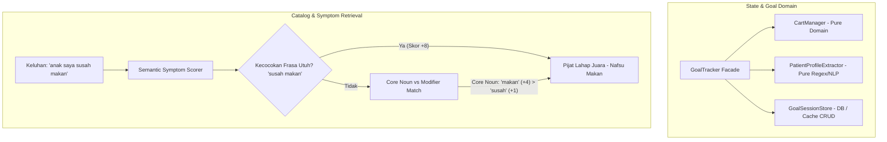

# Implementation Plan — Dekomposisi Domain State GoalTracker, Resolusi Skor Semantik Gejala Klinis (Issue #48), & Isolasi Test Harness (Issue #47)

Dokumen ini merinci rencana implementasi arsitektur fondasional tahap berikutnya untuk memecah monolitik **`GoalTracker`** (1.591 LOC) menjadi modul domain murni yang kohesif, menyelesaikan limitasi pencocokan gejala klinis ambigu multi-kata pada katalog (**Known Issue #48: "susah makan" vs "susah BAB"**), serta mengisolasi harness test agar tidak lagi memutasi berkas git-tracked `services_custom.json` saat pengujian dijalankan (**Known Issue #47**).

---

## 📌 Root Cause Analysis & Masalah Desain Sistemik

### 1. Monolitik `GoalTracker` (1.591 LOC)
- **Lokasi**: [src/v3/state/goal-tracker.ts](file:///c:/Users/User/Documents/chatbot%20AG/src/v3/state/goal-tracker.ts)
- **Akar Masalah**:
  1. Berkas ini mencampurkan 3 domain yang sepenuhnya berbeda:
     - **Cart Domain Logic**: aturan keranjang, dedup bundle, afirmasi swap, scope penerima, proteksi orphan add-on (`syncCartItems`, `resolveAffirmativeSwap`, `calcCartTotal`).
     - **Patient Demographic Extraction**: parsing usia anak, kehamilan ibu, deteksi multi-anak, kinship honorifics (`syncChildrenProfiles`, `syncMomProfile`, `extractAgesMonths`, `isMaternalOnlyMessage`).
     - **Session Persistence & Caching**: operasi CRUD database Prisma, cache in-memory fallback, lock concurrency (`getGoalSession`, `updateGoalSession`).
  2. Akibat pencampuran ini, logika murni keranjang (yang seharusnya tidak bergantung pada database atau jaringan) sulit diuji secara terisolasi tanpa memicu mock DB.
- **Solusi Fondasional (Deep Module Philosophy)**:
  - Ekstraksi modul domain murni: [CartManager](file:///c:/Users/User/Documents/chatbot%20AG/src/v3/state/cart-manager.ts) dan [PatientProfileExtractor](file:///c:/Users/User/Documents/chatbot%20AG/src/v3/state/patient-extractor.ts).
  - Jadikan `GoalTracker` sebagai facade tipis (<200 LOC) yang mempertahankan kompatibilitas API publik ke seluruh sistem.

### 2. Ambiguity Scoring Gejala Klinis (Known Issue #48)
- **Lokasi**: [src/services/treatment-catalog.service.ts](file:///c:/Users/User/Documents/chatbot%20AG/src/services/treatment-catalog.service.ts#L945-L965)
- **Akar Masalah**:
  1. `recommendServiceBySymptoms` memecah keluhan menjadi token tunggal mandiri (`w.length > 3`).
  2. Saat customer menyampaikan keluhan *"susah makan"*, token *"susah"* cocok dengan deskripsi *Pijat Bayi Pulih Ceria* (*"susah BAB"*, skor +2), sementara token *"makan"* cocok dengan deskripsi *Pijat Lahap Juara* (*"nafsu makan"*, skor +2).
  3. Terjadi skor seri (2 vs 2). Karena *Pulih Ceria* berada di urutan lebih awal dalam katalog, sistem merekomendasikan terapi batuk/pilek (*Pulih Ceria*) untuk anak yang keluhannya adalah nafsu makan (*Lahap Juara*).
- **Solusi Fondasional**:
  - **Multi-word Phrase Matching**: Berikan bobot tertinggi (+8) untuk kecocokan frasa multi-kata utuh (`"susah makan"`, `"susah bab"`, `"nafsu makan"`).
  - **Noun vs Modifier Semantic Weighting**: Pisahkan kata benda keluhan klinis inti (*core complaint nouns*: `makan`, `bab`, `bapil`, `pilek`, `batuk`, `kembung`, `tidur`, `kolik`) yang berbobot tinggi (+4) dari kata sifat/keterangan modifikator generik (*clinical modifiers*: `susah`, `kurang`, `tidak`, `sering`, `bisa`) yang hanya berbobot rendah (+1).

### 3. Test Runner Mengotori Tracked `services_custom.json` (Known Issue #47)
- **Lokasi**: [src/services/treatment-catalog.service.ts](file:///c:/Users/User/Documents/chatbot%20AG/src/services/treatment-catalog.service.ts#L428) & [tests/setup.ts](file:///c:/Users/User/Documents/chatbot%20AG/tests/setup.ts)
- **Akar Masalah**:
  1. Saat pengujian dijalankan, beberapa test memutasi katalog in-memory (mis. mengaktifkan/menonaktifkan layanan untuk menguji branch filter).
  2. Fungsi `saveServices()` memanggil `fs.writeFileSync` langsung ke berkas `services_custom.json` di working tree root.
  3. Hal ini menghasilkan diff artifisial (*git dirty tree*) yang mengotori repository dan berisiko mengubah katalog live secara tidak sengaja.
- **Solusi Fondasional**:
  - Pasang isolasi otomatis di `saveServices()`: jika `process.env.NODE_ENV === 'test'` atau flag global vitest aktif, operasi penulisan disk `fs.writeFileSync` di-bypass (atau dialihkan ke memori) tanpa mengubah file fisik di disk.

---

## 🏛️ Arsitektur State & Retrieval Baru



---

## 🛠️ Staged Implementation Phases

### Phase 1: Resolusi Skor Semantik Gejala Klinis Multi-Word (Issue #48)
**Tujuan**: Menghilangkan false-recommendation antara *Pulih Ceria* vs *Lahap Juara* akibat token tunggal ambigu *"susah"*.

#### [MODIFY] [treatment-catalog.service.ts](file:///c:/Users/User/Documents/chatbot%20AG/src/services/treatment-catalog.service.ts)
1. Perluas algoritma di `recommendServiceBySymptoms`:
   - Definisikan daftar *Core Complaint Nouns*:
     ```ts
     const CORE_COMPLAINT_NOUNS = new Set([
       'makan', 'lahap', 'gtm', 'asi', 'menyusu',
       'bab', 'sembelit', 'feses', 'konstipasi',
       'batuk', 'pilek', 'bapil', 'flu', 'dahak', 'lendir', 'grok',
       'kembung', 'kolik', 'begah', 'gas',
       'tidur', 'rewel', 'begadang', 'terjaga',
       'pegal', 'relaksasi', 'lelah', 'capek'
     ]);
     const CLINICAL_MODIFIERS = new Set(['susah', 'kurang', 'tidak', 'sering', 'jarang', 'agak', 'mulai', 'berat']);
     ```
   - Skoring bertingkat:
     - **Exact Phrase Match (+8)**: Frasa gejala (misal `"susah makan"`) muncul utuh di `item.description` atau `item.name`.
     - **Core Noun Match (+4)**: Kata benda keluhan inti cocok.
     - **Modifier Match (+1)**: Kata sifat cocok hanya sebagai penguat, tidak dapat mengalahkan kata benda inti.

#### [NEW] `tests/unit/v3/symptom-semantic-scorer.test.ts`
- Buat test verifikasi:
  1. `"susah makan"` $\rightarrow$ mutlak merekomendasikan `Pijat Lahap Juara`.
  2. `"susah BAB"` $\rightarrow$ mutlak merekomendasikan `Pijat Bayi Pulih Ceria`.
  3. `"susah tidur"` $\rightarrow$ merekomendasikan `Pijat Bayi Ceria (Rileksasi)`.
  4. `"anak batuk dan susah makan"` $\rightarrow$ evaluasi prioritas gejala ganda secara deterministik.

---

### Phase 2: Isolasi Test Harness & Proteksi Tracked File (Issue #47)
**Tujuan**: Menjamin `npm test` tidak lagi memodifikasi atau mengotori berkas `services_custom.json` di git tree.

#### [MODIFY] [treatment-catalog.service.ts](file:///c:/Users/User/Documents/chatbot%20AG/src/services/treatment-catalog.service.ts)
- Pada fungsi `saveServices()`:
  ```ts
  export function saveServices(): boolean {
    // Isolasi Test Harness (Issue #47): Jangan pernah menulis ke file git-tracked saat pengujian
    if (process.env.NODE_ENV === 'test' || process.env.VITEST) {
      return true;
    }
    try {
      const data = treatmentCatalogService.getAllServices(false, DEFAULT_TENANT_ID);
      fs.writeFileSync(SERVICES_FILE, JSON.stringify(data, null, 2), 'utf8');
      return true;
    } catch (error) {
      console.error('[TREATMENT CATALOG] Failed to save services:', error);
      return false;
    }
  }
  ```

#### [MODIFY] [tests/setup.ts](file:///c:/Users/User/Documents/chatbot%20AG/tests/setup.ts)
- Setel `process.env.NODE_ENV = 'test'` dan pastikan guard aktif.

---

### Phase 3: Ekstraksi `CartManager` (Pure Domain Module)
**Tujuan**: Memisahkan logika manipulasi keranjang dari `goal-tracker.ts`.

#### [NEW] `src/v3/state/cart-manager.ts`
- Pindahkan dan isolasi fungsi domain keranjang:
  ```ts
  export class CartManager {
    public static syncCartItems(
      session: CustomerGoalSession,
      history: Array<{ role: string; content: string }>,
      catalog: Array<any>
    ): CartItem[];

    public static resolveAffirmativeSwap(
      session: CustomerGoalSession,
      history: Array<{ role: string; content: string }>,
      catalog: Array<any>
    ): { oldName: string; newName: string; scope: RecipientScope } | null;

    public static calcCartTotal(session: CustomerGoalSession): number;
    public static detectRecipientScope(text: string, svc?: any): RecipientScope;
    public static isDurationOnlyQuestion(text: string): boolean;
  }
  ```
- Modul ini murni (*zero side-effect*, tanpa akses DB, input/output deterministik).

---

### Phase 4: Ekstraksi `PatientProfileExtractor` (Demographic Domain)
**Tujuan**: Memisahkan ekstraksi profil anak dan ibu dari `goal-tracker.ts`.

#### [NEW] `src/v3/state/patient-extractor.ts`
- Pindahkan fungsi ekstraksi demografis:
  ```ts
  export class PatientProfileExtractor {
    public static extractAgesMonths(lower: string): number[];
    public static isKakakHonorific(text: string): boolean;
    public static isExplicitChildCountSignal(text: string): boolean;
    public static detectUnconfirmedMultiChild(history: Array<{ role: string; content: string }>, currentChildren: any[]): boolean;
    public static isMaternalOnlyMessage(text: string): boolean;
    public static detectTargetAudience(text: string): TargetAudienceType | undefined;
    public static parseGestationalWeeks(text: string): number | undefined;
    public static syncChildrenProfiles(session: CustomerGoalSession, incomingText: string): any[];
    public static syncMomProfile(session: CustomerGoalSession, incomingText: string): any;
  }
  ```

---

### Phase 5: Perampingan `GoalTracker` Menjadi Facade Bersih
**Tujuan**: Mengecilkan `src/v3/state/goal-tracker.ts` menjadi <200 baris yang mendelegasikan pemanggilan ke `CartManager` dan `PatientProfileExtractor`.

#### [MODIFY] [goal-tracker.ts](file:///c:/Users/User/Documents/chatbot%20AG/src/v3/state/goal-tracker.ts)
- Ganti implementasi internal dengan delegasi langsung:
  ```ts
  export class GoalTracker {
    public static syncCartItems = CartManager.syncCartItems;
    public static resolveAffirmativeSwap = CartManager.resolveAffirmativeSwap;
    public static calcCartTotal = CartManager.calcCartTotal;
    public static detectRecipientScope = CartManager.detectRecipientScope;
    public static isDurationOnlyQuestion = CartManager.isDurationOnlyQuestion;

    public static syncChildrenProfiles = PatientProfileExtractor.syncChildrenProfiles;
    public static syncMomProfile = PatientProfileExtractor.syncMomProfile;
    public static isMaternalOnlyMessage = PatientProfileExtractor.isMaternalOnlyMessage;
    public static detectTargetAudience = PatientProfileExtractor.detectTargetAudience;
    public static parseGestationalWeeks = PatientProfileExtractor.parseGestationalWeeks;
    
    // CRUD Session Store tetap di sini atau didelegasikan ke GoalSessionStore
    ...
  }
  ```
- Menjamin **100% backwards-compatibility** bagi seluruh berkas pemanggil lain di codebase.

---

### Phase 6: Penutupan Issue & Dokumentasi
#### [MODIFY] [docs/KNOWN_ISSUES.md](file:///c:/Users/User/Documents/chatbot%20AG/docs/KNOWN_ISSUES.md)
- Perbarui status **Issue #47** (`services_custom.json` mutation in tests) menjadi `RESOLVED`.
- Perbarui status **Issue #48** (Ambiguity scoring "susah makan" vs "susah BAB") menjadi `RESOLVED`.

---

## 🧪 Verification Plan & Regression Gate

### Automated Tests
1. **Symptom Semantic Scorer**:
   - `npx vitest run tests/unit/v3/symptom-semantic-scorer.test.ts`
   - `npx vitest run tests/unit/symptom-gtm-recommendation.test.ts`
2. **Cart & Domain Isolation**:
   - `npx vitest run tests/unit/v3/cart-dedup-total.test.ts`
   - `npx vitest run tests/unit/v3/cart-single-primary-domain.test.ts`
   - `npx vitest run tests/unit/v3/treatment-swap-cart-sync.test.ts`
3. **Tracked File Immutability**:
   - Jalankan `npx vitest run` secara penuh.
   - Verifikasi lewat terminal: `git status --porcelain services_custom.json` harus menghasilkan string kosong (tidak ada mutasi file).
4. **Full Regression & Typecheck**:
   - `npx vitest run` (seluruh berkas test lulus).
   - `npm run build` (`tsc` exit code 0).
