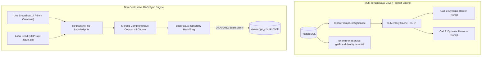

# Implementation Plan — Arsitektur Multi-Tenant Persona Dinamis, Sinkronisasi RAG Non-Destruktif (Issue #46), & Eliminasi Residu Frasa Pihak Ketiga

Dokumen ini merinci rencana implementasi arsitektur fondasional tahap ke-4: mengintegrasikan konfigurasi persona dinamis berbasis basis data ke dalam **Call 1 Router Prompt** (menegakkan *Mandat Non-Hardcode & Data-Driven Architecture*), mengamankan proses sinkronisasi RAG dari `deleteMany` destruktif dengan strategi *safe-merge* dua arah (**Known Issue #46**), serta membersihkan residu frasa pihak ketiga yang tertinggal pada tool kebijakan klinik.

---

## 📌 Root Cause Analysis & Masalah Desain Sistemik

### 1. Pelanggaran Mandat Non-Hardcode pada Call 1 Router Prompt
- **Lokasi**: [src/v3/agent/persona.ts](file:///c:/Users/User/Documents/chatbot%20AG/src/v3/agent/persona.ts#L107-L150)
- **Akar Masalah**:
  1. Pada Call 2 (Persona Prompt), sistem sudah mendukung pembacaan dinamis dari basis data via `TenantPromptConfigService.getActivePromptConfig(tenantId)` (baris 406).
  2. Namun, pada Call 1 (`buildRouterPrompt`), teks prompt router, panduan gaya WhatsApp, instruksi hierarki jadwal, dan aturan batas 2–3 kalimat **masih 100% di-hardcode di file TypeScript runtime**.
  3. Akibatnya, jika admin memperbarui *negative constraints*, *tone*, atau panduan klinik di dashboard admin untuk tenant tertentu, Call 1 (penentu arah percakapan & pemilihan tool) tidak pernah membaca pembaruan tersebut.
  4. Identitas brand pada `src/config/brand.ts` masih menggunakan *singleton in-memory state* global (`getBrandIdentity()`) tanpa membedakan `tenantId`.
- **Solusi Fondasional**:
  - Hubungkan `buildRouterPrompt` dengan `TenantPromptConfigService`.
  - Jadikan `getBrandIdentity(tenantId)` tenant-aware dengan membaca data `Tenant` / `TenantConfig` dari DB dengan in-memory caching.

### 2. Risiko Destruktif `deleteMany()` & Drift RAG Live vs Seed (Known Issue #46)
- **Lokasi**: [src/cli/seed-faq.ts](file:///c:/Users/User/Documents/chatbot%20AG/src/cli/seed-faq.ts#L179-L181) & [docs/KNOWN_ISSUES.md](file:///c:/Users/User/Documents/chatbot%20AG/docs/KNOWN_ISSUES.md#L1057)
- **Akar Masalah**:
  1. `seed-faq.ts` mengeksekusi `prisma.knowledgeChunk.deleteMany({ where: { tenant_id: DEFAULT_TENANT_ID, source_type: 'FAQ' } })` sebelum melakukan seeding.
  2. Di server produksi (live), admin telah mengurasi **14 judul FAQ baru** langsung lewat antarmuka dashboard (seputar mandi, susu, minyak, tumbuh-gigi+bapil, cukur-gundul, paket komplit ibu, perbandingan imunisasi, dll). Snapshot live telah diarsipkan di `docs/live-snapshots/knowledge-chunks-2026-09-12.json`.
  3. Sebaliknya, seed lokal memiliki **5 artikel penting** yang belum masuk ke live (termasuk SOP keselamatan medis krusial: *artikel observasi bayi jatuh/terbentur*).
  4. Jika developer atau pipeline CI/CD menjalankan `npm run seed:faq`, seluruh 14 kurasi admin live akan **terhapus permanen**!
- **Solusi Fondasional**:
  - Hapus operasi destruktif `deleteMany()` pada `seed-faq.ts`. Gantikan dengan **Idempotent Smart Upsert** berbasis hash/slug pertanyaan.
  - Buat script integrasi dua arah `scripts/sync-live-knowledge.ts` yang menggabungkan 14 artikel kurasi live ke seed lokal secara permanen, sehingga database live dan seed lokal berada dalam kondisi sinkron 100% tanpa kehilangan data (*zero data-loss*).

### 3. Residu Frasa Pihak Ketiga pada `clinic-faq.tool.ts`
- **Lokasi**: [src/v3/tools/clinic-faq.tool.ts](file:///c:/Users/User/Documents/chatbot%20AG/src/v3/tools/clinic-faq.tool.ts#L126)
- **Akar Masalah**:
  Pada fallback statis topik `operational_hours_and_booking`, template respon masih memuat kalimat:
  > *"...akan kami bantu cekkan terlebih dahulu slot Bidan kami yang ready 🤗"*
  Frasa *"Bidan kami yang ready"* telah dilarang keras di seluruh sistem (audit sesi 462651, `docs/KNOWN_ISSUES.md:1149`) karena terdengar seperti pihak ketiga/makelar/broker perantara.
- **Solusi Fondasional**:
  Ganti dengan frasa internal klinik resmi: *"ketersediaan jadwal tim Bidan kami"*, dan tambahkan guard invariant test.

---

## 🏛️ Arsitektur Integrasi Prompt & Safe RAG



---

## 🛠️ Staged Implementation Phases

### Phase 1: Integrasi Multi-Tenant Data-Driven Persona ke Router Prompt (Call 1)
**Tujuan**: Memastikan pembaruan aturan, *tone*, dan *negative constraints* dari basis data aktif secara instan pada Call 1 Router.

#### [MODIFY] [persona.ts](file:///c:/Users/User/Documents/chatbot%20AG/src/v3/agent/persona.ts)
1. Perluas `buildRouterPrompt`:
   ```ts
   public static async buildRouterPromptAsync(
     session: CustomerGoalSession,
     isFollowUp: boolean = false,
     opts?: {
       contextSummary?: string;
       phaseDirective?: string;
       tenantId?: string;
     }
   ): Promise<string> {
     const tenantId = opts?.tenantId || DEFAULT_TENANT_ID;
     const dbPrompt = await TenantPromptConfigService.getActivePromptConfig(tenantId);
     const brand = await getBrandIdentity(tenantId);
     ...
   }
   ```
2. Gantikan hardcode aturan negatif dan gaya percakapan statis dengan menyuntikkan section dari `dbPrompt` jika tersedia, dengan *fallback* aman ke template statis saat DB offline.

#### [MODIFY] [brand.ts](file:///c:/Users/User/Documents/chatbot%20AG/src/config/brand.ts)
- Perbarui `getBrandIdentity(tenantId?: string)` agar mendukung parameter `tenantId` dengan in-memory cache dan pembacaan tabel DB `Tenant`.

---

### Phase 2: Transformasi Non-Destruktif `seed-faq.ts` & Safe Merge RAG (Issue #46)
**Tujuan**: Mengamankan seeding database agar tidak pernah menghapus kurasi admin dan menyatukan seluruh 48 artikel FAQ.

#### [NEW] `scripts/sync-live-knowledge.ts`
1. Membaca arsip live `docs/live-snapshots/knowledge-chunks-2026-09-12.json`.
2. Membaca entri default `src/cli/seed-faq.ts`.
3. Melakukan *union-merge*:
   - 14 FAQ kurasi admin live (mandi, susu, tumbuh-gigi, imunisasi, dll) diintegrasikan ke daftar `faqs`.
   - 5 FAQ lokal (termasuk SOP keselamatan "bayi jatuh" dan "panduan induksi") tetap dipertahankan.
4. Menghasilkan korpus gabungan lengkap (48 artikel FAQ) tanpa duplikasi.

#### [MODIFY] [seed-faq.ts](file:///c:/Users/User/Documents/chatbot%20AG/src/cli/seed-faq.ts)
1. **HAPUS** baris 179–181 (`await prisma.knowledgeChunk.deleteMany(...)`).
2. Gantikan mekanisme import dengan `upsertKnowledgeChunk`:
   - Gunakan kombinasi `tenant_id` + `slug` (atau hash normalisasi pertanyaan).
   - Update entri jika sudah ada, buat baru jika belum ada.
   - Jangan pernah menyentuh atau menghapus chunk buatan staf admin di luar daftar seed.

---

### Phase 3: Pembersihan Residu Frasa Pihak Ketiga & Penguncian Invariant Test
**Tujuan**: Menghilangkan sisa sebutan calo/makelar *"slot Bidan kami yang ready"* dari fallback kebijakan klinik.

#### [MODIFY] [clinic-faq.tool.ts](file:///c:/Users/User/Documents/chatbot%20AG/src/v3/tools/clinic-faq.tool.ts)
- Pada baris 126:
  ```diff
  - suggestedReply: `Layanan homecare kami buka setiap hari (Senin - Minggu) mulai pukul 08.00 hingga 17.00 WIB ya Bunda 😊\n\nUntuk ketersediaan jadwal di hari yang Bunda inginkan, akan kami bantu cekkan terlebih dahulu slot Bidan kami yang ready 🤗`
  + suggestedReply: `Layanan homecare kami buka setiap hari (Senin - Minggu) mulai pukul 08.00 hingga 17.00 WIB ya Bunda 😊\n\nUntuk ketersediaan jadwal di hari yang Bunda inginkan, akan kami bantu cekkan terlebih dahulu ketersediaan jadwal tim Bidan kami ya Bunda 🤗`
  ```

#### [MODIFY] [no-third-party-phrasing.test.ts](file:///c:/Users/User/Documents/chatbot%20AG/tests/unit/v3/no-third-party-phrasing.test.ts)
- Tambahkan `src/v3/tools/clinic-faq.tool.ts` ke dalam daftar berkas yang dipindai oleh invariant test anti-frasa pihak ketiga.

---

### Phase 4: Penutupan Issue #46 di `docs/KNOWN_ISSUES.md`
#### [MODIFY] [docs/KNOWN_ISSUES.md](file:///c:/Users/User/Documents/chatbot%20AG/docs/KNOWN_ISSUES.md)
- Perbarui status **Issue #46** (`Drift live <-> seed: RAG 43 vs 34, bank 26 vs 37`) menjadi `RESOLVED`.
- Catat bahwa korpus RAG telah digabungkan secara aman tanpa kehilangan 14 entri kurasi live admin.

---

## 🧪 Verification Plan & Regression Gate

### Automated Tests
1. **Non-Destructive RAG Upsert Test**:
   - `tests/unit/v3/knowledge-safe-upsert.test.ts`: Uji bahwa menjalankan seed 2x berturut-turut menghasilkan jumlah baris yang sama (idempoten), dan tidak menghapus chunk kustom admin.
2. **Anti-Third-Party Phrasing Invariant Test**:
   - `npx vitest run tests/unit/v3/no-third-party-phrasing.test.ts`: Memastikan nol kemunculan kata "Bidan yang ready" di seluruh source code dan fallback tool.
3. **Dynamic Router Prompt Tenant Test**:
   - `tests/unit/v3/dynamic-router-prompt.test.ts`: Uji bahwa saat DB memiliki `TenantPromptConfig`, Call 1 router prompt menyerap nilai dari DB; saat offline, fallback ke default template.
4. **Full Test Suite Gate**:
   - Jalankan `npx vitest run` (seluruh 263 berkas pengujian wajib lulus hijau).
   - Jalankan `npm run build` (`tsc` exit 0).
