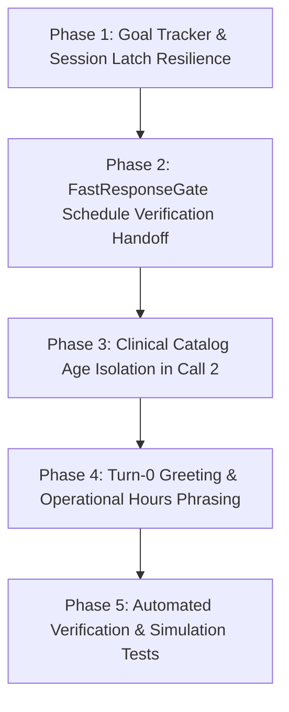

# PLAN 7 — FOUNDATIONAL FIX FOR SCHEDULE VERIFICATION FLOW, FASTRESPONSEGATE DEADLOCK & CLINICAL AGE CONSULTATION

> **Status:** COMPLETED (100% Selesai & Terverifikasi Hijau)
> **Tanggal:** 2026-09-15
> **Hasil:** Semua 4 fase terimplementasi, unit test baru 8/8 passed, regression test passed, TypeScript build exit 0.

Memperbaiki secara sistemik dan fondasional masalah kebuntuan percakapan (*infinite holding stall loop*), kegagalan eskalasi pengecekan jadwal ke live-chat staf manusia, pelanggaran batas rekomendasi terapi sakit pada konsultasi usia sehat, kegagalan pembaruan *latch* preferensi jadwal di sesi, dan terlewatnya perkenalan resmi Turn-0 Bidan Yusi.

---

## 📌 User Review Required

> [!IMPORTANT]
> **Transisi Handoff Cek Jadwal ke Live-Chat Manusia**:
> Ketika customer meminta pengecekan ketersediaan slot (misal: *"minggu pagi apa bisa?"* / *"hari biasa sore jam 5"*), asisten AI tidak boleh berjanji mengecek di layar jika tidak ada tindakan sistem di baliknya. Saat customer merespons konfirmasi menunggu (*"oke min"*, *"baik saya tunggu"*), sistem akan mengirim **1x closing resmi yang menenangkan**, lalu secara otomatis mengaktifkan status `is_human_handling = true` di database (`Conversation`) dan menghentikan balasan bot (*silent skip*). Staf klinik / admin akan menerima percakapan ini di antrean Live Chat dashboard untuk mengabari ketersediaan slot aktual Bidan.

> [!NOTE]
> Seluruh perbaikan mematuhi **Mandat Non-Hardcode & Data-Driven Architecture**, **Zero New Runtime Dependencies**, dan mempertahankan kompatibilitas 266 Vitest files (1.951 tests).

---

## 🧩 Multi-Layer Root Cause Analysis

1. **Lapisan 1 (FastResponseGate Blind Spot & Deadlock)**:
   `resolvePostReservationAck` di `src/v3/agent/pipeline/context-grounder.ts` dirancang hanya untuk customer yang sudah memiliki `reservationId`. Pada kasus pengecekan jadwal awal di mana `save_reservation` belum dipanggil, gerbang ini mengabaikan pesan pendek (*"oke"*, *"baik"*, *"tunggu ya"*). Akibatnya, pesan diteruskan ke LLM Call 1 Router.
2. **Lapisan 2 (Prompt Contradiction & Infinite Loop Stalling)**:
   Prompt router Call 1 (`persona.ts:132`) memuat instruksi negatif tanpa kondisi keluar:
   `"DILARANG KERAS memanggil save_reservation jika customer hanya merespons persetujuan menunggu... jawab LANGSUNG sebagai Bidan Yusi bahwa pengecekan slot sedang diproses, tanpa memanggil tool."`
   Karena customer membalas *"oke min"*, *"saya tunggu"*, *"kabari ya"*, LLM membaca instruksi ini berulang-ulang dan membalas janji cek slot 5 kali beruntun tanpa ada entitas manusia/sistem yang mengecek jadwal.
3. **Lapisan 3 (Pelanggaran Kontrak Konsultasi Usia Sehat - persona.ts:261)**:
   Tool `get_catalog_and_price` mengembalikan seluruh paket kategori `BABY` (termasuk *Pulih Ceria* batuk/pilek/kembung). Ketika customer hanya menanyakan paket usia tanpa keluhan, Call 2 generator mempromosikan paket terapi sakit, melanggar aturan eksplisit persona line 261.
4. **Lapisan 4 (Stale RequestedTimeHint Latch)**:
   `ContextGrounder.applySessionLatches` mengunci `requestedTimeHint` hanya saat nilainya masih kosong (`!session.booking?.requestedTimeHint`). Ketika customer mengubah preferensi hari dari *"minggu"* ke *"hari biasa sore"*, sesi menolak memperbarui preferensi tersebut. Selain itu, kamus `extractTimeHint` belum mengenal frasa *"hari biasa"* / *"weekday"*.
5. **Lapisan 5 (Bypass Perkenalan Turn-0 akibat SuggestedTemplateReply)**:
   Pada pesan pembuka Turn-0, `calculate_delivery` mengembalikan `suggestedTemplateReply` yang tidak diawali perkenalan resmi Bidan Yusi. Model Call 2 menjiplak template tersebut dan mengabaikan sapaan pembuka Turn-0.

---

## 🏗️ Proposed Changes

### Staged Phase Execution Architecture



---

### Phase 1: Goal Tracker & Session Latch Resilience

#### [MODIFY] [goal-tracker.ts](file:///c:/Users/User/Documents/chatbot%20AG/src/v3/state/goal-tracker.ts)
- Tambahkan flag `pendingScheduleCheck?: boolean` pada interface `BookingState`.
- Izinkan pembaruan flag `pendingScheduleCheck` saat customer meminta pengecekan ketersediaan hari/jadwal.

#### [MODIFY] [context-grounder.ts](file:///c:/Users/User/Documents/chatbot%20AG/src/v3/agent/pipeline/context-grounder.ts)
- Perluas `extractTimeHint`:
  - Tambahkan token `'hari biasa'`, `'weekday'`, `'weekdays'` ke dalam daftar penanda waktu.
- Perbaiki `applySessionLatches`:
  - Izinkan pembaruan `requestedTimeHint` jika customer menyebutkan waktu baru yang berbeda dari nilai lama (jangan kunci kaku dengan `!session.booking?.requestedTimeHint`).
  - Tandai `session.booking.pendingScheduleCheck = true` ketika `hasScheduleSignal(cleanIncomingText)` terdeteksi dan treatment/lokasi sudah diketahui.

---

### Phase 2: FastResponseGate Schedule Verification Handoff

#### [MODIFY] [context-grounder.ts](file:///c:/Users/User/Documents/chatbot%20AG/src/v3/agent/pipeline/context-grounder.ts)
- Perbarui `resolvePostReservationAck`:
  - Modifikasi kondisi agar memicu tidak hanya saat `session.booking?.reservationId` ada, tetapi juga saat `session.booking?.pendingScheduleCheck === true`.
  - Jika customer mengirimkan short acknowledgement (*"oke"*, *"baik"*, *"siap"*, *"saya tunggu"*, *"kabari ya"*):
    - Jika `handoffClosingSent !== true`: kembalikan `'closing'` (memicu 1x pesan penutup resmi + aktivasi `isEscalated: true` dengan alasan `'pending_schedule_check'`).
    - Jika `handoffClosingSent === true`: kembalikan `'silent'` (silent skip, 0 balasan, zero LLM token).
- Perbarui `FastResponseGate.check`:
  - Pastikan output eskalasi dari `'pending_schedule_check'` mengeskalasi percakapan di database (`Conversation.is_human_handling = true`, `current_state = HUMAN_HANDLING`), sehingga admin menerima tiket di antrean Live Chat dashboard.

---

### Phase 3: Clinical Catalog Age Isolation in Call 2

#### [MODIFY] [persona.ts](file:///c:/Users/User/Documents/chatbot%20AG/src/v3/agent/persona.ts)
- Di bagian `buildRouterPrompt` (baris 132):
  - Perbaiki instruksi larangan agar tidak memerintahkan asisten membalas kaset rusak penahan waktu jika pengecekan slot sudah dialihkan ke antrean staf.
- Di bagian `KONDISI A.1 (Tanya Usia / Ketersediaan Umum TANPA Keluhan)` (baris 256–262):
  - Pertegas guard: ketika `symptoms` kosong, asisten WAJIB HANYA menyebutkan paket dasar relaksasi (*Pijat Bayi Ceria*) dan/atau nutrisi (*Pijat Lahap Juara*).
  - DILARANG KERAS menyebut *Pijat Bayi Pulih Ceria*, batuk, pilek, atau kembung sama sekali jika customer tidak menyebut keluhan fisik.
  - Sampaikan dalam 1 paragraf narasi mengalir singkat (maksimal 2–3 kalimat) tanpa daftar bullet point menu brosur.

#### [MODIFY] [get-catalog.tool.ts](file:///c:/Users/User/Documents/chatbot%20AG/src/v3/tools/get-catalog.tool.ts)
- Di hasil kembalian `executeGetCatalog`:
  - Bila `childAgeMonths` terisi dan `symptoms.length === 0` (konsultasi usia sehat), jangan tempatkan paket terapi sakit (*Pulih Ceria*) di urutan teratas `suggestedReply` atau filter agar paket terapi tidak mencemari ringkasan konsultasi sehat.

---

### Phase 4: Turn-0 Greeting & Operational Hours Phrasing

#### [MODIFY] [generation-stage.ts](file:///c:/Users/User/Documents/chatbot%20AG/src/v3/agent/pipeline/generation-stage.ts)
- Pastikan saat `isFollowUp === false` (Turn-0):
  - Jika balasan draft tidak memuat sapaan pembuka resmi (*"Halo Bunda! ✨ Perkenalkan, saya Bidan Yusi..."*), sisipkan sapaan perkenalan resmi di awal balasan secara deterministik sebelum teks kalkulasi ongkir dikirim.

#### [MODIFY] [persona.ts](file:///c:/Users/User/Documents/chatbot%20AG/src/v3/agent/persona.ts)
- Tambahkan klausul edukasi jam operasional pada panduan jadwal:
  - Layanan homecare klinik beroperasi pukul 08.00–17.00 WIB.
  - Jika customer meminta jam 17.00 (batas akhir) atau jam spesifik, jelaskan secara ramah bahwa penetapan jam kunjungan diselaraskan dengan rute tim bidan harian dan batas jam operasional adalah 17.00 WIB.

---

## 🧪 Verification Plan

### Automated Tests
1. **Unit Test FastResponseGate Schedule Check**:
   ```bash
   npx vitest run tests/unit/v3/fast-response-gate-schedule.test.ts
   ```
   - Menguji transisi short acknowledgement saat `pendingScheduleCheck === true`:
     - Putaran 1: Balas 1x closing resmi + `isEscalated: true`.
     - Putaran 2 ("baik bunda saya tunggu"): `shouldSendReply: false` (silent skip).
     - Putaran 3 ("okey bund, nanti kabari ya"): `shouldSendReply: false` (silent skip).
2. **Unit Test Age Consultation Isolation**:
   ```bash
   npx vitest run tests/unit/v3/age-consultation-isolation.test.ts
   ```
   - Menguji input customer: *"Untuk anak umur 17 bulan yg mana yaa"*.
   - Verifikasi output: TIDAK mengandung kata `"Pulih Ceria"`, `"batuk"`, `"pilek"`, `"kembung"`.
   - Verifikasi format: Maksimal 3 kalimat, tanpa bullet point kaku.
3. **Unit Test RequestedTimeHint Latch Update**:
   ```bash
   npx vitest run tests/unit/v3/time-hint-latch.test.ts
   ```
   - Verifikasi customer yang awalnya meminta *"minggu"* lalu mengubah ke *"hari biasa sore jam 5"* berhasil memperbarui `requestedTimeHint` di session.
4. **Full Regression Suite**:
   ```bash
   npm test
   ```
   - Memastikan seluruh 266 test files (1.951 tests) tetap **100% HIJAU**.
5. **Typecheck Build**:
   ```bash
   npm run build
   ```
   - Memastikan TypeScript compiling tanpa error (`tsc 0 errors`).

### Manual & Simulator Verification
- Jalankan simulasi percakapan via CLI chat / simulator:
  ```bash
  npm run chat
  ```
- Uji alur 7 turn persis seperti yang dilaporkan user (ID: 216683):
  1. Ongkir Banjarmukti Residence -> Muncul perkenalan resmi Turn-0 + ongkir promo Rp 15.000.
  2. Anak 17 bulan -> Rekomendasi Pijat Bayi Ceria / Lahap Juara tanpa mencatut Pulih Ceria / batuk pilek.
  3. Minggu pagi -> Cek jadwal santun.
  4. Hari biasa sore jam 5 -> Info batas operasional 17.00 + koordinasi rute bidan.
  5. "oke min.." -> 1x closing resmi penenang + status handoff live-chat aktif di DB.
  6. "baik bunda saya tunggu" -> Bot senyap (silent skip, zero duplicate reply).
  7. "okey bund, nanti kabari ya" -> Bot senyap (admin menangani via dashboard).
