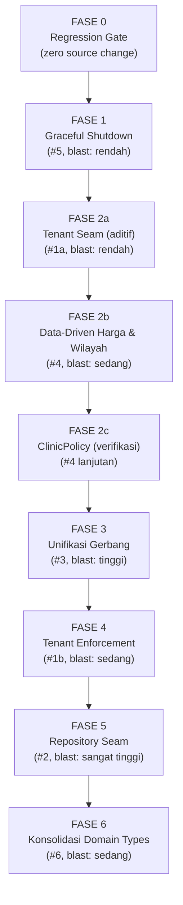

# PLAN 8 — FOUNDATIONAL ARCHITECTURE FIX: TENANT SEAM, REPOSITORY PERSISTENCE & PROCESS LIFECYCLE

> **Status:** SELESAI — FASE 0, 1, 2a, 2b, 2c, 3, 4, 5, 6 (semua hijau; 2 test merah pra-ada #68 milik sesi lain)
> **Tanggal:** 2026-09-16
> **Klasifikasi:** Implementation Plan (Staged-Phase & Micro-Task) — turunan dari Architecture Review `architecture-review-2026-09-16.html` (v2)
> **Mandat yang dipatuhi:** Staged-Phase & Micro-Task Implementation Plan · Non-Hardcode & Data-Driven · Solusi Fondasional (anti make-up) · Zero New Runtime Dependencies · Minimalisasi Regex

---

## 📈 Progress Log

> **⚠️ Catatan prioritas (audit 2026-09-16):** Fase 0–2a adalah fondasi *operasional* (gate, reliability, tenant).
> Untuk tujuan user — **"efisien, efektif, cerdas membalas seperti pemilik sendiri"** — temuan berdampak langsung
> ada di `docs/KNOWN_ISSUES.md` **#66** (efisiensi token/latensi 42k-char prompt, loop belajar mati, gate belum
> mengukur kualitas bahasa). Peta prioritas bergeser: kerjakan **PLAN 9** lebih dulu daripada Fase 2b–6 arsitektur.

### FASE 0 — Regression Gate ✅ SELESAI (2026-09-16)
- **Temuan kritis:** `npm run test:golden` ternyata **GAGAL** ("No test files found") — runner golden corpus dihapus di commit `3db9bec` karena bergantung pada `src/slot-engine/*` yang didekomisioning. Corpus 50 skenario menjadi **dead data**, gate tidak pernah berjalan.
- **Temuan kritis 2:** isolasi LLM test tidak lengkap — V3 runner tetap memanggil jaringan, kena 401, lalu eskalasi sunyi. Percobaan pertama: **48/50 skenario ter-skip** = gate palsu.
- **Fix:** runner baru `tests/golden-corpus/golden-corpus.test.ts` di atas `ConversationStateMachine` ASLI + stub LLM deterministik via seam resmi `GenerationStage.executeChatCompletion`.
- **Verifikasi adversarial:** menyuntikkan regresi → **24 test merah** (gate sensitif, bukan rubber stamp). Dikembalikan → 51/51 hijau.
- **Baseline tercatat** di `docs/BASELINE_GOLDEN_RESULTS.md`: 291 files · 2151 passed · 0 failed · 19 skipped.
- **Tech debt baru (TD-7):** isolasi LLM test masih bergantung pada spy level-test; idealnya seam transport bisa di-inject di produksi. Dicatat, tidak dikerjakan sekarang.

### FASE 1 — Graceful Shutdown ✅ SELESAI (2026-09-16)
- **Perubahan:** `src/lifecycle/interval-registry.ts` (baru), `src/lifecycle/shutdown.ts` (baru), `src/app.ts` (8× `setInterval` → `trackInterval`, + register hook).
- **Verifikasi:** `npm run build` exit 0; grep `setInterval(` di `app.ts` = **0**, `trackInterval(` = **8**; golden 51/51; unit test lifecycle **11/11**; full suite **295 files · 2172 passed · 0 failed**.
- **Catatan flake (bukan regresi):** 2 test media/live-chat sempat merah pada satu run (urutan paralel, state filesystem bersama); lulus di run berikutnya dan lulus di isolasi dengan perubahan ini. Dicatat sebagai flakiness pra-ada.
- **Belum dikerjakan dari audit:** `WahaMonitorService.stop()` belum dipanggil di shutdown (ditunda — perlu audit API monitor; dicatat TD-8).

### FASE 2a — Tenant Seam (Aditif) ✅ SELESAI (2026-09-16)
- **Perubahan:** `src/services/waha-tenant.service.ts` (baru, mirror `waba-tenant.service.ts` dengan **TTL cache 5 menit** — menutup kelemahan cache WABA), `src/routes/webhook.route.ts` (resolve + log-only, belum mengubah tenant downstream).
- **Sifat:** ADITIF — session tidak dikenal / DB offline → fallback `DEFAULT_TENANT_ID`; perilaku single-tenant tidak berubah.
- **Verifikasi:** `npm run build` exit 0; unit test resolver **9/9** (termasuk adversarial: session kosong, DB offline, tenant tak ditemukan, cache TTL expired, `resetCache`, DB pulih setelah error tidak ter-cache); golden 51/51; full suite **296 files · 2181 passed · 0 failed**.
- **Belum:** penggantian `DEFAULT_TENANT_ID` di jalur downstream → FASE 4.


> **Changelog v3 (koreksi pasca audit implementasi 2026-09-16):**
> 1. **K9 — Fase 2c ternyata SUDAH sebagian besar selesai.** Verifikasi: `clinic-faq.tool.ts:150` sudah membaca `prisma.clinicPolicy.findUnique`. Literal di baris 85–125 adalah **fallback** saat DB kosong — pola ini sah (bukan pelanggaran hardcode). Fase 2c dinaikkan statusnya menjadi **verifikasi + budget fallback**, bukan migrasi besar.
> 2. **K10 — Nomor baris diverifikasi ulang** setelah commit sesi lain: `persona.ts` harga di 244,270,284–312,348–368; `calculate-delivery.tool.ts` di 136,141; boot init `app.ts` 177–196. Gunakan Guardrail Verifikasi Nomor Baris sebelum tiap edit.
> 3. **K11 — Fase 5 blast radius kuantitatif:** `customer.service.ts` 1759 LOC / 54 catch; `conversation.service.ts` 597 / 18; `message.service.ts` 1163 / 34. Repository seam menyentuh ~130 blok `catch→memory`, bukan sekadar "3 service".
> 4. **K12 — Prioritas PLAN 9** (kecerdasan & efisiensi) didokumentasikan di `docs/plans/PLAN_9_INTELLIGENCE_AND_EFFICIENCY.md`. Fase 9.1 menyentuh `persona.ts` yang sama dengan Fase 2b → **kerjakan bersamaan** untuk menghindari konflik merge (Keputusan A3).

> **Changelog v2 (koreksi pasca-audit):**
> 1. **K1** — Mikro-Task 1.1/1.2: tambah penghentian 8 `setInterval` cron di `app.ts` (audit 4.1). Tanpa ini, cron akan menembak DB setelah `$disconnect`.
> 2. **K2** — Keputusan #1: angka blast radius dikoreksi dari "288 file" menjadi **62 file** yang benar-benar menyentuh `customerService`/`conversationService`/`messageService`.
> 3. **K3** — Mikro-Task 2.1 (audit): batas bawah range `persona.ts:270` adalah **instruksi larangan**, bukan data. Harga hardcode aktual di **338-368**.
> 4. **K4** — Mikro-Task 4.2 (baru): boot init `app.ts:162-172` masih single-tenant, harus masuk cakupan Fase 4.
> 5. **K5** — Mikro-Task 5.1: detailkan wiring pattern Repository (module-level setter + `resetForTest`).
> 6. **K6** — Fase 2c (baru, opsional): `clinic-faq.tool.ts` → tabel `ClinicPolicy`.
> 7. **K7** — Catat tech debt empty-catch (10 di `machine.ts`, puluhan di service lain) ke `docs/KNOWN_ISSUES.md` sebagai item terpisah, di luar PLAN 8.
> 8. **K8** — Mikro-Task 6.2 diklarifikasi: `isKakakHonorific` adalah **validator profil pasien** (anti-phantom CHILD_2), bukan gerbang intent bisnis — jangan dihapus tanpa pengganti setara.

---

## 📌 User Review Required

> [!IMPORTANT]
> **Dokumen ini adalah titik masuk persetujuan.** Tiga keputusan di bawah mengubah arsitektur inti dan **tidak boleh dieksekusi** sebelum Anda memilih. Masing-masing punya konsekuensi berbeda.

> [!WARNING]
> **Keputusan #1 — Perlakuan `tests/setup.ts` saat Fase 5 (Repository seam).**
> **Koreksi angka (audit):** dari 288 file test, hanya **62 file** yang benar-benar menyentuh `customerService`/`conversationService`/`messageService` — itulah blast radius sebenarnya, bukan 288. File lain (typing, cart-manager, persona, dll.) tidak berinteraksi dengan DB.
> Pilihan:
> - **(A) Migrasi bertahap**: satu service per fase (`customer` → `conversation` → `message`). Lebih aman, 3x kerja.
> - **(B) Migrasi sekaligus**: ketiga service dalam satu fase. Lebih cepat, blast radius besar.
> - **(C) Tunda Fase 5**: kerjakan Fase 0–4 dulu, repository ditunda ke plan terpisah.
> **Rekomendasi: (A).**

> [!IMPORTANT]
> **Keputusan #2 — Definisi "fail-closed" untuk operasi tulis.**
> Dua interpretasi yang sah, dan pilihannya menentukan UX:
> - **(A) Throw + eskalasi**: write gagal → error dilempar, percakapan masuk `HUMAN_HANDLING` dengan pesan jujur. Aman, tapi customer melihat "gangguan".
> - **(B) Durable outbox**: write gagal → masuk outbox (tabel/file), retry async. Customer tidak terganggu, tapi butuh tabel/worker baru (LOC besar → Confirmation Gate).
> **Rekomendasi: (A)** untuk Fase 5 awal; (B) dipertimbangkan bila audit menunjukkan volume kegagalan DB signifikan.

> [!NOTE]
> **Keputusan #3 — Cakupan Fase 2b (data-driven).**
> **Koreksi baris (audit):** `persona.ts:270` ternyata **instruksi larangan** ("DILARANG KERAS memuntahkan nominal rupiah"), bukan data harga. Data harga hardcode yang sesungguhnya ada di **`persona.ts:338-368`** (blok `[CONTOH GAYA CHAT ... FEW-SHOT EXAMPLES]`).
> Rekomendasi: Fase 2b menyentuh **harga di blok few-shot (338-368)** dan **array wilayah** (`calculate-delivery.tool.ts:136,141`). Opsional Fase 2c: `clinic-faq.tool.ts:85-125` → tabel `ClinicPolicy` (tabelnya sudah ada). Sisanya (`medical-keywords.ts`, dll.) dicatat sebagai tech debt terpisah.

---

## 🧩 Multi-Layer Root Cause Analysis

| # | Lapisan | Akar Masalah | Bukti |
|---|---------|--------------|-------|
| 1 | Webhook entry | Tenant resolution tidak pernah dihubungkan di jalur WAHA walau seam-nya sudah dibangun | `webhook.route.ts` **76×** `DEFAULT_TENANT_ID`; total **714** occurrence di `src/`; `Tenant.waha_session_id` ada (`schema.prisma:616`) |
| 2 | Persistensi | Kegagalan DB diubah menjadi objek mock sukses, menyatu dengan test | `customer.service.ts:144-178`; `conversation.service.ts:53-77`; `tests/setup.ts:50`; **62** file test terdampak |
| 3 | Orkestrasi | Dua otoritas gerbang & dua jalur tulis reservasi (deterministik form-parse vs agentic tool) | `machine.ts:131-196` (medis), `machine.ts:255-407` (form), `machine.ts:428-480` (domain) vs `save-reservation.tool.ts`; duplikasi domain gate di `agent-runner.ts:78-94` |
| 4 | Konfigurasi | Data bisnis hidup di literal TypeScript | **`persona.ts:338-368`** (harga di few-shot); `calculate-delivery.tool.ts:136,141`; `clinic-faq.tool.ts:85-125` |
| 5 | Lifecycle | Tidak ada handler sinyal; method close/flush sudah ada tapi tak dipanggil; **8 `setInterval` cron tanpa `clearInterval`** | `app.ts:147-160`; `app.ts:203-297` (cron); `queue.service.ts:409`; `burst-coalesce.service.ts:206` |
| 6 | Domain model | Tipe terduplikasi: `CartItem` **3×**, `CustomerGoalSession` **3×**, `ChildState` **3×** | `goal-tracker.ts:18,72,86`; `cart-manager.ts:4,29,77`; `patient-extractor.ts:6,32` |
| 7 | Persistensi (luas) | Empty catch menyembunyikan kegagalan di luar CRUD inti | `machine.ts` (10 blok), `follow-up.service.ts` (19), `capi.service.ts` (10) — **dicatat sebagai tech debt terpisah**, di luar PLAN 8 |

---

## 🏗️ Staged Phase Execution Architecture



**Prinsip urutan:** fokus pada *blast radius* dan *dependency*. Fase 0 adalah prasyarat mutlak — tanpa gate, refactor besar tidak punya bukti non-regresi. Fase 2a (seam aditif) sengaja mendahului Fase 2b (data-driven) karena memindahkan data bisnis ke DB **tenant-aware** menjadi sia-sia bila tenant yang mengalir masih konstanta — namun karena 2a aditif (fallback tetap), risikonya nihil.

---

## FASE 0 — Regression Gate (Prasyarat)

**Tujuan:** Membuktikan setiap fase berikutnya tidak mengubah perilaku percakapan.
**Blast radius:** Nol — tidak ada perubahan source code runtime.

### Mikro-Task 0.1 — Verifikasi golden corpus berjalan
- **File:** `tests/golden-corpus/index.ts` (50 skenario), `package.json:13`.
- **Perintah:**
  ```powershell
  npm run test:golden
  npm run test:real-replay
  ```
- **Acceptance criteria:** Kedua perintah exit 0. Bila `test:golden` belum ada runner test-nya (saat ini hanya validator di `index.ts`), buat `tests/golden-corpus/golden.test.ts` yang memanggil `validateGoldenCorpus()` dan meng-assert `ok === true`.
- **Regression gate:** N/A (ini gate-nya sendiri).

### Mikro-Task 0.2 — Dokumentasikan baseline angka hijau
- **File:** `docs/BASELINE_GOLDEN_RESULTS.md` (sudah ada — perbarui).
- **Tindakan:** Jalankan `npm test` dan catat `X passed / Y failed / Z skipped` sebagai baseline. Setiap fase berikutnya **tidak boleh** menaikkan angka failed.
- **Acceptance criteria:** Angka baseline tercatat dengan tanggal.

---

## FASE 1 — Graceful Shutdown (Kandidat #5)

**Tujuan:** Mencegah kehilangan pesan buffered & pemotongan LLM call saat deploy/restart.
**Blast radius:** Rendah. Hanya menambah hook saat proses berhenti.
**Prasyarat:** Fase 0 selesai.

> [!IMPORTANT]
> **Koreksi audit (K1):** `app.ts` menjalankan **8 `setInterval` cron** (`app.ts:203,215,225,235,245,255,288,297`) tanpa menyimpan referensi handle. Tanpa `clearInterval`, cron akan tetap menembak DB **setelah** `prisma.$disconnect()`, memicu error beruntun saat shutdown. Fase 1 **wajib** menangani ini — bukan opsional.

### Mikro-Task 1.0 — Registry interval yang bisa dihentikan
- **File baru:** `src/lifecycle/interval-registry.ts`
- **Isi (blok pengganti penuh):**
  ```typescript
  type IntervalHandle = ReturnType<typeof setInterval>;

  const handles: IntervalHandle[] = [];

  /** Bungkus setInterval agar handle tersimpan & bisa di-clear saat shutdown. */
  export function trackInterval(fn: () => void | Promise<void>, ms: number): IntervalHandle {
    const handle = setInterval(fn, ms);
    handles.push(handle);
    return handle;
  }

  export function clearAllIntervals(): void {
    for (const h of handles) {
      try { clearInterval(h); } catch { /* noop — best effort saat shutdown */ }
    }
    handles.length = 0;
  }

  /** Jumlah interval aktif — untuk test. */
  export function activeIntervalCount(): number {
    return handles.length;
  }
  ```
- **Acceptance criteria:** `npm run build` exit 0.

### Mikro-Task 1.1 — Modul shutdown
- **File baru:** `src/lifecycle/shutdown.ts`
- **Isi (blok pengganti penuh):**
  ```typescript
  import type { FastifyInstance } from 'fastify';
  import { prisma } from '../db/client';
  import { queueService } from '../services/queue.service';
  import { burstCoalesceService } from '../services/burst-coalesce.service';
  import { clearAllIntervals } from './interval-registry';

  const FORCE_EXIT_MS = parseInt(process.env.SHUTDOWN_FORCE_EXIT_MS || '10000', 10);

  let shuttingDown = false;

  export function isShuttingDown(): boolean {
    return shuttingDown;
  }

  export async function gracefulShutdown(
    server: FastifyInstance,
    signal: string,
  ): Promise<void> {
    if (shuttingDown) return;
    shuttingDown = true;
    console.log(`[SHUTDOWN] ${signal} diterima — memulai graceful shutdown (batas ${FORCE_EXIT_MS}ms).`);

    const forceTimer = setTimeout(() => {
      console.error('[SHUTDOWN] Batas waktu terlampaui — force exit.');
      process.exit(1);
    }, FORCE_EXIT_MS);
    forceTimer.unref();

    // 1. Hentikan cron DULU agar tidak ada query baru saat koneksi ditutup.
    try {
      clearAllIntervals();
      console.log('[SHUTDOWN] Cron intervals dihentikan.');
    } catch (e: any) {
      console.error('[SHUTDOWN] clearAllIntervals() gagal:', e?.message);
    }

    // 2. Stop penerimaan request baru, tunggu in-flight selesai.
    try {
      await server.close();
      console.log('[SHUTDOWN] HTTP server ditutup.');
    } catch (e: any) {
      console.error('[SHUTDOWN] server.close() gagal:', e?.message);
    }

    // 3. Kuras buffer burst coalescing (pesan yang belum diproses).
    try {
      await burstCoalesceService.flushAll();
      console.log('[SHUTDOWN] Burst coalescer di-flush.');
    } catch (e: any) {
      console.error('[SHUTDOWN] flushAll() gagal:', e?.message);
    }

    // 4. Tutup queue (BullMQ drain + in-memory).
    try {
      await queueService.close();
      console.log('[SHUTDOWN] Queue ditutup.');
    } catch (e: any) {
      console.error('[SHUTDOWN] queue.close() gagal:', e?.message);
    }

    // 5. Putuskan koneksi DB paling akhir.
    try {
      await prisma.$disconnect();
      console.log('[SHUTDOWN] Prisma terputus.');
    } catch (e: any) {
      console.error('[SHUTDOWN] prisma.$disconnect() gagal:', e?.message);
    }

    clearTimeout(forceTimer);
    console.log('[SHUTDOWN] Selesai. Keluar.');
    process.exit(0);
  }

  export function registerShutdownHooks(server: FastifyInstance): void {
    process.on('SIGTERM', () => void gracefulShutdown(server, 'SIGTERM'));
    process.on('SIGINT', () => void gracefulShutdown(server, 'SIGINT'));
  }
  ```
- **Acceptance criteria:** `npm run build` exit 0.

### Mikro-Task 1.2 — Daftarkan hook & konversi `setInterval` di `app.ts`
- **File:** `src/app.ts`
- **Lokasi 1 — baris 146-147:** daftarkan hook segera setelah `const server = buildApp();`
  ```typescript
  const server = buildApp();
  const { registerShutdownHooks } = await import('./lifecycle/shutdown');
  registerShutdownHooks(server);
  ```
- **Lokasi 2 — ganti seluruh `setInterval(` menjadi `trackInterval(`** di baris 203, 215, 225, 235, 245, 255, 288, 297, dengan menambahkan import di header `app.ts`:
  ```typescript
  import { trackInterval } from './lifecycle/interval-registry';
  ```
  **Perintah verifikasi setelah edit:**
  ```powershell
  (Select-String -Path src\app.ts -Pattern "\bsetInterval\(" -AllMatches).Count   # harus 0
  (Select-String -Path src\app.ts -Pattern "trackInterval\(" -AllMatches).Count   # harus 8
  ```
- **Catatan:** jangan ubah nilai interval atau logika callback — hanya bungkus pemanggilannya.
- **Acceptance criteria:** kedua perintah di atas mengembalikan 0 dan 8; `npm run build` exit 0.

### Mikro-Task 1.3 — Test lifecycle
- **File baru:** `tests/unit/lifecycle-shutdown.test.ts`
- **Kasus uji (adversarial, bukan happy-path):**
  1. `gracefulShutdown` dipanggil 2× → hanya bereksekusi sekali (guard `shuttingDown`).
  2. `server.close()` throw → shutdown tetap melanjutkan ke flushAll & queue.close.
  3. `burstCoalesceService.flushAll()` throw → shutdown tetap melanjutkan ke queue.close.
  4. Force-exit timer dipasang dengan nilai dari env `SHUTDOWN_FORCE_EXIT_MS`.
  5. `trackInterval` menambah `activeIntervalCount()`; `clearAllIntervals()` mengembalikannya ke 0.
  6. `clearAllIntervals()` dipanggil sebelum `server.close()` (urutan — verifikasi via spy call order).
- **Acceptance criteria:** 6/6 passed.

### Regression Gate Fase 1
```powershell
npm run build
(Select-String -Path src\app.ts -Pattern "\bsetInterval\(" -AllMatches).Count
npm run test:golden
npx vitest run tests/unit/lifecycle-shutdown.test.ts
npm test
```
**Lulus bila:** build exit 0, count `setInterval(` = 0, golden hijau, 6 test baru hijau, dan total failed ≤ baseline Fase 0.

---

## FASE 2a — Tenant Seam (Aditif) (Kandidat #1a)

**Tujuan:** Menghubungkan seam resolusi tenant di webhook WAHA **tanpa mengubah perilaku** single-tenant (fallback `DEFAULT_TENANT_ID` tetap).
**Blast radius:** Rendah — murni aditif, tidak ada penghapusan.
**Prasyarat:** Fase 1 selesai.

### Mikro-Task 2a.1 — Buat resolver (dengan TTL cache)
- **File baru:** `src/services/waha-tenant.service.ts` (mengikuti pola `src/services/waba-tenant.service.ts`)
- **Catatan audit (K5):** cache Map tanpa TTL membuat tenant yang diubah/dihapus di DB tidak ter-invalidate sampai restart. `WabaTenantService` punya masalah yang sama (existing tech debt). Resolver baru ini **memperbaiki** dengan TTL 5 menit.
- **Isi (blok pengganti penuh):**
  ```typescript
  import { prisma } from '../db/client';
  import { DEFAULT_TENANT_ID } from '../config/tenant';

  const CACHE_TTL_MS = 5 * 60 * 1000;

  class WahaTenantService {
    private cache = new Map<string, { tenantId: string; expiresAt: number }>();

    /**
     * Resolve tenant dari WAHA session id. Aditif: bila tidak ditemukan
     * atau DB offline, kembalikan DEFAULT_TENANT_ID (perilaku single-tenant
     * tidak berubah). Bukan multi-tenant enforcement.
     */
    public async resolveTenantBySession(session: string | undefined | null): Promise<string> {
      if (!session) return DEFAULT_TENANT_ID;
      const cached = this.cache.get(session);
      if (cached && cached.expiresAt > Date.now()) return cached.tenantId;
      try {
        const tenant = await prisma.tenant.findFirst({
          where: { waha_session_id: session },
          select: { id: true },
        });
        const resolved = tenant?.id || DEFAULT_TENANT_ID;
        this.cache.set(session, { tenantId: resolved, expiresAt: Date.now() + CACHE_TTL_MS });
        return resolved;
      } catch {
        return DEFAULT_TENANT_ID;
      }
    }

    /** Untuk test — paksa invalidasi cache. */
    public clearCache(): void {
      this.cache.clear();
    }
  }

  export const wahaTenantService = new WahaTenantService();
  ```
- **Acceptance criteria:** `npm run build` exit 0.

### Mikro-Task 2a.2 — Panggil resolver di webhook (log-only dulu)
- **File:** `src/routes/webhook.route.ts`
- **Lokasi pasti:** di dalam handler `POST /webhook`, setelah event type diekstrak (sekitar `webhook.route.ts:107`), **sebelum** cabang manapun.
- **Blok pengganti (tambahan):**
  ```typescript
  const eventSession = (body as any)?.session as string | undefined;
  const resolvedTenantId = await wahaTenantService.resolveTenantBySession(eventSession);
  if (eventSession && resolvedTenantId !== DEFAULT_TENANT_ID) {
    console.log(`[WAHA TENANT] session=${eventSession} → tenant=${resolvedTenantId}`);
  }
  ```
- **Catatan:** Fase ini **hanya mencatat**. Variabel `resolvedTenantId` belum dipakai untuk mengganti `DEFAULT_TENANT_ID` — itu Fase 4.
- **Acceptance criteria:** `npm run build` exit 0; log `[WAHA TENANT]` muncul saat session bukan default.

### Mikro-Task 2a.3 — Test resolver
- **File baru:** `tests/unit/waha-tenant-resolution.test.ts`
- **Kasus uji:**
  1. `session` undefined → `DEFAULT_TENANT_ID`.
  2. DB offline (mock reject) → `DEFAULT_TENANT_ID` (tidak throw).
  3. DB mengembalikan tenant → id tenant benar.
  4. Cache: query kedua tidak memanggil Prisma lagi.
  5. **Cache expired:** setelah `Date.now()` maju melewati TTL, Prisma dipanggil ulang.
  6. **`clearCache()`** memaksa query ulang.
  7. **Adversarial:** `session` = string kosong `''` → perlakukan seperti undefined (fallback), bukan query DB.
- **Acceptance criteria:** 7/7 passed.

### Regression Gate Fase 2a
```powershell
npm run build
npm run test:golden
npx vitest run tests/unit/waha-tenant-resolution.test.ts
npm test
```
**Lulus bila:** semua hijau, failed ≤ baseline, dan **tidak ada** perubahan pada `webhook.route.ts` yang mengubah nilai tenant apa pun.

---

## FASE 2b — Data-Driven Harga & Wilayah (Kandidat #4)

**Tujuan:** Menghapus harga & wilayah hardcode dari prompt/tool, sumber dari DB tenant-aware.
**Blast radius:** Sedang — mengubah output prompt dan tool.
**Prasyarat:** Fase 2a selesai.

### Mikro-Task 2b.1 — Audit lokasi pasti hardcode
- **File:** `src/v3/agent/persona.ts`, `src/v3/tools/calculate-delivery.tool.ts`
- **Koreksi audit (K3):** baris 270 adalah **instruksi larangan** (`DILARANG KERAS memuntahkan nominal rupiah (*Rp 70.000*)`) — bukan data harga. Harga hardcode yang sesungguhnya ada di blok **`[CONTOH GAYA CHAT WHATSAPP BIDAN YUSI (FEW-SHOT EXAMPLES)]`** mulai baris ~336, contoh harga di **baris 348, 356, 364, 366-368**.
- **Perintah audit:**
  ```powershell
  # Harga di few-shot (target utama)
  Select-String -Path src\v3\agent\persona.ts -Pattern "Rp\s*\d{1,3}(\.\d{3})*" -AllMatches | Select-Object LineNumber, Line
  # Array wilayah
  Select-String -Path src\v3\tools\calculate-delivery.tool.ts -Pattern "'(surabaya|sidoarjo|gresik|sby|sda)'" -AllMatches | Select-Object LineNumber, Line
  ```
- **Acceptance criteria:** daftar lengkap `file:line` tersusun sebelum mengedit. Konfirmasi bahwa baris 270 **tidak** disentuh (itu instruksi kebijakan, bukan data).

### Mikro-Task 2b.2 — Buat provider katalog & wilayah
- **File baru:** `src/v3/domain/business-config.provider.ts`
- **Prinsip:** Membaca `ClinicService` (harga) & `DeliveryTier`/`ClinicPolicy` (wilayah/kebijakan) per tenant, dengan cache TTL + fallback env, mengikuti pola `ai-models.config.ts`.
- **Acceptance criteria:** `npm run build` exit 0; unit test provider lulus (mis. `tests/unit/business-config-provider.test.ts`).

### Mikro-Task 2b.3 — Prompt membaca provider
- **File:** `src/v3/agent/persona.ts`
- **Tindakan:** Ganti literal harga di baris 270–368 dengan placeholder yang diisi dari provider saat prompt dirakit (`buildRouterPromptAsync`). **Jangan** mengubah teks instruksi lain.
- **Acceptance criteria:** `npm test` failed ≤ baseline; golden corpus hijau (membuktikan perilaku harga tidak berubah).

### Mikro-Task 2b.4 — Tool wilayah membaca provider
- **File:** `src/v3/tools/calculate-delivery.tool.ts:136,293`
- **Tindakan:** Ganti array literal dengan pemanggilan provider.
- **Acceptance criteria:** 17 test `google-maps-url-resolver` + test delivery hijau.

### Regression Gate Fase 2b
```powershell
npm run build
npm run test:golden
npm run test:real-replay
npm test
```
**Lulus bila:** golden & replay hijau (bukti perilaku percakapan identik), failed ≤ baseline.

---

## FASE 2c (KOREKSI) — ClinicPolicy FAQ: Verifikasi, Bukan Migrasi

**Tujuan:** Memastikan kebijakan klinis sudah data-driven; literal hanya sebagai fallback saat DB kosong.
**Blast radius:** Rendah — verifikasi + penyesuaian kecil.
**Prasyarat:** Fase 2b selesai.
**Status:** **Sebagian besar SUDAH SELESAI (K9).** Bukan migrasi besar.

> [!IMPORTANT]
> **Koreksi audit (K9):** Rencana awal mengasumsikan `clinic-faq.tool.ts` hardcode kebijakan. Verifikasi kode menunjukkan sebaliknya: `clinic-faq.tool.ts:150` **sudah membaca** `prisma.clinicPolicy.findUnique({ where: { tenant_id_topic } })`. Literal di baris 85–125 adalah **fallback deterministik** yang dipakai HANYA saat DB tidak punya record (atau DB offline). Pola ini **sah dan sesuai best practice**: default aman tanpa mengorbankan data-driven.
> **Konsekuensi:** Fase 2c turun dari "migrasi" menjadi "verifikasi + bereskan tech debt kecil".

### Mikro-Task 2c.1 — Verifikasi jalur DB-first
- **File:** `src/v3/tools/clinic-faq.tool.ts:140-170`
- **Tindakan:** Konfirmasi urutan: cek cache → `clinicPolicy.findUnique` → bila ada pakai DB → bila tidak pakai fallback literal. Pastikan fallback **tidak** menimpa data DB.
- **Acceptance criteria:** unit test membuktikan: (a) DB terisi → jawaban dari DB; (b) DB kosong → fallback literal; (c) DB error → fallback literal tanpa throw.

### Mikro-Task 2c.2 — Catat fallback sebagai keputusan yang disengaja
- **File:** `docs/KNOWN_ISSUES.md` (perbarui TD-2)
- **Tindakan:** Ubah status TD-2 dari "belum dipakai penuh" menjadi "resolved — DB-first dengan fallback sengaja", dengan bukti baris.
- **Acceptance criteria:** KNOWN_ISSUES mencerminkan status sebenarnya (tutup tech debt yang sudah selesai).

### Regression Gate Fase 2c
```powershell
npm run build
npm run test:golden
npm test
```

---

## FASE 3 — Unifikasi Gerbang Percakapan (Kandidat #3)

**Tujuan:** Satu otoritas untuk gerbang domain/medis/form; hapus duplikasi.
**Blast radius:** Tinggi — menyentuh `machine.ts` dan `agent-runner.ts`.
**Prasyarat:** Fase 2b selesai & golden corpus stabil.

### Mikro-Task 3.1 — Petakan duplikasi ✅ SELESAI (2026-09-16, tanpa edit kode)
- **File:** `src/state-machine/machine.ts`, `src/v3/agent/agent-runner.ts`, `src/v3/agent/pipeline/context-grounder.ts`
- **Baris referensi (terverifikasi audit):** medis `machine.ts:131-196`; form parse `machine.ts:255-407`; domain `machine.ts:434-480`; duplikat domain `agent-runner.ts:77-94`.

#### Tabel pemetaan gerbang (hasil investigasi read-only)

| # | Gerbang | Lokasi primer | Lokasi duplikat | Verdict primer | Verdict duplikat | Otoritas tunggal yang diusulkan |
|---|---|---|---|---|---|---|
| G1 | Medis (deteksi + eskalasi + alert) | `machine.ts:131-196` (`MedicalDetectionService`, FAQ exemption, `escalateToHumanHandling`, alert) | — (tidak ada duplikat; V3 hanya punya tool `escalate_to_human` via LLM) | `HUMAN_HANDLING` + alert + `medical_concern` | — | **Tetap di machine** (pre-LLM, deterministik). V3 tool melengkapi, bukan menggantikan. |
| G2 | Domain (`out_of_domain`/`complaint`/`human_agent` → eskalasi sunyi) | `machine.ts:434-480` (`extractFastIntents` → `EntityExtractor.preExtractDeterministic` → `SILENT_ESCALATE_REASONS`) | `agent-runner.ts:77-94` (cek `preExtractedIntents` ulang → eskalasi sunyi) | `HUMAN_HANDLING`, `shouldSendReply:false` | identik | **Hapus duplikat di agent-runner** (3.3). Machine adalah otoritas (berjalan lebih dulu, tanpa LLM). |
| G3 | Form reservasi deterministik | `machine.ts:255-407` (parse + `reservationCoreService.saveReservation` + CAPI + eskalasi `reservation_submitted`) | `save-reservation.tool.ts` (via LLM Call 1) | `HUMAN_HANDLING` + reply konfirmasi | reservasi via tool | **PERTAHANKAN KEDUANYA** — konteks berbeda (lihat nuansa di bawah). Bukan duplikasi murni. |
| G4 | Slash commands | `machine.ts:482+` (setelah gate medis/domain — komentar eksplisit) | — | bervariasi | — | Tetap (urutan sudah benar). |

> [!WARNING]
> **Nuansa G3 (terverifikasi):** form parser adalah **jalur deterministik bypass-LLM** (hemat latensi + token untuk template form copy-paste). Tool V3 menangani **reservasi percakapan** (LLM menyimpulkan kesepakatan). Menghapus form parser = semua form lewat LLM. Maka 3.2 **hanya memigrasikan G1+G2**, G3 dipertahankan.

> [!WARNING]
> **Nuansa penting (audit §2 #3):** form parser di `machine.ts:255-407` **bukan** sekadar duplikat — itu **jalur deterministik bypass-LLM**: customer mengirim template form copy-paste → parser regex → simpan langsung tanpa memanggil LLM (hemat latensi & token). Menghapusnya dan memaksa semuanya lewat `save_reservation.tool.ts` akan **menambah latensi + biaya token** untuk setiap form reservasi. Karena itu Mikro-Task 3.2 **hanya memigrasikan gerbang medis & domain**, sedangkan form parser **tetap dipertahankan** kecuali keputusan user berbeda.

### Mikro-Task 3.2 — Ekstrak `ConversationGates` (medis + domain saja)
- **File baru:** `src/state-machine/conversation-gates.ts`
- **Kontrak interface (final, jangan diperluas):**
  ```typescript
  export interface GateVerdict {
    action: 'continue' | 'silent_escalate' | 'reply_and_stop';
    reason?: string;
  }
  export function evaluateInboundGates(input: {
    customer: Customer; conversation: Conversation; text: string;
  }): GateVerdict;
  ```
  *(migrasikan logika dari `machine.ts:131-196` medis & `machine.ts:428-480` domain, **tanpa** mengubah perilaku dan **tanpa** memindahkan form parser.)*
- **Acceptance criteria:** unit test `gate` mereplikasi perilaku lama secara eksak (snapshot test).

### Mikro-Task 3.3 — Delegasi & hapus duplikasi
- **File:** `src/state-machine/machine.ts`, `src/v3/agent/agent-runner.ts`
- **Tindakan:** Panggil `evaluateInboundGates` sekali; hapus cek `out_of_domain` kedua di `agent-runner.ts:78`.
- **Acceptance criteria:** `npm test` failed ≤ baseline; golden hijau; tidak ada test eskalasi medis yang merah.

### Regression Gate Fase 3
```powershell
npm run build
npm run test:golden
npm run test:real-replay
npm test
```
**Lulus bila:** seluruh test medis/domain/escalation hijau tanpa perubahan ekspektasi. **Bila ada yang merah: rollback fase ini, jangan sesuaikan test.**

---

## FASE 4 — Tenant Enforcement (Kandidat #1b)

**Tujuan:** Hapus ketergantungan `DEFAULT_TENANT_ID` di jalur webhook; tenant jadi parameter mengalir.
**Blast radius:** Sedang — tapi banyak titik.
**Prasyarat:** Fase 3 selesai; log Fase 2a menunjukkan session resolution bekerja.

### Mikro-Task 4.1 — Ganti di webhook (bertahap, per-100-referensi)
- **File:** `src/routes/webhook.route.ts`
- **Perintah verifikasi sebelum:**
  ```powershell
  (Select-String -Path src\routes\webhook.route.ts -Pattern "DEFAULT_TENANT_ID" -AllMatches).Count
  ```
- **Tindakan:** Ganti referensi dengan `resolvedTenantId` dari Fase 2a. Lakukan dalam batch kecil (<20 perubahan) lalu jalankan regression gate tiap batch.
- **Acceptance criteria:** count turun bertahap ke 0 (di file ini) tanpa test merah.

### Mikro-Task 4.2 — Jadikan `tenantId` parameter wajib di service publik
- **File:** `src/services/customer.service.ts`, `conversation.service.ts`, `message.service.ts`
- **Tindakan:** Ubah signature `getOrCreateCustomer(phone, tenantId = DEFAULT_TENANT_ID)` → `(phone, tenantId: string)`. TypeScript akan menandai semua call site yang lupa.
- **Acceptance criteria:** `npm run build` exit 0 (kompilasi memaksa semua caller memperbaiki).

### Mikro-Task 4.3 — Boot init multi-tenant di `app.ts` (K4)
- **File:** `src/app.ts:162-172` dan `src/app.ts:185-187`
- **Temuan audit (K4):** boot init saat ini memuat konfigurasi **hanya untuk `DEFAULT_TENANT_ID`**:
  ```
  app.ts:168  loadServicesFromDb(DEFAULT_TENANT_ID)
  app.ts:169  getDeliveryTiersFromDb(DEFAULT_TENANT_ID)
  app.ts:170  loadPersonaFromDb(DEFAULT_TENANT_ID)
  app.ts:171  AiModelConfigService.loadConfigsFromDb(DEFAULT_TENANT_ID)
  app.ts:172  AiEligibilityConfigService.loadConfigsFromDb(DEFAULT_TENANT_ID)
  app.ts:187  whatsappProviderService.syncSessionWebhooks(DEFAULT_TENANT_ID)
  ```
  Ini membuat tenant kedua tidak pernah memuat katalog/persona/config-nya saat boot.
- **Tindakan:** Ganti dengan iterasi seluruh tenant aktif (`prisma.tenant.findMany({ select: { id: true } })`), dengan fallback ke `[DEFAULT_TENANT_ID]` bila DB offline (perilaku saat ini tidak berubah untuk single-tenant).
- **Blok pengganti (pola):**
  ```typescript
  let tenantIds: string[] = [DEFAULT_TENANT_ID];
  try {
    const tenants = await prisma.tenant.findMany({ select: { id: true } });
    if (tenants.length > 0) tenantIds = tenants.map((t) => t.id);
  } catch {
    console.warn('[INIT TENANT DATA] DB offline — fallback ke DEFAULT_TENANT_ID.');
  }
  for (const tid of tenantIds) {
    await loadServicesFromDb(tid);
    await getDeliveryTiersFromDb(tid);
    await loadPersonaFromDb(tid);
    await AiModelConfigService.loadConfigsFromDb(tid);
    await AiEligibilityConfigService.loadConfigsFromDb(tid);
  }
  // syncSessionWebhooks(idem, loop per tenant)
  ```
- **Acceptance criteria:** `npm run build` exit 0; boot log menampilkan inisialisasi per-tenant; test boot tidak merah.

### Regression Gate Fase 4
```powershell
npm run build
npm run test:golden
npm test
```
**Lulus bila:** build exit 0, golden hijau, failed ≤ baseline.

---

## FASE 5 — Repository Seam & Fail-Closed (Kandidat #2)

**Tujuan:** Isolasi persistensi ke `Repository` dengan dua adapter: produksi fail-closed, test fake eksplisit.
**Blast radius:** Sangat tinggi — menyentuh 288 file test.
**Prasyarat:** Fase 4 selesai. **Wajib lewat Confirmation Gate (Keputusan #1).**

### Mikro-Task 5.1 — Definisikan seam (satu entity dulu)
- **File baru:** `src/repositories/customer.repository.ts`
- **Kontrak:**
  ```typescript
  export interface CustomerRepository {
    getOrCreate(phone: string, tenantId: string): Promise<Customer>;
    findById(id: string, tenantId: string): Promise<Customer | null>;
    findByPhone(phone: string, tenantId: string): Promise<Customer | null>;
    update(id: string, patch: Partial<Customer>, tenantId: string): Promise<Customer>;
  }
  ```
- **Adapter 1:** `PostgresCustomerRepository` — write gagal → throw.
- **Adapter 2:** `InMemoryCustomerRepository` — **hanya** di-inject eksplisit di test.

- **Wiring pattern (K5 — koreksi audit §6):** service saat ini adalah singleton module-scoped (`export const customerService = new CustomerService()`), bukan constructor-injected. Untuk menghindari refactor besar pada 62 call site, gunakan **module-level setter dengan default produksi**:
  ```typescript
  // src/repositories/customer.repository.ts
  let repo: CustomerRepository = new PostgresCustomerRepository();

  export function getCustomerRepository(): CustomerRepository {
    return repo;
  }

  /** HANYA untuk test — inject adapter in-memory. */
  export function setCustomerRepository(next: CustomerRepository): void {
    repo = next;
  }

  /** HANYA untuk test — kembalikan ke adapter produksi. */
  export function resetCustomerRepository(): void {
    repo = new PostgresCustomerRepository();
  }
  ```
  `tests/setup.ts` memanggil `setCustomerRepository(new InMemoryCustomerRepository())` di `beforeEach`, sehingga **tidak** mengandalkan fallback implisit.
- **Acceptance criteria:** `npm run build` exit 0; tidak ada lagi `catch → mock` di `customer.service.ts`.

### Mikro-Task 5.2 — Wire & migrasi test
- **File:** `tests/setup.ts`, `customer.service.ts`
- **Tindakan:** `tests/setup.ts` meng-inject `InMemoryCustomerRepository` alih-alih mengandalkan fallback implisit. Hapus blok `customer` dari mock Prisma bila sudah tidak dipakai.
- **Acceptance criteria:** `npm test` hijau dengan repository eksplisit.

### Mikro-Task 5.3 — Ulangi untuk `conversation` & `message`
- **File:** analog. **Jangan digabung** dengan 5.1–5.2 (Keputusan #1: rekomendasi (A)).

### Regression Gate Fase 5
```powershell
npm run build
npm run test:golden
npm run test:real-replay
npm test
```
**Lulus bila:** seluruh 288 file hijau dengan Repository seam; `customer.service.ts` tidak lagi mengandung blok `catch → mock`.

---

## FASE 6 — Konsolidasi Domain Types (Kandidat #6)

**Tujuan:** Satu sumber `CustomerGoalSession`, `CartItem`, dst.
**Blast radius:** Sedang (kompilasi akan menandai drift).
**Prasyarat:** Fase 5 selesai.

### Mikro-Task 6.1 — Ekstrak ke `src/v3/domain/types.ts`
- **File:** `goal-tracker.ts:7-137`, `cart-manager.ts:3-125`, `patient-extractor.ts:6-77`
- **Tindakan:** Re-export dari satu module; hapus definisi ganda.
- **Acceptance criteria:** `npm run build` exit 0; grep definisi ganda = 0.

### Mikro-Task 6.2 — Kendalikan gerbang intent (bukan mutasi)
- **File:** `patient-extractor.ts:349`, `persona.ts:14`
- **Klarifikasi audit (K8):**
  - `isKakakHonorific` (`patient-extractor.ts:349-359`) adalah **validator profil pasien** — mencegah sapaan CS "kakak" disalahartikan sebagai anak kedua (*phantom CHILD_2*). Ini **bukan** gerbang intent bisnis. **JANGAN dihapus tanpa pengganti setara**, karena akan meregresi alokasi cart.
  - `extractFastIntents` (`persona.ts:14`) adalah keyword engine yang mengisi `preExtractedIntents`, yang **memicu eskalasi sunyi** (`machine.ts:462`). Ini yang lebih dekat ke "gatekeeper intent" dan layak ditinjau.
- **Tindakan:**
  - Untuk `extractFastIntents`: nilai apakah keputusan dapat dipindah ke state machine / prompt / few-shot. Bila tidak, dokumentasikan sebagai pengecualian resmi.
  - Untuk `isKakakHonorific`: **pertahankan**; tambahkan komentar `@ai-guardrail` yang menjelaskan perannya sebagai validator profil, agar audit berikutnya tidak salah menandainya sebagai pelanggaran.
- **Acceptance criteria:** keputusan tercatat (migrasi atau tech debt terdokumentasi); tidak ada regresi test cart anak.```


### Regression Gate Fase 6
```powershell
npm run build
npm run test:golden
npm test
```

---

## 📊 Dependency & Blast Radius Matrix

| Fase | Kandidat | Blast Radius | Prasyarat | Reversible? | Confirmation Gate |
|---|---|---|---|---|---|
| 0 | Regression gate | Nol | — | Ya | Tidak |
| 1 | #5 Shutdown (+cron registry) | Rendah | 0 | Ya (hapus hook) | Tidak |
| 2a | #1a Tenant seam | Rendah | 1 | Ya (aditif) | Tidak |
| 2b | #4 Data-driven | Sedang | 2a | Ya (revert commit) | Ya (Keputusan #3) |
| 2c | #4 lanjutan (ClinicPolicy) | Sedang | 2b | Ya | Opsional |
| 3 | #3 Unifikasi gate | Tinggi | 2b/2c | Sulit | Tidak (tapi rollback disiapkan) |
| 4 | #1b Enforcement + boot init | Sedang | 3 | Sedang | Tidak |
| 5 | #2 Repository | Sangat tinggi | 4 | Sulit | **Ya (Keputusan #1 & #2)** |
| 6 | #6 Types | Sedang | 5 | Ya | Tidak |

---

## 📋 Tech Debt yang Dicatat Terpisah (K7)

Item berikut **di luar cakupan PLAN 8** tetapi wajib dicatat ke `docs/KNOWN_ISSUES.md` agar tidak hilang:

| ID | Temuan | Bukti | Alasan ditunda |
|---|---|---|---|
| TD-1 | Empty catch menyembunyikan kegagalan di luar CRUD inti | `machine.ts` (10 blok), `follow-up.service.ts` (19), `capi.service.ts` (10) | Bukan blocker; perlu audit per-titik |
| TD-2 | ~~`ClinicPolicy` belum dipakai penuh untuk FAQ~~ **RESOLVED (K9)** | `clinic-faq.tool.ts:150` sudah DB-first | Fallback literal adalah default aman yang disengaja |
| TD-3 | In-memory fallback tidak di-gate `NODE_ENV` | `queue.service.ts:243`, service CRUD | Tertutup sebagian oleh Fase 5 |
| TD-4 | `admin_sessions.json` menyimpan token plaintext | `admin-session.service.ts` | Di luar scope arsitektur; perlu plan terpisah |
| TD-5 | Boot migration baseline tidak lengkap | `KNOWN_ISSUES.md` #1 | Sudah tercatat |
| TD-6 | `patient-extractor` import siklik tipe | `patient-extractor.ts:4` ↔ `goal-tracker.ts` | Akan hilang sebagai bonus Fase 6 |

---

## ✅ Definition of Done (per fase)

Sebuah fase dinyatakan selesai **hanya bila seluruh** kondisi berikut terpenuhi:
1. `npm run build` exit 0.
2. `npm run test:golden` exit 0.
3. `npm test` — jumlah failed ≤ baseline Fase 0.
4. Semua unit test baru untuk fase tersebut hijau.
5. Entri CHANGELOG ditambahkan mengikuti format repo (dengan akar masalah & file:line).
6. `docs/KNOWN_ISSUES.md` diperbarui bila ada temuan yang sengaja ditunda (termasuk tabel TD-1..TD-6).
7. Commit terpisah per fase dengan pesan sesuai konvensi repo.
8. **Tidak ada ekspektasi test yang disesuaikan demi membuatnya hijau.** Bila test merah, kode yang salah.

---

## 🔒 Guardrail Verifikasi Nomor Baris

Karena nomor baris bisa bergeser oleh commit lain, setiap fase **wajib** menjalankan verifikasi grep sebelum mengedit:

```powershell
# Fase 1 — pastikan semua setInterval bisa dilacak
(Select-String -Path src\app.ts -Pattern "\bsetInterval\(" -AllMatches).Count          # target akhir: 0
(Select-String -Path src\app.ts -Pattern "trackInterval\(" -AllMatches).Count          # target akhir: 8

# Fase 2b — pastikan target harga, bukan instruksi larangan
Select-String -Path src\v3\agent\persona.ts -Pattern "DILARANG KERAS memuntahkan"      # JANGAN disentuh
Select-String -Path src\v3\agent\persona.ts -Pattern "CONTOH GAYA CHAT"                # awal blok target

# Fase 3 — pastikan baris gerbang masih di posisi yang diharapkan
Select-String -Path src\state-machine\machine.ts -Pattern "MEDICAL|SILENT_ESCALATE" | Select-Object LineNumber
Select-String -Path src\v3\agent\agent-runner.ts -Pattern "out_of_domain" | Select-Object LineNumber
```

**Aturan:** bila hasil grep berbeda dari yang tercatat di plan ini, **stop** — perbarui plan dulu, jangan menebak.

---

## 🚫 Yang TIDAK Dilakukan Plan Ini

- **Tidak** menyentuh label WAHA (mandat mutlak).
- **Tidak** menambah dependency runtime (Zero New Runtime Dependencies).
- **Tidak** memutasi teks LLM di tengah kalimat (mandat anti-mutilasi).
- **Tidak** menyesuaikan ekspektasi test agar hijau — bila test merah, kode yang salah, bukan test-nya.
- **Tidak** mengerjakan Fase 5 tanpa Keputusan #1 dari user.

---

## 🧭 Rekomendasi Urutan Akhir (PLAN 8 × PLAN 9)

Mengingat tujuan user adalah **efisien, efektif, cerdas seperti pemilik**, urutan gabungan yang direkomendasikan:

| Urutan | Item | Alasan |
|---|---|---|
| 1 | **PLAN 9 Fase 9.0** | Baseline metrik (tanpa ini, tak bisa membuktikan perbaikan) |
| 2 | **PLAN 9 Fase 9.1 + PLAN 8 Fase 2b** ⚡ | Keduanya menyentuh `persona.ts` → kerjakan bersamaan, hindari konflik merge (Keputusan A3). 9.1 = efisiensi; 2b = harga/wilayah data-driven |
| 3 | **PLAN 9 Fase 9.2** | Gate kualitas bahasa — prasyarat untuk belajar gaya dengan aman |
| 4 | **PLAN 8 Fase 2c** | Verifikasi ClinicPolicy (kecil, sudah hampir selesai) |
| 5 | **PLAN 9 Fase 9.3 + 9.4** | Loop belajar gaya + kurasi (butuh 9.2 untuk validasi) |
| 6 | **PLAN 8 Fase 3** | Unifikasi gerbang (blast radius tinggi) |
| 7 | **PLAN 8 Fase 4** | Tenant enforcement + boot init |
| 8 | **PLAN 8 Fase 5** | Repository seam (blast radius sangat tinggi) |
| 9 | **PLAN 8 Fase 6** | Konsolidasi domain types |

**Prinsip:** yang memberi dampak langsung ke tujuan user (efisiensi → kecerdasan gaya) dikerjakan lebih dulu; kebersihan fondasi (tenant/repository/types) menyusul karena sifatnya *enabler*, bukan *value* langsung.
