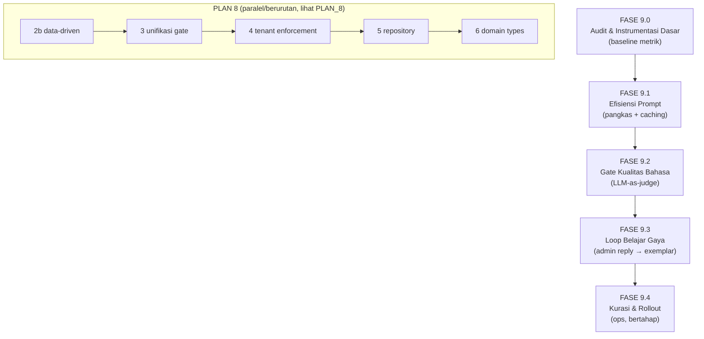

# PLAN 9 — CHATBOT INTELLIGENCE & EFFICIENCY: PROMPT COST, STYLE LEARNING LOOP & QUALITY GATE

> **Status:** 🔄 IN PROGRESS — 9.0 ✅ · 9.1 ✅ · 9.2 ✅ · 2c ✅ · 9.3 ✅ · 9.4 ✅
> **Tanggal:** 2026-09-16
> **Klasifikasi:** Implementation Plan (Staged-Phase & Micro-Task)
> **Turunan dari:** Audit #66 (`docs/KNOWN_ISSUES.md`), Architecture Review v2.1, `docs/plans/PLAN_8_ARCHITECTURE_FIX.md`
> **Tujuan user (verbatim):** *"chatbot saya efisien, efektif dan memiliki kecerdasan untuk membalas customer seperti saya sendiri yang membalas chat ke customer"*
> **Mandat:** Staged-Phase & Micro-Task · Non-Hardcode & Data-Driven · Solusi Fondasional (anti make-up) · Zero New Runtime Dependencies · Minimalisasi Regex · Known Issues

---

## 📌 User Review Required

> [!IMPORTANT]
> **Tiga keputusan menentukan bentuk plan ini.** Masing-masing punya trade-off nyata.

> [!WARNING]
> **Keputusan A — Prioritas: PLAN 9 vs sisa PLAN 8?**
> PLAN 8 Fase 0–2a sudah selesai (fondasi operasional). Sisa Fase 2b–6 adalah kebersihan arsitektur (tenant enforcement, repository, data-driven).
> - **(A1) PLAN 9 lebih dulu** — langsung menjawab "efisien & cerdas"; arsitektur menyusul. **Rekomendasi.**
> - **(A2) Selesaikan PLAN 8 2b–6 dulu** — fondasi tuntas, kecerdasan belakangan.
> - **(A3) Interleave** — Fase 9.1 (efisiensi) + Fase 2b, karena keduanya menyentuh `persona.ts`.
> **Rekomendasi: (A3)** — 9.1 dan 2b sama-sama mengedit `persona.ts`; mengerjakan bersamaan menghindari konflik merge.

> [!IMPORTANT]
> **Keputusan B — Loop belajar gaya: FAQ vs gaya bicara.**
> Saat ini `self-learning.service.ts` mengekstrak jawaban admin menjadi **FAQ** (medis/umum) lalu masuk staging untuk direview — bukan menjadi **contoh gaya**.
> - **(B1) Perluas ke gaya**: jawaban admin yang bagus juga diusulkan menjadi `few_shot_exemplars` (baru, butuh review admin). Menjawab langsung "seperti saya". **Rekomendasi.**
> - **(B2) Cukup FAQ**: biarkan seperti sekarang, cukup diaktifkan + diverifikasi.
> - **(B3) Tunda**: kerjakan efisiensi prompt dulu saja.
> **Rekomendasi: (B1)** — ini akar tujuan Anda, dan infrastrukturnya (staging + review) sudah ada.

> [!IMPORTANT]
> **Keputusan C — Prompt caching: provider-dependent.**
> Efisiensi terbesar adalah prompt caching untuk prefix statis 5.149 char. Tapi caching hanya berfungsi bila **provider LLM mendukung** (`cache_control` Anthropic / automatic prefix caching OpenAI / dsb).
> - **(C1) Implementasi seam caching + feature-detect provider** — aman, no-op bila provider tak mendukung. **Rekomendasi.**
> - **(C2) Hanya pangkas prompt** (buang blok statis yang tak perlu) — tanpa bergantung provider.
> - **(C3) Keduanya** — pangkas dulu (pasti untung), lalu tambah caching.
> **Rekomendasi: (C3).**

---

## 🧩 Root Cause Analysis (berbasis bukti log)

| # | Temuan | Bukti | Dampak ke tujuan user |
|---|--------|-------|------------------------|
| 1 | Prompt generation **42.436 char/p balasan**, head statis 5.149 char identik antar-turn | `logs/llm-2026-09-16.jsonl` (2× V3_GENERATION) | ❌ Efisiensi: token & latensi mahal |
| 2 | Tidak ada prompt caching | grep `cache_control` = 0 implementasi | ❌ Efisiensi |
| 3 | Loop belajar admin **mati default** & hanya ke FAQ, bukan gaya | `self-learning.service.ts:25`; `.env.example:110` | ❌ "Seperti saya" tidak tercapai |
| 4 | Gate regresi tak mengukur kualitas bahasa | `golden-corpus.test.ts` (invarian struktural saja) | ⚠️ Regresi gaya tak terdeteksi |
| 5 | Skrip seed exemplar emas menunjuk `src/slot-engine/` (mati) | `scripts/seed-curated-gold-exemplars.ts:18` | ⚠️ Jalur seed gaya putus |
| 6 | Ratio mutilasi/format belum menjadi metrik keputusan | `telemetry.service.ts` mencatat, tak menjadi gate | ⚠️ Observability tanpa aksi |

---

## 🏗️ Staged Phase Architecture



**Prinsip urutan:** 9.0 wajib (tanpa baseline, tak bisa membuktikan perbaikan). 9.1 memberi ROI instan (efisiensi). 9.2 harus ada **sebelum** 9.3 — tanpa gate kualitas, loop belajar gaya tak bisa divalidasi tidak merusak. 9.3 mengubah perilaku produksi → paling akhir + gated.

---

## FASE 9.0 — Audit & Instrumentasi Dasar

**Tujuan:** Menetapkan baseline terukur sebelum mengubah apa pun (konsisten dengan disiplin Fase 0 PLAN 8).
**Blast radius:** Nol (read-only + dokumentasi).

### Mikro-Task 9.0.1 — Skrip audit prompt
- **File baru:** `src/scripts/audit-prompt-cost.ts`
- **Tindakan:** Baca `logs/llm-*.jsonl`, hitung per flowType: jumlah call, rata-rata `systemPrompt.Length`, ukuran head statis (sebelum `[STATUS DATA CUSTOMER`), ukuran tail dinamis, estimasi token (`/4`), dan estimasi biaya via `cost-calculator.ts`.
- **Perintah:**
  ```powershell
  npx tsx src/scripts/audit-prompt-cost.ts --days=7
  ```
- **Acceptance criteria:** output tabel per flowType; head statis terbukti identik antar-turn (dibuktikan, bukan diasumsikan).

### Mikro-Task 9.0.2 — Catat baseline
- **File:** `docs/BASELINE_INTELLIGENCE_RESULTS.md` (baru).
- **Isi:** angka baseline prompt cost dari 9.0.1; status gate kualitas (belum ada); status loop belajar (mati); jumlah exemplar bank.
- **Acceptance criteria:** baseline terdokumentasi dengan tanggal.

### Regression Gate 9.0
```powershell
npm run build
npm run test:golden
```
**Lulus bila:** exit 0 & golden hijau (tidak ada perubahan source runtime).

---

## FASE 9.1 — Efisiensi Prompt

**Tujuan:** Menurunkan karakter/token per balasan tanpa menurunkan kualitas, dan menambahkan prompt caching bila provider mendukung.
**Blast radius:** Sedang — mengubah isi prompt generation (berdampak ke perilaku) → WAJIB dijaga gate golden + gate kualitas 9.2 (bila sudah ada).
**Prasyarat:** 9.0 selesai. Jika Keputusan A = A3, kerjakan bersama Fase 2b PLAN 8.

> [!IMPORTANT]
> **Prinsip anti make-up:** dilarang memangkas aturan hanya agar prompt pendek. Setiap aturan yang dihapus dari prompt WAJIB punya penggantinya: (a) tetap ada di prompt, (b) dipindah ke validator deterministik, atau (c) dipindah ke exemplar/grounding. Aturan yang tidak punya pengganti = tidak boleh dihapus.

### Mikro-Task 9.1.1 — Inventarisasi aturan prompt ✅ SELESAI (2026-09-16)

Hasil audit pemetaan aturan → validator deterministik (`guardrail-pipeline.ts`):

| Aturan prompt | Validator pengganti | Verdict |
|---|---|---|
| Anti-halusinasi harga/total/aritmatika | `validateNumericFacts` + reprompt 1x + fallback template tool (baris 211-294) | `TETAP_PROMPT` — prompt = steer pertama, validator = jaring. Hapus dari prompt berisiko menaikkan reprompt rate (biaya + latensi). Tanpa pengukuran reprompt, dilarang hapus (anti make-up). |
| Anti-halusinasi nama layanan/domisili/vaksin | `validateFactualClaims` + reprompt → eskalasi (baris 300+) | `TETAP_PROMPT` — alasan sama. |
| Kata ganti "kami/Bidan kami" | `detectFirstPersonSlip` + reprompt (baris 369+) | `TETAP_PROMPT` — alasan sama. |
| Anti-todong usia | age-solicitation reprompt (`hasAgeQuestion`) | `TETAP_PROMPT` — alasan sama. |
| Disclaimer same-day | safety-net pasca-generasi (`SAME_DAY_DISCLAIMER`) | `TETAP_PROMPT` — alasan sama. |
| Format WhatsApp (`**`, panjang) | `OutputSanitizer` + batas 1200/1500 char | `TETAP_PROMPT` — sanitizer deterministik tapi prompt menjaga kualitas first-pass. |

**Keputusan:** TIDAK ADA aturan yang dihapus dari prompt pada Fase 9.1. Penghematan dicapai lewat **prefix stabilization + caching** (9.1.2/9.1.3), bukan pemangkasan aturan. Penghapusan aturan hanya boleh dipertimbangkan bila metrik reprompt (`NUMERIC_REPROMPT_FIXED`, `FACTUAL_REPROMPT_STILL_INVALID`, dst.) membuktikan validator jarang terpicu — data itu belum dikumpulkan.

### Mikro-Task 9.1.2 — Blok statis dipisah jadi konstanta ber-cache
- **File:** `src/v3/agent/persona.ts`
- **Tindakan:** Pisahkan blok statis (identitas + gaya + negative constraints) menjadi konstanta level-modul yang dihitung **sekali**, lalu dirakit dengan tail dinamis. Ini tidak mengubah isi, hanya memastikan prefix byte-stabil untuk caching provider.
- **Acceptance criteria:** `npm run build` exit 0; output prompt identik dengan sebelumnya (verifikasi via snapshot test).

### Mikro-Task 9.1.3 — Seam prompt caching
- **File baru:** `src/integrations/llm/prompt-cache.ts`
- **Kontrak:**
  ```typescript
  export interface CacheableSystemPrompt {
    /** Prefix statis yang layak di-cache (byte-stabil). */
    stablePrefix: string;
    /** Sisa prompt yang berubah per-turn. */
    volatileSuffix: string;
  }
  export function buildCacheableSystemPrompt(full: string, marker: string): CacheableSystemPrompt;
  /** Terapkan anotasi caching bila provider mendukung; no-op bila tidak. */
  export function applyCacheAnnotations(parts: CacheableSystemPrompt, providerBaseUrl: string): any[];
  ```
- **Aturan:** `applyCacheAnnotations` mengembalikan bentuk `messages` dengan `cache_control` untuk provider yang dikenal (mis. Anthropic-compatible), dan **no-op** (string gabungan biasa) untuk provider lain. Tidak menambah dependency.
- **Acceptance criteria:** unit test — provider dikenal → anotasi muncul; provider tak dikenal → output identik dengan tanpa caching.

### Mikro-Task 9.1.4 — Integrasi ke generation stage
- **File:** `src/v3/agent/pipeline/generation-stage.ts`
- **Tindakan:** Gunakan `buildCacheableSystemPrompt` + `applyCacheAnnotations` pada panggilan Call 2. Pastikan fallback aman bila seam mengembalikan string biasa.
- **Acceptance criteria:** `npm test` failed ≤ baseline; golden hijau.

### Regression Gate 9.1
```powershell
npm run build
npm run test:golden
npx tsx src/scripts/audit-prompt-cost.ts --days=1   # bandingkan setelah perubahan lokal
npm test
```
**Lulus bila:** golden hijau; audit 9.0.1 menunjukkan penurunan ukuran prompt *atau* anotasi caching terpasang; failed ≤ baseline.

---

## FASE 9.2 — Gate Kualitas Bahasa (LLM-as-judge)

**Tujuan:** Membuat regresi bahasa/gaya/kepatuhan terdeteksi otomatis, melengkapi gate struktural.
**Blast radius:** Rendah — menambah evaluator + gate, tidak mengubah produksi.
**Prasyarat:** 9.1 selesai (agar gate mengukur perilaku pasca-optimasi).

### Mikro-Task 9.2.1 — Rubrik persona
- **File baru:** `tests/evals/persona-rubric.ts`
- **Isi:** Rubrik penilaian dengan skor 1–5 per dimensi: (1) kehangatan & naturalitas WhatsApp, (2) kepatuhan aturan emas (tidak todong jam, tidak sebut harga tanpa ditanya), (3) ketepatan grounding (tidak mengarang harga/nama), (4) panjang & format (2–3 kalimat, tanpa `**`), (5) penggunaan kata ganti "kami/Bidan kami". Threshold lulus per dimensi.
- **Acceptance criteria:** rubrik terdokumentasi & dapat dipakai sebagai prompt evaluator.

### Mikro-Task 9.2.2 — Harness evaluasi (LLM nyata, terpisah dari gate offline)
- **File baru:** `tests/evals/persona-quality-harness.ts`
- **Tindakan:** Jalankan sekumpulan percakapan (gunakan skenario golden corpus) melalui pipeline dengan **LLM nyata** (env key), lalu nilai dengan rubrik via `llmEvaluatorService` yang sudah ada. Output ringkasan skor + daftar turn di bawah ambang.
- **Prasyarat:** hanya dijalankan bila `LLM_API_KEY` tersedia; **bukan** bagian `npm test` offline.
- **Acceptance criteria:** skrip berjalan & menghasilkan laporan; exit 1 bila skor rata-rata < ambang.

### Mikro-Task 9.2.3 — Integrasi ke evaluator eksisting
- **File:** `src/services/llm-evaluator.service.ts`
- **Tindakan:** Pastikan rubrik persona dapat dipakai oleh evaluator yang ada (reuse, bukan modul baru).
- **Acceptance criteria:** tidak ada duplikasi logika evaluasi.

### Regression Gate 9.2
```powershell
npm run build
npm run test:golden
npx tsx tests/evals/persona-quality-harness.ts --dry-run   # tanpa LLM → memastikan skrip valid
```
**Lulus bila:** golden hijau; harness lolos sintaks & mode dry-run.

---

## FASE 9.3 — Loop Belajar Gaya (admin reply → exemplar)

**Tujuan:** Koreksi manual admin/CS menjadi bahan belajar gaya secara otomatis (dengan review manusia), bukan hanya FAQ.
**Blast radius:** Tinggi — mengubah perilaku produksi (bot mulai meniru contoh baru). Wajib gated + review.
**Prasyarat:** 9.2 selesai (gate kualitas tersedia untuk validasi).

> [!WARNING]
> **Confirmation Gate (Keputusan B).** Fase ini hanya dikerjakan bila user memilih B1. Bila B2/B3, lewati.

### Mikro-Task 9.3.1 — Aktifkan & verifikasi self-learning yang ada
- **File:** `src/services/self-learning.service.ts`, `.env` gate.
- **Tindakan:** Uji di staging dengan `ENABLE_SELF_LEARNING=true`; verifikasi Q&A non-transaksional masuk ke `general_faq_staging` / `medical_faq_staging` dengan status `PENDING`.
- **Acceptance criteria:** bukti record staging terbentuk; tidak mengganggu jalur pesan.

### Mikro-Task 9.3.2 — Perluas staging ke exemplar gaya
- **File:** `src/services/self-learning.service.ts`, skema review.
- **Tindakan:** Setelah refined FAQ terbentuk, bila jawaban admin memenuhi ambang kualitas (panjang wajar, bukan transaksional, bukan template CS), buat **usulan** `FewShotExemplar` dengan `is_active=false` (menunggu review admin). **Tidak** auto-aktif.
- **Acceptance criteria:** usulan exemplar muncul di antrean review; default tidak aktif; tidak ada aktivasi otomatis.

### Mikro-Task 9.3.3 — Antrean review exemplar (UI hemat, no page bloat)
- **File:** `packages/admin-dashboard` — integrasikan sebagai **tab/modal** di modul Knowledge Base atau Live Chat yang ada (mandat anti-bloat), bukan halaman baru.
- **Tindakan:** Reuse komponen tabel/review eksisting untuk daftar `FewShotExemplar` non-aktif, dengan aksi Aktifkan/Tolak/Edit.
- **Acceptance criteria:** `npm run build` dashboard exit 0; tidak ada rute/page baru.

### Regression Gate 9.3
```powershell
npm run build
npm run test:golden
npm test
```
**Lulus bila:** perilaku produksi tidak berubah sampai admin mengaktifkan exemplar (default non-aktif); failed ≤ baseline.

---

## FASE 9.4 — Kurasi & Rollout (Operasional)

**Tujuan:** Menaikkan kualitas gaya secara bertahap dan terukur.
**Blast radius:** Operasional (bukan kode).

### Mikro-Task 9.4.1 — Perbaiki skrip seed exemplar
- **File:** `scripts/seed-curated-gold-exemplars.ts:18` → arahkan dari `../src/slot-engine/gold-few-shot-exemplars` ke `../src/v3/agent/gold-few-shot-exemplars`.
- **Acceptance criteria:** skrip berjalan tanpa error import.

### Mikro-Task 9.4.2 — Prosedur kurasi mingguan
- **File:** `docs/RUNBOOK_GAYA_BIDAN.md` (baru).
- **Tindakan:** Prosedur: jalankan harness kualitas → tinjau exemplar usulan → aktifkan yang lolos rubrik → jalankan harness lagi → catat delta skor.
- **Acceptance criteria:** runbook terdokumentasi; siklus dapat diulang oleh admin.

---

## 📊 Dependency & Blast Radius Matrix (PLAN 9)

| Fase | Blast Radius | Prasyarat | Reversible? | Confirmation Gate |
|---|---|---|---|---|
| 9.0 | Nol | — | Ya | Tidak |
| 9.1 | Sedang | 9.0 | Ya (revert) | Ya (Keputusan C) |
| 9.2 | Rendah | 9.1 | Ya | Tidak |
| 9.3 | Tinggi | 9.2 | Ya (default non-aktif) | **Ya (Keputusan B)** |
| 9.4 | Operasional | 9.3 | Ya | Tidak |

## ✅ Definition of Done (PLAN 9)

1. `npm run build` exit 0.
2. `npm run test:golden` exit 0.
3. `npm test` failed ≤ baseline.
4. `src/scripts/audit-prompt-cost.ts` menunjukkan perbaikan (untuk 9.1).
5. Harness kualitas berjalan & melaporkan skor (untuk 9.2+).
6. CHANGELOG diperbarui; KNOWN_ISSUES #66 diperbarui statusnya.
7. **Tidak ada aturan prompt yang dihapus tanpa pengganti terdokumentasi.**

## 🚫 Yang TIDAK Dilakukan Plan Ini

- **Tidak** menambah dependency runtime.
- **Tidak** memangkas aturan demi prompt pendek (anti make-up).
- **Tidak** mengaktifkan exemplar hasil belajar otomatis tanpa review admin.
- **Tidak** membuat page dashboard baru (mandat anti-bloat).
- **Tidak** mengubah label WAHA.
