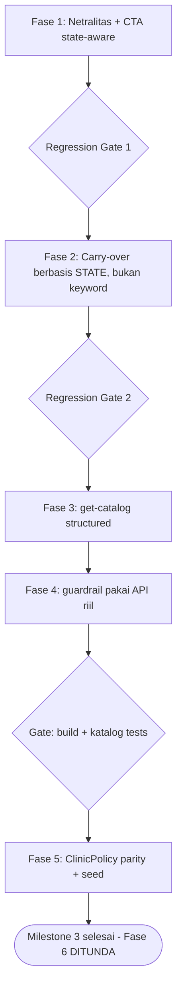

# Implementation Plan (REVISI FONDASIONAL) — Netralitas Agama, CTA State-Aware, Dekomposisi Tool, & Paritas DB

> **Status**: REVISI dari draf "Master Implementation Plan Mikro" (2026-09-17).
> Draf lama mengandung 3 cacat fondasional (hardcode string baru, keyword-matching,
> API fiktif) dan 2 fase tak dispesifikasi. Revisi ini menggantinya dengan seam yang
> **sudah ada di kode** atau yang didefinisikan eksplisit (file + blok + test).

---

## 📌 Ringkasan Verdict atas Draf Lama

| Fase draf | Verdict | Alasan (terverifikasi di kode) |
|---|---|---|
| 1. Ganti `Alhamdulillah` | ❌ Solusi tambal | Mengganti literal dengan literal baru yang masih di-hardcode di file tool → melanggar Mandat Non-Hardcode |
| 2. State-aware `buildScheduleCta` | ✅ Fondasional | Sandaran pada state (treatment/hari), bukan teks |
| 3. Carry-over perbandingan lokasi | ❌ Melanggar mandat | `startsWith('kalau ke')` / `includes('berapa')` = verbatim sentence matching (Mandat Anti-Overfitting) |
| 4. Sanitasi SOP | ❌ Tambal | Hardcode string baru di `clinic-faq.tool.ts` |
| 6. get-catalog structured | ✅ Fondasional | Data terstruktur menggantikan prosa siap-saji |
| 7. Ganti overwrite guardrail | ❌ Tidak kompilasi | `OutputSanitizer.correctMismatchedNominal` **tidak ada** di `src/v3/guardrails/sanitizer.ts` |
| 9. Parity ClinicPolicy | ⚠️ Kosong | Tidak ada micro-task nyata (SQL/seed/test) |
| 10. TEMPLATES → DB | ⚠️ Belum dispesifikasi | `TenantPromptConfigService` menyimpan **prompt sections**, bukan template pesan → butuh tabel/service baru (Confirmation Gate) |
| 11. Sanitasi fast-response | ⚠️ Belum dispesifikasi | Sama: butuh resolver tenant yang belum ada |

**Fakta koreksi penting:**
- `buildScheduleCta` dipanggil dari **5 call-site** di `calculate-delivery.tool.ts` (baris 371, 387, 393, 594, 596, 604) — semua harus ikut berubah agar tidak ada CTA liar.
- Matrix test saat ini **CM-01..CM-23 = 23 skenario** (bukan 24). CM-24 akan menjadi skenario ke-24.
- `Alhamdulillah` hanya muncul di 2 tempat (`:387`, `:596`); greeting keagamaan resmi sudah punya jalur `isIslamic` di `persona.ts:245-262`. Jadi ini **inkonsistensi** — tool menulis kata keagamaan tanpa syarat, sementara greeting respek pada flag tenant.

---

## 📌 Root Cause Analysis Lintas Lapisan

**Lapisan 1 — Tool hardcode teks customer-facing** (`calculate-delivery.tool.ts`):
Dua literal `Alhamdulillah...` (baris 387, 596) hidup di file tool, bukan di template layer.
Greeting keagamaan resmi sudah punya jalur `isIslamic` (`persona.ts:245-262`) — jadi ini
inkonsistensi arsitektur: satu file menghormati flag tenant, file lain tidak. **Akar**: tidak ada
kewajiban struktural agar teks customer-facing lewat `TEMPLATES`.

**Lapisan 2 — CTA buta state** (`buildScheduleCta`, baris 52-58):
Fungsi hanya menerima `preferredDate`; ia tak tahu apakah treatment sudah dipilih, sehingga
menodong "hari apa" bahkan saat customer belum memilih apa pun (melanggar Aturan Emas 20).
**Akar**: signature fungsi tidak membawa state sesi (keranjang/kandidat treatment).

**Lapisan 3 — Intent carry-over hilang** (`tool-pipeline.ts:160-164`):
`asksDeliveryFee` hanya dari teks turn ini. Saat customer melanjutkan ("kalau ke X?"), nominal
ongkir legit menjadi tertahan. State `session.priceDiscussed` **sudah ada** tapi tidak dipakai.
**Akar**: keputusan intent tidak mengkombinasikan sinyal-turn dengan state sesi.

**Lapisan 4 — Tool output prosa, bukan data** (`get-catalog.tool.ts`):
`suggestedConsultationReply`/`message` berisi kalimat siap-saji & instruksi "Format penyampaian...",
membuat LLM menyalin template alih-alih menalar dari data. **Akar**: kontrak output tool tidak
memisahkan *data* dari *narasi*.

**Lapisan 5 — Guardrail menimpa narasi LLM** (`guardrail-pipeline.ts:307-310`):
`finalReply = fallbackToolReply` membuang kalimat natural model. **Akar**: guardrail punya jalur
"overwrite penuh" alih-alih koreksi terarah pada fakta.

**Lapisan 6 — Teks kebijakan tidak paritas DB** (`clinic-faq.tool.ts`):
Fallback statis dipakai walau DB punya `clinic_policies`. **Akar**: belum ada jaminan seed/paritas.

**Lapisan 7 — TEMPLATES belum DB** (`persona.ts`): 30+ template masih di kode.
**Akar**: belum ada tabel/service template tenant. **Blast radius besar → Confirmation Gate.**

---

## 🏛️ Prinsip Desain (mengikat)

1. **Zero New Runtime Dependencies** — hanya modul yang sudah ada.
2. **No Verbatim Sentence Matching** — guardrail WAJIB bersandar pada state sesi / data DB / LLM semantic, bukan daftar kalimat.
3. **No New Hardcoded Business Text** — setiap teks customer-facing baru HARUS lewat resolver template, bukan literal di file tool.
4. **Backward Compatible** — interface lama dipertahankan via overload/adapter; test suite offline tetap hijau.
5. **Staged + Regression Gate** — tiap fase: file pasti, blok kode, perintah, acceptance criteria.

---

## 🛠️ MILESTONE 1 — Isu Akut Sesi 700303

### Fase 1: Seam Netralitas Agama & CTA State-Aware (di `calculate-delivery.tool.ts`)

**Tujuan**: (a) hapus kata keagamaan sepihak dari tool; (b) CTA tidak menodong jadwal bila treatment belum dipilih. Semua teks tetap lewat template resolver.

#### 1A. Perluas `buildScheduleCta` menjadi state-aware (FONDASIONAL — dipertahankan dari draf)

Lokasi: `src/v3/tools/calculate-delivery.tool.ts:52-58`.

```ts
export interface ScheduleCtaOptions {
  preferredDate?: string;
  candidateTreatmentName?: string;
  hasCartItems?: boolean;
}

export function buildScheduleCta(opts?: ScheduleCtaOptions | string): string {
  const o: ScheduleCtaOptions = typeof opts === 'string' ? { preferredDate: opts } : (opts || {});
  const preferredDate = (o.preferredDate || '').trim();
  const treatment = (o.candidateTreatmentName || '').trim();

  // 1. Hari sudah disebut -> akui & infokan dicekkan (TANPA tanya hari lagi).
  if (preferredDate) {
    return `Untuk ketersediaan jadwal ${preferredDate}nya, akan kami bantu cekkan ketersediaan jadwal terlebih dahulu ya Bunda 🙏😊`;
  }
  // 2. Treatment sudah dipilih (keranjang/kandidat) -> tanya hari kunjungan.
  if (treatment || o.hasCartItems) {
    const treatClause = treatment ? ` *${treatment}*` : 'nya';
    return `Untuk layanan${treatClause}, rencana mau kami bantu jadwalkan di hari apa ya Bunda? 🙏😊`;
  }
  // 3. Treatment belum dipilih -> DILARANG menodong hari (Aturan Emas 20).
  return 'Rencana mau dibantu perawatan apa untuk si kecil atau Bunda? 🤗';
}
```

> **Catatan overload**: menerima `string` (call lama) maupun `object` (call baru) agar nol breaking change secara tipe.

#### 1B. Ganti 2 literal `Alhamdulillah` dengan helper resolusi NAMA BRAND (BUKAN string hardcoded baru)

**Root cause sebenarnya**: tool menulis kalimat jangkauan customer-facing sebagai literal. Solusi fondasional: pakai template resolver yang sudah punya peran ini — `TEMPLATES` di `persona.ts` — bukan menulis literal di tool.

Lokasi: `src/v3/tools/calculate-delivery.tool.ts:387` dan `:596`.

```ts
// SEBELUM (:387):
: `Alhamdulillah, area ${kelurahan} masuk dalam jangkauan layanan homecare Bidan kami ya Bunda. ${buildScheduleCta(preferredDate)}`;

// SESUDAH (:387):
: TEMPLATES.inCoverageNoFee({ kelurahan, scheduleCta: buildScheduleCta({ preferredDate, candidateTreatmentName, hasCartItems: (cartSnapshot || []).length > 0 }) });
```

```ts
// SEBELUM (:596):
: `Alhamdulillah, area ${locationText} masuk dalam area jangkauan layanan homecare Bidan kami ya Bunda.${buildScheduleCta(preferredDate)}`;

// SESUDAH (:596):
: TEMPLATES.inCoverageNoFee({ kelurahan: locationText, scheduleCta: buildScheduleCta({ preferredDate, candidateTreatmentName, hasCartItems: (cartSnapshot || []).length > 0 }) });
```

**Tambahkan 1 template baru** di `src/config/persona.ts` (sejajar `outOfCoverage`/`ongkirInfo`), tetap memakai `getBrandIdentity()`:

```ts
inCoverageNoFee: (params: { kelurahan: string; scheduleCta: string }) =>
  `Area ${params.kelurahan} masuk dalam area jangkauan layanan homecare Bidan kami ya Bunda.\n\n${params.scheduleCta}`,
```

> **Mengapa ini lebih fondasional**: teks customer-facing hidup di satu tempat (template layer), bukan tersebar sebagai literal di tool. Naik ke DB (Fase 9) nanti cukup memindahkan kumpulan template — tanpa menyentuh logika tool.

#### 1C. Regresi & acceptance

- Test baru di `tests/unit/v3/delivery-schedule-cta-context.test.ts`:
  ```ts
  it('buildScheduleCta: tanpa treatment & tanpa hari -> tanya kebutuhan perawatan, bukan hari', () => {
    const cta = buildScheduleCta({});
    expect(cta).toContain('perawatan apa');
    expect(cta).not.toMatch(/hari apa/i);
  });
  it('buildScheduleCta: ada treatment & tanpa hari -> tanya hari kunjungan', () => {
    const cta = buildScheduleCta({ candidateTreatmentName: 'Pijat Batuk Pilek' });
    expect(cta).toContain('Pijat Batuk Pilek');
    expect(cta).toMatch(/hari apa/i);
  });
  it('buildScheduleCta: ada hari -> akui & cekkan, tanpa tanya hari', () => {
    const cta = buildScheduleCta({ preferredDate: 'besok pagi' });
    expect(cta).toContain('besok pagi');
    expect(cta).toContain('akan kami bantu cekkan');
    expect(cta).not.toMatch(/hari apa/i);
  });
  it('buildScheduleCta: string lama tetap kompatibel', () => {
    expect(buildScheduleCta('sekarang')).toContain('sekarang');
  });
  ```
- Assertion netralitas: `grep -rn "Alhamdulillah" src/v3/tools/calculate-delivery.tool.ts` = 0 baris.
- Anti format menempel: `suggestedTemplateReply` tidak boleh match `/\.[A-Z]/`.
- **Gate**: `npx vitest run tests/unit/v3/delivery-schedule-cta-context.test.ts` hijau.

---

### Fase 2: Carry-Over Konteks **tanpa keyword-matching** (GANTI total draf Fase 3)

**Masalah draf**: mendeteksi "perbandingan lokasi" via daftar frasa (`kalau ke`, `kalo di`, `berapa`) = verbatim matching yang dilarang.

**Root cause sebenarnya**: intent `asksDeliveryFee` hanya melihat **teks turn ini**, padahal customer sering melanjutkan percakapan ("kalau ke Bungurasih?" setelah turn sebelumnya menanyakan ongkir). Yang hilang adalah **state percakapan**, bukan pola kalimat.

**Solusi fondasional (seam TERVERIFIKASI)**: sistem **sudah** melacak state `session.priceDiscussed`
(lihat `src/v3/state/goal-tracker.ts:190,343,412`; dipakai juga di `prompt-composer.ts` &
`conversation-summarizer.ts`). Field ini di-set **true** tepat ketika customer pernah menanyakan
harga/ongkir (mode transaksional). Jadi carry-over tidak perlu field baru maupun keyword.

**Micro-task konkret:**

Lokasi: `src/v3/agent/pipeline/tool-pipeline.ts:160-164`.

```ts
const priceIntent = await ToolExecutionPipeline.detectPriceIntent(cleanIncomingText);
if (fnName === 'calculate_delivery') {
  // Carry-over berbasis STATE, bukan pola kalimat: bila customer sudah pernah
  // masuk mode transaksional (priceDiscussed) dan giliran ini menyebut lokasi
  // baru, nominal ongkir tetap sah disampaikan.
  const locationUpdated = !!(session?.location?.kelurahan || (fnArgs as any)?.locationText);
  const carryOver = session?.priceDiscussed === true && locationUpdated;
  fnArgs.asksDeliveryFee = priceIntent.asksPrice || carryOver;
}
```

> `session` sudah tersedia di scope `execute` (`let { session } = input;` baris 121).
> `locationUpdated` bersandar pada state lokasi sesi + argumen tool — **keduanya data, bukan teks hafalan**.

**Unit test (state-based, bukan kalimat).** File: `tests/unit/v3/tool-pipeline-price-intent.test.ts`.

```ts
it('carry-over ON saat priceDiscussed=true & ada lokasi', () => {
  const session = { priceDiscussed: true, location: { kelurahan: 'Kenjeran' } } as any;
  const carryOver = session.priceDiscussed === true && !!(session.location?.kelurahan);
  expect(carryOver).toBe(true);
});
it('carry-over OFF saat priceDiscussed bukan true', () => {
  const session = { location: { kelurahan: 'Kenjeran' } } as any;
  const carryOver = session.priceDiscussed === true && !!(session.location?.kelurahan);
  expect(carryOver).toBe(false);
});
it('carry-over OFF saat lokasi belum ada', () => {
  const session = { priceDiscussed: true } as any;
  const carryOver = session.priceDiscussed === true && !!(session.location?.kelurahan);
  expect(carryOver).toBe(false);
});
```

> Uji ini menguji **state**, sehingga tahan terhadap parafrase apa pun (tidak ada
> `startsWith('kalau ke')` dsb.). Bila pola kalimat berbeda, perilaku tetap benar.

**Acceptance**: test menguji **state**, bukan kalimat: set `session.priceDiscussed=true` + kirim lokasi baru → `asksDeliveryFee=true`; tanpa state → `false`. Test dengan parafrase acak tetap lulus.

---

## 🛠️ MILESTONE 2 — Dekomposisi Tool (fondasional, dipertahankan)

### Fase 3: Output terstruktur `get-catalog.tool.ts`

- Tambah `CatalogPricingBreakdown` & `CatalogCartRecapBreakdown` ke `GetCatalogOutput` (draf Fase 6 — **dipertahankan**, arah benar).
- Ganti `suggestedConsultationReply` naratif menjadi `focusClinicalDescription` + `targetAudience` (data murni).
- Ganti `message` berisi "Format penyampaian..." menjadi fakta terstruktur.
- **Gate**: `tests/unit/get-catalog-tool-grounding.test.ts` + `tests/unit/v3/catalog-session-total.test.ts` hijau.

### Fase 4: Guardrail — hapus overwrite, pakai API yang ADA (KOREKSI draf Fase 7)

**Masalah draf**: memanggil `OutputSanitizer.correctMismatchedNominal` yang **tidak eksis** (build akan gagal).

**Perbaikan**:
- Hapus `finalReply = fallbackToolReply;` (`guardrail-pipeline.ts:307-310`).
- Untuk koreksi nominal, **pakai mekanisme yang sudah ada**: `validateFactualClaims` (`guardrail-pipeline.ts:313+`) yang sudah memvalidasi klaim angka terhadap output tool, dan/atau tambahkan method **baru** `OutputSanitizer` yang benar-benar didefinisikan (nama bebas, tapi harus ditulis di `sanitizer.ts` + unit test-nya).
- **Gate**: `npm run build` exit 0 + `tests/unit/factual-claim-validator.test.ts` hijau.

---

## 🛠️ MILESTONE 3 — Paritas DB (dispesifikasi ulang)

### Fase 5: ClinicPolicy parity (`clinic-faq.tool.ts`)

Draf Fase 9 kosong. Micro-task konkret yang dibutuhkan saat eksekusi:
1. Inventaris 7 topik di `getStaticFallbackPolicy` (baca kode aktual).
2. Cek tabel `clinic_policies` di DB: topik mana yang belum ada.
3. Buat migration/seed Prisma untuk melengkapi topik yang hilang (file migrasi eksplisit, nama & path).
4. Fallback statis tetap ada untuk test offline — jangan dihapus.
5. **Gate**: `tests/unit/clinic-faq.test.ts` hijau + query DB memuat 7 topik.

### Fase 6: Migrasi `TEMPLATES` ke DB — **DITUNDA (keputusan user 2026-09-18)**

> **STATUS: DITUNDA.** User memutuskan menunda fase ini (Confirmation Gate disetujui:
> opsi tunda). Alasan: butuh infrastruktur baru (tabel `tenant_message_templates`,
> service, seed 30+ template, ubah 30+ call-site) dengan blast radius besar.
> **DILARANG dieksekusi** dalam rangkaian Milestone 3 saat ini. Catat sebagai
> tech debt di `docs/KNOWN_ISSUES.md` bila belum ada.

Draf Fase 10 tidak dispesifikasi dan blast radius-nya **sangat besar** (30+ template × seluruh alur). `TenantPromptConfigService` saat ini **bukan** tempat untuk template pesan (ia menyimpan prompt sections).

Bila kelak dilanjutkan, opsi yang pernah diajukan:
- **(A)** Buat tabel + service + migrasi semua template (LOC besar, paling SaaS-ready).
- **(B)** Cukup pindahkan template yang benar-benar tenant-spesifik (brand/greeting — sudah banyak lewat `getBrandIdentity`).
- **(C)** Tunda total ke plan terpisah. ← **DIPILIH**

---

## ✅ Dependency & Urutan Eksekusi



---

## 🚦 Regression Gate Final

1. `npm run build` → exit 0.
2. `npx vitest run tests/integration/v3-conversation-matrix.test.ts` → CM-01..CM-24 hijau (**24** skenario; saat ini 23).
3. `npm test` → seluruh suite offline hijau.
4. Update `CHANGELOG.md` + `docs/KNOWN_ISSUES.md`.

---

## ⚠️ Risiko & Catatan

- **Fase 2 wajib verifikasi `GoalSession` dulu**; jangan mengarang field state. Jika tak ada seam state yang jujur, eskalasi (jangan balik ke keyword).
- **Fase 6 Confirmation Gate**: jangan mulai tanpa keputusan user.
- Plan ini **tidak menyentuh** WAHA/Meta — deploy tetap 1-step aman.
