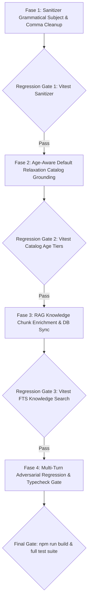

# Implementation Plan: Perbaikan Fondasional 3 Anomali Sesi 391501

Dokumen ini merinci rencana eksekusi staged-phase berjenjang mikro untuk menuntaskan secara fondasional seluruh anomali teknis yang teridentifikasi pada sesi pengujian simulator **391501** (Sidoarjo Banjarmukti Residence, 17-month baby & 2-year toddler inquiry), sesuai seluruh mandat ketat `AGENTS.md` (Zero Hardcoded If-Else, Anti Mid-Sentence Mutilation, Data-Driven Catalog, dan Deterministic Testing).

---

## User Review Required

> [!IMPORTANT]
> **Kebijakan Usia Layanan Katalog (Age Tiers)**:
> Pada database layanan (`Treatment`), rentang usia diatur sebagai berikut:
> - `Pijat Bayi Ceria Newborn`: 0 - 6 bulan
> - `Pijat Bayi Ceria`: 7 - 24 bulan
> - `Pijat Kids Ceria`: 25 - 144 bulan (2 - 12 tahun)
>
> Perbaikan pada Fase 2 akan membuat fungsi `treatmentCatalogService.getDefaultRelaxationService()` secara otomatis memfilter layanan berdasarkan rentang usia si kecil (`ageMonths`). Untuk anak usia 17 bulan tanpa keluhan spesifik, sistem akan secara otomatis merekomendasikan **Pijat Bayi Ceria** (bukan *Newborn*).

> [!NOTE]
> Seluruh perbaikan dilakukan pada lapisan logika inti (*State Machine*, *Sanitizer Engine*, *Catalog Service*, dan *Database Knowledge Chunks*), **tanpa menambah dependency baru** di `package.json` dan tanpa membatasi fleksibilitas semantik AI.

---

## Proposed Changes

### Layer 1: Deterministic Output Normalizer (Sanitizer)

#### [MODIFY] [sanitizer.ts](file:///c:/Users/User/Documents/chatbot%20AG/src/v3/guardrails/sanitizer.ts)
- **Akar Masalah**:
  Pada `OutputSanitizer.limitVocativeQuota`, pencarian regex `/\b(Bunda|Bapak)\b/gi` memperlakukan semua kata "Bunda" setelah kemunculan pertama sebagai sapaan vokatif dan menghapusnya dengan spasi. Akibatnya:
  1. Kata "Bunda" yang berfungsi sebagai **subjek tata bahasa** di awal kalimat/klausa (`"Bunda hanya perlu menyiapkan..."`) terpotong menjadi `" hanya perlu menyiapkan..."`.
  2. Penghapusan sapaan yang didahului koma (`"silakan tanya ya, Bunda! 🤗"`) hanya membersihkan koma setelah kata tersebut, sehingga meninggalkan koma menggantung sebelum tanda seru (`"silakan tanya ya,! 🤗"`).
- **Rincian Perubahan**:
  1. Identifikasi *Grammatical Subject*: Jika kata "Bunda"/"Bapak" berada di awal kalimat/paragraf/klausa (setelah tanda titik/seru/tanya/enter) dan langsung diikuti kata kerja/modal bantu (misal: *hanya, cukup, bisa, perlu, dapat, mau, ingin, sudah, belum, tidak, harus, tinggal*), kata tersebut diproteksi sebagai subjek kalimat dan **TIDAK DIHAPUS** serta tidak mengurangi kuota sapaan vokatif.
  2. Pembersihan Tanda Baca Rapi: Saat sapaan vokatif berlebih yang didahului tanda koma dihapus, bersihkan koma yang mendahului tanda baca penutup: `replace(/,\s*([!?.])/g, '$1')` dan rapikan spasi sebelum tanda baca ganda.

#### [MODIFY] [v3-sanitizer-vocative-quota.test.ts](file:///c:/Users/User/Documents/chatbot%20AG/tests/unit/v3-sanitizer-vocative-quota.test.ts)
- Menambahkan test case adversarial:
  - Proteksi subjek: `"Tenang saja ya Bunda, seluruh peralatan sudah siap. Bunda hanya perlu menyiapkan tempat yang nyaman."` -> kata Bunda kedua tetap utuh.
  - Pembersihan koma menggantung: `"Kalau ada yang ingin ditanyakan lagi, jangan ragu untuk bertanya ya, Bunda! 🤗"` -> `"Kalau ada yang ingin ditanyakan lagi, jangan ragu untuk bertanya ya! 🤗"`.

---

### Layer 2: Clinical Catalog & Goal Tracker (Age-Aware Relaxation)

#### [MODIFY] [treatment-catalog.service.ts](file:///c:/Users/User/Documents/chatbot%20AG/src/services/treatment-catalog.service.ts)
- **Akar Masalah**:
  Metode `getDefaultRelaxationService(category?, tenantId?)` tidak menerima parameter usia anak (`ageMonths`). Akibatnya, untuk kategori `BABY`, ia selalu mengambil item pertama yang cocok dengan kata 'ceria' dari array katalog, yaitu `Pijat Bayi Ceria Newborn` (0-6 bulan), meskipun usia anak sebenarnya 17 bulan.
- **Rincian Perubahan**:
  1. Perbarui signature metode menjadi:
     ```typescript
     public getDefaultRelaxationService(
       category?: TreatmentCategoryType,
       ageMonths?: number | null,
       tenantId: string = DEFAULT_TENANT_ID
     ): ClinicServiceItem | undefined
     ```
  2. Tambahkan penyaringan usia data-driven:
     - Jika `ageMonths != null`, filter `pool` menggunakan `s.ageTier.minMonths` dan `s.ageTier.maxMonths`.
     - Untuk anak usia 17 bulan, `ageTier` [7, 24] akan mencocokkan `Pijat Bayi Ceria`.
     - Untuk bayi usia 0-6 bulan, `ageTier` [0, 6] mencocokkan `Pijat Bayi Ceria Newborn`.
     - Untuk balita usia 25+ bulan (>= 2 tahun), otomatis mencocokkan `Pijat Kids Ceria`.

#### [MODIFY] [goal-tracker.ts](file:///c:/Users/User/Documents/chatbot%20AG/src/v3/state/goal-tracker.ts)
- **Akar Masalah**:
  Pada baris 318, `getDefaultRelaxationService()` dipanggil tanpa argumen usia (`childAgeMonths`).
- **Rincian Perubahan**:
  1. Ekstrak `childAge = session.childProfile?.ageMonths ?? session.children?.[0]?.ageMonths ?? null`.
  2. Tentukan `categoryHint = session.targetAudience === 'MOMS' ? 'MOMS' : session.targetAudience === 'KIDS' ? 'KIDS' : 'BABY'`.
  3. Panggil `treatmentCatalogService.getDefaultRelaxationService(categoryHint, childAge, tenantId)`.
  4. Prompt yang diinjeksikan untuk anak 17 bulan secara presisi menjadi:
     `• Rekomendasi Paket Dasar (Bayi Sehat Tanpa Keluhan): *Pijat Bayi Ceria* — ...` (bukan *Newborn*).

#### [NEW] [treatment-catalog-default-relaxation.test.ts](file:///c:/Users/User/Documents/chatbot%20AG/tests/unit/treatment-catalog-default-relaxation.test.ts)
- Unit test TDD untuk memastikan `getDefaultRelaxationService`:
  - `ageMonths = 3` -> menghasilkan `Pijat Bayi Ceria Newborn`
  - `ageMonths = 17` -> menghasilkan `Pijat Bayi Ceria`
  - `ageMonths = 36` (3 tahun) -> menghasilkan `Pijat Kids Ceria`
  - `ageMonths = null` -> menghasilkan paket default umum yang valid

---

### Layer 3: RAG Knowledge Base & Keywords Enrichment (Preparation & Oils)

#### [MODIFY] [keyword-enrichment.service.ts](file:///c:/Users/User/Documents/chatbot%20AG/src/services/keyword-enrichment.service.ts)
- **Akar Masalah**:
  Aturan `KB_KEYWORD_RULES` untuk topik persiapan hanya mencakup kata-kata umum (*alat, alas tidur, perlak, kabel olor*), tanpa kata kunci klinis spesifik pelanggan seperti *pijat bayi, bayi, anak, si kecil, minyak, baby oil, minyak telon, tempat tidur, kudu nyiapin*. Ketika router memanggil `search_knowledge_faq` dengan query `"persiapan sebelum pijat bayi"`, FTS membersihkan query menjadi `"persiapan bayi"`. Karena chunk tidak memiliki kata `"bayi"`, pencarian FTS gagal total dan mencatut artikel lain yang tidak relevan.
- **Rincian Perubahan**:
  1. Perbarui keyword rule untuk topik persiapan pada `KB_KEYWORD_RULES`:
     ```typescript
     { keys: ['disiapkan', 'perlengkapan', 'perlu disiapkan'],
       keywords: K('siap, persiapan, disiapkan, menyiapkan, sedia, menyediakan, perlengkapan, peralatan, alat, matras, perlak, alas tidur, tempat tidur, minyak, baby oil, minyak telon, minyak pijat, bawa apa saja, bawa apa, sebelum treatment, perlu bawa, pijat bayi, bayi, anak, si kecil, homecare, perlengkapan bidan, kudu nyiapin') },
     ```

#### [MODIFY] [faq-corpus.ts](file:///c:/Users/User/Documents/chatbot%20AG/src/cli/faq-corpus.ts)
- Perbarui konten FAQ #6:
  - Pertanyaan: `Apa saja yang perlu disiapkan sebelum treatment?`
  - Jawaban: `Bunda tidak perlu menyiapkan apa-apa. Seluruh perlengkapan medis dan perawatan sudah disiapkan secara lengkap dan steril oleh Bidan kami, termasuk baby oil, minyak telon, matras, dan perlak. Bunda di rumah cukup menyiapkan tempat yang nyaman/alas tidur untuk si kecil berbaring.`

#### [NEW] [sync-prep-knowledge.ts](file:///c:/Users/User/Documents/chatbot%20AG/scripts/sync-prep-knowledge.ts)
- Skrip migrasi/sync idempoten satu kali untuk memperbarui chunk database `Apa saja yang perlu disiapkan sebelum treatment?` pada PostgreSQL, meng-update konten dan kolom `keywords` secara langsung, serta melakukan invalidasi cache FAQ Redis.

#### [NEW] [knowledge-preparation-search.test.ts](file:///c:/Users/User/Documents/chatbot%20AG/tests/unit/knowledge-preparation-search.test.ts)
- Test verifikasi retrieval FTS:
  - Query: `"persiapan sebelum pijat bayi"` -> Mengembalikan chunk persiapan di posisi #1
  - Query: `"kudu nyiapin apa"` -> Mengembalikan chunk persiapan di posisi #1
  - Query: `"pakai baby oil atau minyak telon"` -> Mengembalikan chunk persiapan

---

## Staged Implementation Plan & Regression Gates



### Fase 1: Sanitizer Grammatical Subject & Comma Cleanup
1. Modifikasi `src/v3/guardrails/sanitizer.ts`: implementasi proteksi subjek kalimat dan pembersihan koma sebelum tanda baca.
2. Update unit test `tests/unit/v3-sanitizer-vocative-quota.test.ts`.
3. **Regression Gate**: `npx vitest run tests/unit/v3-sanitizer-vocative-quota.test.ts` (Wajib 100% Pass).

### Fase 2: Age-Aware Default Relaxation Catalog Grounding
1. Tambahkan parameter usia `ageMonths` pada `treatmentCatalogService.getDefaultRelaxationService` di `src/services/treatment-catalog.service.ts`.
2. Integrasikan `childAge` pada `formatGoalSessionForPrompt` di `src/v3/state/goal-tracker.ts`.
3. Buat unit test baru `tests/unit/treatment-catalog-default-relaxation.test.ts`.
4. **Regression Gate**: `npx vitest run tests/unit/treatment-catalog-default-relaxation.test.ts` (Wajib 100% Pass).

### Fase 3: RAG Knowledge Base Enrichment & DB Sync
1. Perbarui `KB_KEYWORD_RULES` di `src/services/keyword-enrichment.service.ts` dan `src/cli/faq-corpus.ts`.
2. Buat dan jalankan skrip `scripts/sync-prep-knowledge.ts` untuk meng-upsert chunk dan keywords ke database live / staging Postgres.
3. Buat test verifikasi retrieval `tests/unit/knowledge-preparation-search.test.ts`.
4. **Regression Gate**: `npx vitest run tests/unit/knowledge-preparation-search.test.ts` (Wajib 100% Pass).

### Fase 4: Multi-Turn Adversarial Regression & Full Build
1. Buat integration test komprehensif `tests/integration/deterministic-guardrails-session-391501.test.ts` yang menguji kombinasi ketiga aspek di atas secara end-to-end.
2. Jalankan `npm run build` (`tsc`).
3. **Final Gate**: Seluruh test file di atas hijau dan kompilasi TypeScript bebas error.

---

## Verification Plan

### Automated Tests
- `npx vitest run tests/unit/v3-sanitizer-vocative-quota.test.ts`
- `npx vitest run tests/unit/treatment-catalog-default-relaxation.test.ts`
- `npx vitest run tests/unit/knowledge-preparation-search.test.ts`
- `npx vitest run tests/integration/deterministic-guardrails-session-391501.test.ts`
- `npm run build`

### Manual Verification
- Menjalankan simulasi chat interaktif CLI (`npm run chat`) atau skrip simulator dengan skenario sesi 391501 untuk membuktikan:
  - Anak 17 bulan direkomendasikan *Pijat Bayi Ceria* (bukan *Newborn*).
  - Pertanyaan persiapan minyak/alat dijawab secara mulus dengan RAG chunk persiapan tanpa teks menggantung `" hanya perlu..."` dan tanpa tanda baca `"ya,! 🤗"`.
