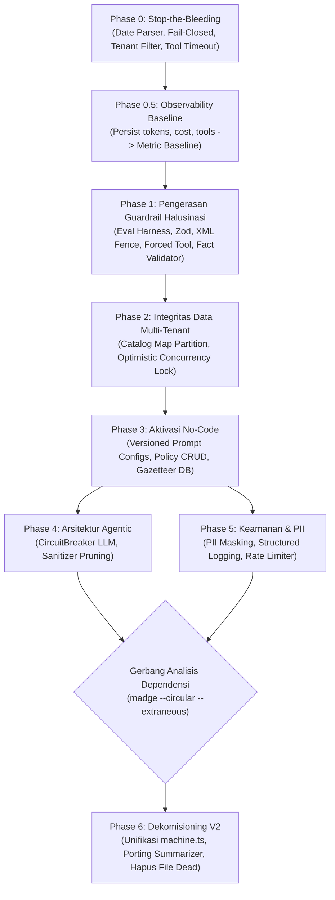

# MASTER IMPLEMENTATION PLAN — V3 BOT HARDENING & NO-CODE ROADMAP

> **Status:** Approved for Execution  
> **Basis:** Laporan Audit Komprehensif Arsitektur V3 (17 Temuan Critical/High + 8 Temuan Medium/Low)  
> **Scope:** `src/v3/**`, `src/services/**`, `src/config/**`, dekomisioning `src/slot-engine/**`  
> **Estimasi Total:** ±6 Minggu Kerja Fokus (1–2 Developer)  

---

## 1. Daftar Dokumen Fase & Direktori Kerja

Setiap fase telah dipecah menjadi dokumen instruksi kerja mikro (*micro-staged tasks*) yang sepenuhnya prosedural tanpa memerlukan interpretasi atau tebak-tebakan. Seluruh instruksi memuat lokasi file pasti, baris kode, blok kode pengganti, perintah eksekusi terminal, dan kriteria kelulusan otomatis.

| Dokumen Fase | Fokus Utama | Target Waktu | Estimasi Effort | File Rencana |
|---|---|---|:---:|---|
| **Phase 0** | Stop-the-Bleeding (Hotfix Kritis & Quick Wins) | Hari 1–3 | 4x S | [PHASE_0_STOP_THE_BLEEDING.md](./PHASE_0_STOP_THE_BLEEDING.md) |
| **Phase 0.5** | Observability Baseline (Metrik Biaya & Latensi) | Hari 4–7 | 1x M, 1x S | [PHASE_0_5_OBSERVABILITY_BASELINE.md](./PHASE_0_5_OBSERVABILITY_BASELINE.md) |
| **Phase 1** | Pengerasan Guardrail Halusinasi & Safety Medis | Minggu 2–3 | 5x M, 3x S | [PHASE_1_GUARDRAIL_HARDENING.md](./PHASE_1_GUARDRAIL_HARDENING.md) |
| **Phase 2** | Integritas Data Multi-Tenant & Concurrency Lock | Minggu 3–4 | 2x M | [PHASE_2_MULTI_TENANT_INTEGRITY.md](./PHASE_2_MULTI_TENANT_INTEGRITY.md) |
| **Phase 3** | Aktivasi No-Code (DB-Driven Persona, Policy, Tiers) | Minggu 4–5 | 2x M, 3x S | [PHASE_3_NO_CODE_ACTIVATION.md](./PHASE_3_NO_CODE_ACTIVATION.md) |
| **Phase 4** | Pengerasan Arsitektur Agentic (CircuitBreaker) | Minggu 5 | 2x M | [PHASE_4_AGENTIC_ARCHITECTURE.md](./PHASE_4_AGENTIC_ARCHITECTURE.md) |
| **Phase 5** | Keamanan Ingest, Throttling & Masking PII | Minggu 5–6 | 1x M, 3x S | [PHASE_5_SECURITY_OPERATIONAL.md](./PHASE_5_SECURITY_OPERATIONAL.md) |
| **Phase 6** | Dekomisioning Legacy V2 & Eliminasi Tech Debt | Minggu 6 | 3x M, 4x S | [PHASE_6_DECOMMISSION_V2_TECH_DEBT.md](./PHASE_6_DECOMMISSION_V2_TECH_DEBT.md) |

---

## 2. Diagram Ketergantungan Antar Fase (Dependency Graph)

---

## 3. Aturan Eksekusi Wajib (Golden Rules)

1. **Prinsip Mikro-Task:** Setiap sub-task (misal 0.1, 0.2) adalah 1 commit/PR terisolasi. Dilarang menggabungkan seluruh fase ke dalam 1 commit besar.
2. **Zero New NPM Dependencies:** Tidak boleh menambah dependency runtime baru di `package.json` tanpa persetujuan eksplisit. Manfaatkan pustaka yang sudah terpasang (`zod`, `crypto`, `fastify`, `@prisma/client`).
3. **Database Offline Mock Safety:** Unit test Vitest (`npm test`) harus selalu berjalan offline tanpa membutuhkan PostgreSQL atau koneksi jaringan aktif.
4. **Verifikasi Statis Phase 6:** Sebelum menghapus file apa pun di `src/slot-engine/**`, tool dependensi statis (`madge`) wajib dijalankan untuk membuktikan tidak ada import aktif yang terlewat.

---

## 4. Definition of Done (DoD) Seluruh Proyek

- [ ] Eval harness numerik (Phase 1.1) berjalan otomatis di CI dengan 0% halusinasi harga/ongkir pada set uji ≥30 kasus.
- [ ] 100% query database pada alur percakapan memfilter `tenant_id`.
- [ ] Circuit Breaker aktif dan terbukti fail-fast (<2s) saat provider LLM primer offline.
- [ ] Aturan persona, kebijakan SOP operasional klinik, dan delivery tier dapat diubah via database/UI tanpa perlu deploy kode ulang.
- [ ] Folder `src/slot-engine/**` didekomisioning bersih; seluruh modul yang masih diperlukan telah dipindahkan ke domain native V3.
- [ ] Log produksi tidak lagi memuat data pribadi sensitif (PII) dalam bentuk teks terbuka.
